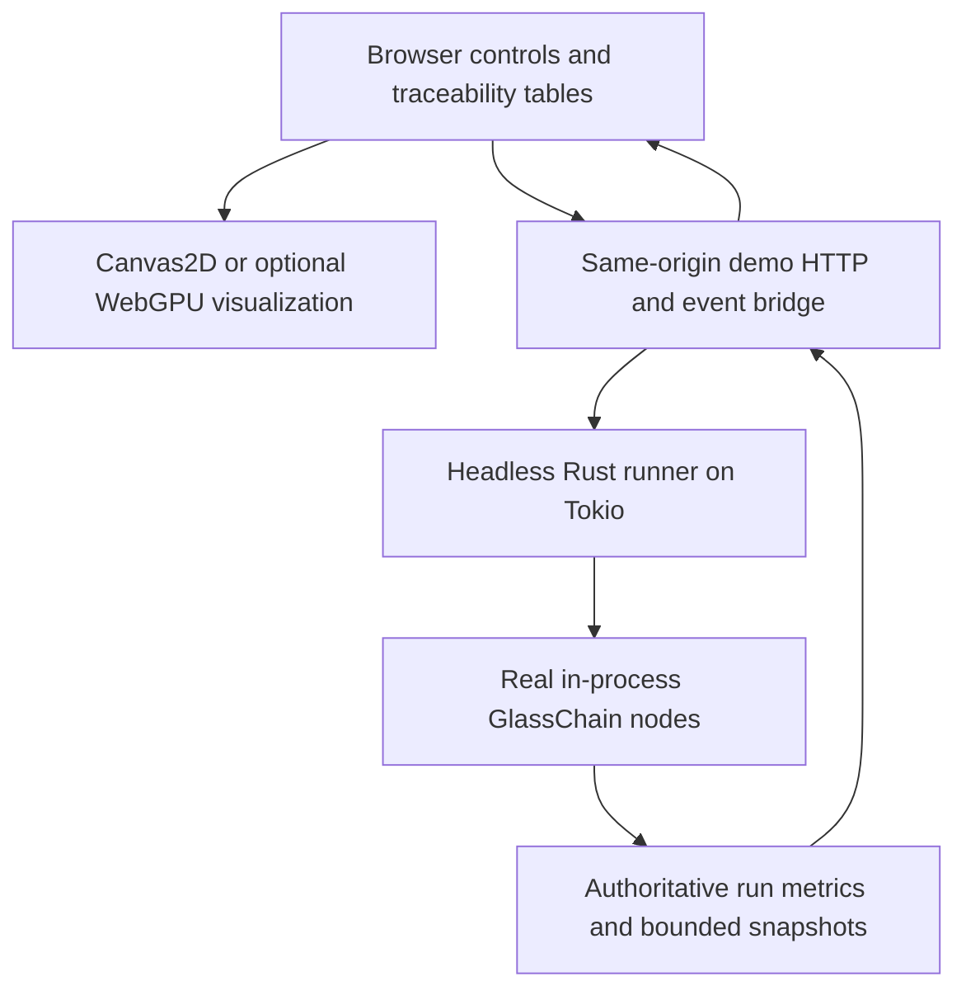

# Plan — `glasschain-demo`: browser demo and benchmark web app

**Status:** steps 1–3 + zero-trust/multi-company slice + docs-half of 6 shipped (2026-09-16/17); steps 4–5 pending
**Reviewed:** 2026-09-05 against `f7b434e`; decisions settled by grill 2026-09-16 (below)
**Tracking:** [Visual demo and benchmark harness](https://github.com/dbbvitor/GlassChain/issues/61)
**Decision update:** the owner requested a **web app instead of the gpui desktop
app** on 2026-09-05. The previous gpui pin, native-window/toolchain spike and
“no web build” restriction are superseded. Keep this plan's path for existing links.

## Settled decisions (grill 2026-09-16, supersedes step-0 detail)

- **Scope:** steps 1–5 in the first build (no throwaway spike phase; the
  spike's deliverables became settled decisions below) plus the docs half of
  step 6. CI browser-smoke stays out.
- **HTTP stack:** `axum` + SSE — already in the tree via tonic; a manifest
  line, not a new compile unit.
- **Frontend:** vanilla ES modules, plain CSS, `<canvas>`. No htmx (wants
  HTML fragments, bridge is JSON), no Tailwind (build step / Play CDN), no
  Leptos/Yew (wasm toolchain). Named fallback if the table/SSE code turns
  gnarly: htmx as a single build-free file.
- **WebGPU adoption bar:** p95 frame ≤ 16.7 ms at ~500 visible moving
  elements on a mid-range iGPU; the same gate applies at step 0 and step 5.
  The result (browser/version/device/failed-or-met) is recorded in
  `docs/demo.md`; WebGPU code ships only if the bar is met, with Canvas2D
  as the automatic fallback for missing adapters/device loss/reduced motion.
- **Federation (expanded 2026-09-17):** multiple real companies per role
  (3 manufacturers, 2 distributors, 2 logistics, 3 pharmacies, regulator,
  2 certifiers = 13 honest nodes) **plus two evil companies** — `QuimicaFalsa`
  (verified, not a `pricing` member: membership-gate + strict-schema
  rejections) and `DipFakeCerts` (no verifier: fail-closed #86 rejection;
  under-metadata registration admitted with a flagged trust score). Every
  rejection shown is a real code path; equivocation evidence surfaces only
  if the staged BFT engine emits it and is labelled unavailable otherwise.
  Scenario arc per lot: asset registration → custody transfer → quality
  certification → audit attestation, with a member-only pricing payload.
- **Visibility (added 2026-09-17):** per-member views (`?as=<company>`) are
  served from each member's OWN node — its chain height and transient store,
  not the leader's state laundered through a filter — and the UI renders a
  who-sees-what matrix.
- **Manual transactions (added 2026-09-17):** a second real contract
  (`manual-review`, `auto_execute=false`) holds offers priced above the
  `auto-replenish` cap for a human buyer; `POST /api/purchase` completes one
  as the viewing pharmacy. The offers sidebar shows every advertised offer;
  graph dots are per-transaction (click → details drawer).
- **WMS + explained interactions (added 2026-09-17):** a WMS dashboard
  derived from committed custody chains (who holds what, movement totals);
  every adversary row carries a human explanation of the gate that answered,
  expandable on click and mirrored in the member drawer; Apple-grade CSS
  design system with reduced-motion support.
- **Parameters + contract flow (added 2026-09-17):** companies per role,
  evil count, lots/round and interval are live-editable (`POST /api/params`,
  sanitized, topology-affecting changes rebuild mid run); the real contract
  engine matches SupplyOffers into PurchaseOrders (`auto-replenish`,
  auto-execute) and the UI shows offer → match rows; canvas edges thicken
  with per-pair traffic; the graph is interactive (click = view as that
  member, drag = rearrange, hover = tooltip).
- **Star-center mining:** the wire engine relays transactions one hop, so the
  demo's block producer is the star center every company dials; documented in
  `docs/demo.md`. Never construct demo nodes with `127.0.0.1:0` — reserve
  concrete ports via `stash_prebound_listener`.
- **Security slice:** loopback-only bind; `Origin` check on state-changing
  commands; random per-run capability token issued at page serve, passed
  back in a header for commands (the CSRF defense; no cookies), never a
  query param; PDC filtering enforced server-side before serialization.
- **PoW, uniform, difficulty 1:** the staged BFT engine's attested blocks
  can be rejected at peers' PoW admission (consensus_capacity.rs); the demo
  stays uniform PoW and labels commit latency as PoW.
- **Docs:** `docs/demo.md` + README entry when runnable. No ADR (the
  web-over-gpui call is recorded here and in the issue; the rest is cheap
  to reverse).

## Goal

Let a human watch synthetic supply-chain transactions move through a real local
GlassChain federation: custody transfers, endorsements, private-data commitments,
replenishment, recall and lot lineage. Plot measured throughput and latency beside
the activity. A browser makes the demonstration easier to open and share without
installing a native GUI; hosted multi-user access is a separate security scope.

**Demonstration is not production evidence.** The UI must identify the active
consensus mode, synthetic workload and in-process topology, and link the
[benchmark record](../../docs/benchmarks/consensus-capacity.md). A local animated
federation cannot establish the ADR-010 testnet, security or scalability gates.
(See the **synthetic demo run** glossary term, `CONTEXT.md`.)

## 1. What exists, what does not

| Component | Current state | Demo work |
|---|---|---|
| `glasschain_network::Node`, Tokio, ledger/lineage/events | Shipped library APIs | Reuse in a non-interactive headless runner; do not launch the REPL from it |
| `consensus_capacity.rs`, `bft_finality.rs` | Existing PoW propagation and staged BFT harnesses | Reuse/extract appropriate fixtures and metric definitions; avoid a second ledger simulator |
| gRPC ledger/lineage/event services | Native Tonic services exist | Browsers cannot call native gRPC directly; no gRPC-Web/HTTP demo bridge exists |
| REST/WebSocket product API | Not shipped | A narrow demo bridge does not complete that programme requirement |
| Browser frontend, WebGPU rendering, demo packaging | Not implemented | Build after the browser/bridge design spike below |
| Active privacy/endorsement and staged BFT guarantees | Configuration-dependent, with known gaps | Enforce real available checks, label unresolved guarantees; see [zero-trust](zero-trust.md) and D1–D7 |

## 2. Minimal architecture

- **Backend owns the experiment.** Rust generates seeded workloads, holds synthetic
  keys, drives nodes and computes timings/counters. Start with a small federation
  and existing programmatic APIs; do not port Tokio/TCP/Wasmtime to browser WASM.
- **Frontend owns presentation.** Start with HTML/CSS and native JavaScript modules,
  DOM controls/tables, SVG or Canvas2D charts. No frontend framework is required
  for the first slice. Add tooling/library dependencies only when the spike
  demonstrates a concrete benefit; pin them and isolate their lockfile then.
- **Bridge:** same-origin HTTP commands/queries plus server-sent events (SSE) for
  bounded, coalesced snapshots. Polling is an acceptable fallback. Choose an
  existing compatible Rust HTTP stack during the spike, not a hand-written HTTP
  parser. WebSockets/gRPC-Web are alternatives only if bidirectional streaming or
  a real external client requires them.
- **Reconnect semantics:** include run ID and sequence/height; after a gap fetch a
  fresh authorized snapshot. A dropped UI update must not lose a transaction or
  reset backend counters. The presentation stream is not an audit log.
- **Proposed layout, not existing paths:** `demo/` contains a standalone Rust demo
  package and static web assets, path-dependent on workspace crates, explicitly
  excluded from the root workspace when implemented. It gets its own lockfile
  and CI checks; browser tooling does not enter the 12-crate workspace gates.
  The root Rust gates remain unchanged. No directory/package is scaffolded by
  this planning PR.

## 3. WebGPU evaluation

**WebGPU is a browser GPU API, not an application framework.** It is a candidate
for drawing many node/edge/transaction instances and, only if needed, graph layout.
It does not improve ledger consensus throughput. Browser GPU timings must not be
reported as transaction finality.

| Option | Decision for the first implementation |
|---|---|
| DOM + SVG/Canvas2D | Baseline and always-usable fallback; accessible controls and semantic tables remain DOM |
| Native WebGPU + small WGSL renderer | Preferred experiment for dense animations; adopt if measured frame time/CPU gains justify shader/resource code |
| Rust `wgpu` compiled to WASM | Revisit only if sharing an actual Rust renderer is valuable; none exists today, so it adds a build target without reuse |
| Full 3D/WebGPU framework | Defer: a 2D network and time-series panel do not yet justify a game/scene engine |

The spike must test `navigator.gpu`, adapter/device acquisition and feature/limit
support on target browsers; support is not universal. Use HTTPS when hosted;
localhost development may qualify as a trustworthy context. Handle unavailable
adapters, rejected device requests, resource limits and `device.lost` by falling
back without losing controls, run state or traceability. Dispose buffers on stop/
reset; bound GPU allocations and chart history. Do not require experimental
browser flags or disabled browser security.

Compare the same snapshot sequence using Canvas2D and WebGPU at the intended
visible element counts. Record browser/version, device class, frame-time tails,
CPU/memory and backend/headless impact. Adopt WebGPU only when it improves a named
rendering budget; retain the simpler renderer if not. Honour reduced-motion and
pause/background-tab behaviour. No GPU result affects ledger state or authorization.

## 4. Security and privacy boundary

- Initial scope is **local synthetic-only**: bind the demo service to loopback,
  serve assets/API from one origin, and never expose validator keys to JavaScript,
  browser storage or GPU buffers. No production node attachment in the first slice.
- Localhost is not authorization. Validate Host/Origin, bound requests, authorize
  session/run commands and protect state-changing requests from CSRF/cross-origin
  drive-by access. Do not ship wildcard credentialed CORS. Establish a per-session
  capability/token without leaking it into URLs, logs or snapshots.
- Enforce the selected viewing organization's rights **before** serializing a
  snapshot/query result. UI hiding is not PDC enforcement. Switching perspective
  is restricted to the synthetic demo session, not a production impersonation API.
- Represent identifiers and wide integer values losslessly across JSON/browser
  boundaries (decimal strings where needed). Currency stays integer minor units;
  escape displayed payload strings using DOM text APIs, not injected HTML.
- A future hosted version needs explicit authentication, TLS, tenant/run isolation,
  quotas and retention before deployment. Neither WebGPU nor a TLS proxy provides
  these automatically. No analytics telemetry or third-party dataset upload.

## 5. Scenarios and metric semantics

Seed a manufacturer → distributor → logistics → pharmacy federation with synthetic
regulator identities. Use valid schema/GTIN/lot shapes, **not real patient data**.
Drive actual transactions and available endorsement/PDC checks, with a visible
configuration summary. Begin with traceable asset registration and transfer, then
replenishment, demand spike, recall/dispute and partition/repair.

Reuse [performance.md](performance.md) §§5–6; all values come from the headless
runner rather than animation timestamps:

- **Admission:** submission → accepted/rejected/pending; not finality.
- **Finality:** submission → verified quorum commit in staged BFT; display queue
  residence and consensus duration separately. Label PoW commit latency as PoW.
- **Round overhead:** prevote/precommit duration, round changes, timeouts and
  no-quorum/recovery intervals. Do not remove timed-out samples from the story.
- **Replication/durability:** separate peer arrival from stable-storage
  acknowledgement; unavailable durability evidence is “unavailable,” not success.
- **Resources:** offered/committed rate, pending count/bytes/age, peer drops,
  projection rows/RSS and subscriber lag. Show sample counts with percentiles.
- **Speculation:** unavailable in the shipped driver, not zero. Tentative/final/
  aborted states require a separately approved implementation before visualization.

Snapshot publication is bounded/coalesced at a fixed cadence, not one browser
message per transaction. Render with `requestAnimationFrame` independently of
experiment timing. Maintain counters on the backend when a tab is paused or
throttled; display stale/disconnected state. Compare headless and rendered runs
so shared CPU/GPU contention does not masquerade as a consensus regression.

Retain D2 recall-approval, D5 retention-after-restart and D6 triage-recovery
limitations from [source-comment debt](deferred-code-debt.md). Demonstrate known
limits explicitly rather than drawing successful security or recovery guarantees.

## 6. Implementation order and completion gates

- [x] **0 — Browser/bridge spike.** One static page reads a bounded synthetic
  snapshot from a local Rust service and starts/stops a run through validated
  commands. Record the HTTP/tooling choice, session boundary and browser support
  matrix. Compare Canvas2D with a small WebGPU view; settle renderer scope from
  evidence, not a framework preference. *(Settled by grill 2026-09-16 instead of
  a throwaway spike: axum + SSE, vanilla ES modules, session-token commands;
  the Canvas2D/WebGPU comparison runs against the shipped app with the p95 ≤
  16.7 ms gate, still pending a real-device measurement.)*
- [x] **1 — Package and shared fixtures.** Add the excluded demo package/static
  assets, extract only the workload code both tests and runner use, and preserve
  existing harness results. Pin any new tooling in the demo, not core crates.
  *(Shipped: `demo/` excluded from the workspace; scenario fixtures distilled
  from the consensus-capacity/SNCM harnesses in `demo/src/scenario.rs`.)*
- [x] **2 — Headless real-node runner.** Seed/start/stop/reset, bounded resources,
  cleanup and authoritative metrics; tests run without a browser/GPU.
  *(Shipped: `spawn_run`/`run_one_round` over real `Node`s; bounded snapshot,
  rolling metrics, stop = task abort, reset = state wipe.)*
- [x] **3 — Functional web slice.** DOM controls, scenario state and a custody
  table/graph; authorized public/commitment views are visibly distinct. A user
  traces a synthetic lot from shelf to origin without reading Rust.
  *(Shipped: `demo/static/` — start/stop/reset, custody + cert tables, metrics
  grid, activity feed, per-org view selector; server-side PDC filtering.)*
- [ ] **4 — Metrics and faults.** Same metric contract as performance plan;
  seeded WAN/partition controls when those harness capabilities exist. Show
  missing instrumentation as unavailable, not fabricated measurements.
- [ ] **5 — Optional WebGPU acceleration.** Land only with the spike's measurable
  benefit, renderer equivalence and fallback/device-loss tests. No core dependency.
  *(Experiment code exists behind the measured-budget gate; the real-device
  comparison is pending.)*
- [x] **6 — CI and documentation.** Dedicated demo Rust checks plus browser smoke/
  accessibility tests in fallback mode; optional GPU-capable smoke separately.
  Add `docs/demo.md` when runnable and a short README entry. Explain synthetic
  scope and how to reproduce headless versus rendered measurements.
  *(Docs half shipped: `docs/demo.md` + README + docs index entries. Browser
  smoke/accessibility CI is out of scope for this pass.)*

## Validation

Required acceptance cases: start/stop cleans resources; same seed reproduces the
workload; invalid commands cannot control another run; unauthorized PDC bytes
never reach responses; reconnect/gaps recover a snapshot; stalled browser/network
keeps memory bounded; admission is not counted as finality; headless totals match
both renderers; GPU unavailable/device loss/reduced motion leaves a usable UI.

Run normal workspace gates unchanged plus the separate demo checks. Standard
CI cannot assume a physical GPU; render support failures must not disable
functional/security tests. End-to-end browser tests use a bounded harness that
starts and tears down its own service rather than an indefinitely running REPL.

## Out of scope

Desktop gpui, mandatory GPU access, browser-hosted validators, a full product
REST/WebSocket API, public multi-tenant hosting, production key management,
new consensus/schema behaviour, real-data demonstrations and a new benchmark
source of truth. These need separate requirements, not incidental demo scope.

## References reviewed 2026-09-05

- [MDN WebGPU API](https://developer.mozilla.org/en-US/docs/Web/API/WebGPU_API):
  secure context, limited browser availability, adapter/device negotiation and
  error/device-loss handling.
- [WebGPU specification](https://gpuweb.github.io/gpuweb/): normative API reference
  for the implementation spike; no renderer has been built or benchmarked here.
