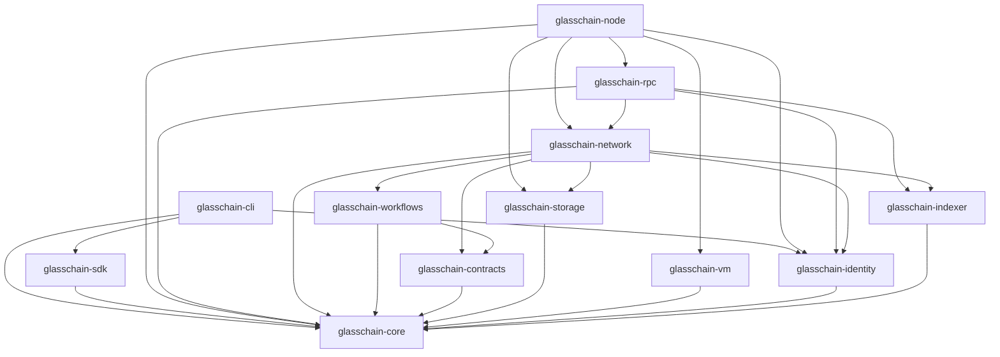
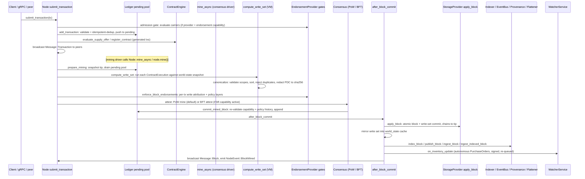

# GlassChain architecture

> **Audience:** an engineer new to this repository who needs to understand how
> GlassChain is put together before changing anything.
>
> **Accuracy rule:** this document is written against the shipped code, not the
> plan. Every claim below names the file and symbol that implements it. Where
> something is designed but not wired into a runnable binary, §7 says so
> explicitly — the repository has a documented review history of docs claiming
> planned work as present, and that failure mode is deliberately avoided here.
> If you find a claim you cannot trace to a symbol, it is a bug: fix the doc.

---

## 1. The big picture

GlassChain is a **federated distributed ledger** for transparent supply-chain
transactions in the Brazilian pharma / SNCM / Anvisa domain: manufacturers,
distributors, pharmacies, and regulators (the SNCM's `anvisa`/`mapa` are the
default regulator organizations in
`crates/glasschain-identity/src/channel.rs`) share one tamper-evident record of
offers, purchase orders, inventory movements, custody handoffs, recalls,
certifications, and audit attestations. "Federated" is the key word: membership
is permissioned (every participant holds an MSP identity), but no single
operator is trusted — `CONTEXT.md` calls this the "zero trust" posture. The
result is a supply-chain ledger, not a public cryptocurrency: SHA-256 chained
blocks, an in-memory pending pool, pluggable consensus (Proof-of-Work for
dev/test, a staged Tendermint-class BFT behind the same seam), a WASM contract
runtime, private data collections for selective disclosure, and a Tonic gRPC
API. It is a Cargo workspace of 12 crates (~37k lines of Rust across the
`crates/` tree), pinned to Rust 1.95, edition 2021, async on Tokio.

Architecturally the project hybridizes three reference systems, and each
influence is visible in the code and in the accepted ADRs:

- **Hyperledger Fabric — permissioned identity + endorsement.** Organizations
  (Root CAs) issue member identities (`crates/glasschain-identity/src/msp.rs`),
  transactions carry endorsement carriers evaluated against committed policies
  (`crates/glasschain-core/src/endorsement.rs`, ADR-008), and private data
  collections follow Fabric's `privdata` model almost feature-for-feature
  (ADR-003: point-to-point dissemination, hash commitments on the global
  chain, a transient store).
- **Corda — workflow-first modelling + selective disclosure.** The
  `glasschain-workflows` crate is explicitly "a Corda-style state-machine
  workflow framework" (`crates/glasschain-workflows/src/lib.rs`): an
  Action / Event / TransitionResult algebra, one type per transition, and
  durable checkpoints. The contracts/workflows crate split mirrors Corda's
  CorDapp split (documented in `README.md`). Selective disclosure is the PDC
  commitment model: the chain carries `sha256(payload)`, only collection
  members ever hold the payload.
- **VeChain Thor — event/subscription surface.** The node exposes a
  broadcast event channel (`Node::subscribe`, `NodeEvent` in
  `crates/glasschain-network/src/node.rs`), an `EventBusProvider` seam with an
  in-memory bus (`crates/glasschain-indexer/src/event_bus.rs`), and gRPC
  subscription endpoints (`stream_blocks`, `subscribe_to_events`). ADR-002
  contains the project's own analysis of Thor's consensus/finality design,
  which was evaluated and rejected for block production but informed the
  separation of commit notifications from the consensus engine.

Two companion docs expand the domain: [`data-model.md`](data-model.md) (the
transaction/schema/state model), [`consensus.md`](consensus.md) (finality and
the BFT staging), [`privacy-and-identity.md`](privacy-and-identity.md) (MSP,
PDCs, TOFU), [`workflows-and-contracts.md`](workflows-and-contracts.md) (the
automation layer), and [`operations.md`](operations.md) (running nodes).

---

## 2. The crate map

All 12 crates live in `crates/`. The workspace manifest (`Cargo.toml`) lists
them; each crate's `lib.rs` re-exports its public surface. LOC counts are
source lines including `#[cfg(test)]` and `tests/` files, as of `main`
(fed76c7).

| Crate | LOC | Owns | Key files |
|---|---|---|---|
| `glasschain-core` | ~7.3k | The ledger leaf: `Block`, `Ledger`, `Transaction`/`TransactionKind`, the provider traits, PoW, canonical schema v1 (13 record families), capabilities (ADR-010), endorsement policies and evaluation, write sets (ADR-007), the BFT provider behind the `bft` feature | `block.rs`, `ledger.rs`, `transaction.rs`, `providers.rs`, `canonical.rs`, `capability.rs`, `endorsement.rs`, `write_set.rs`, `bft.rs` |
| `glasschain-contracts` | ~1.4k | Deterministic contract layer (ticket #49 split): `ContractEngine` (BTreeMap registry), condition matching, WASM approval gate; strictly pure functions of committed state | `engine.rs`, `contract.rs`, `approval_gate.rs` |
| `glasschain-workflows` | ~4.8k | I/O-driven layer: `FlowRunner` (handle/ack), purchase/settlement, recall/quarantine/dispute, attestation flows, `WatcherService` (ECA inventory triggers), triage | `runner.rs`, `purchase_flow.rs`, `recall_flow.rs`, `attestation_flow.rs`, `watcher.rs`, `checkpoint.rs`, `triage.rs` |
| `glasschain-storage` | ~0.6k | `StorageProvider` backends: `SledStorageProvider` (atomic multi-tree `apply_block`), `TransientStore` (PDC private payloads) | `sled_backend.rs`, `transient.rs` |
| `glasschain-identity` | ~2.6k | `Identity` (ed25519 + X.509), `Organization` (Root CA / MSP), `CertChainVerifier` (rustls-webpki), `Channel` (PDC collections), `MspEndorsementProvider` | `identity.rs`, `msp.rs`, `cert_verifier.rs`, `channel.rs`, `msp_policy.rs` |
| `glasschain-vm` | ~1.8k | Wasmtime-backed `ExecutionProvider` with independent fuel/op-gas budgets | `wasm.rs`, `gas.rs` |
| `glasschain-indexer` | ~2.3k | `IndexerProvider`/`InMemoryIndexer`, `EventBusProvider`/`InMemoryEventBus`, `ProvenanceIndex` (custody chains), `AnalyticalFlattener` | `indexer.rs`, `event_bus.rs`, `provenance.rs`, `flattener.rs` |
| `glasschain-network` | ~11.6k | The node: `Node` (lifecycle, mining, commit, PDC, endorsement gates), wire protocol (`Message`, `glasschain/4`), TLS handshake + TOFU registry, peer loops; `LibP2pNode` (implemented, unwired — see §7) | `node.rs`, `protocol.rs`, `peer.rs`, `libp2p_swarm.rs` |
| `glasschain-rpc` | ~2.2k | Tonic/Prost gRPC: `LedgerService`, `NodeService`, `IdentityService`, MSP auth interceptor | `server.rs`, `auth.rs`, `proto/glasschain/v1/glasschain.proto` |
| `glasschain-node` | ~1.1k | The only full node binary: REPL + optional gRPC server + WASM executor attachment | `src/main.rs` |
| `glasschain-sdk` | ~0.6k | High-level Rust client: pure transaction/JSON builders; **no network I/O today** (no `tonic` dep — the client's docs say a `tonic::Channel` would live here in a full implementation) | `client.rs` |
| `glasschain-cli` | ~0.8k | `glasschain` binary: `identity-gen`, `contract-deploy`, `ledger-inspect` | `src/main.rs`, `commands/` |

`glasschain-core/src/lib.rs` is the first file to read: it re-exports the entire
public surface (`Block`, `Ledger`, all transaction kinds, the provider traits,
the schema registry, capabilities, endorsement types, write-set types). Adding
a public type there without updating this list will trip clippy's
`avoid-breaking-exported-api`.

---

## 3. The dependency rule

`glasschain-core` depends on nothing internal; every other crate builds on it.
The edges below are read directly from each `Cargo.toml` `[dependencies]` block
(the only crate-to-crate edges; dev-dependencies are marked `dev`):

```
contracts → core
workflows → core, contracts          (dev: vm)
storage   → core
vm        → core
identity  → core
indexer   → core
network   → core, contracts, workflows, indexer, identity, storage   (dev: vm, storage)
rpc       → core, network, identity, indexer
node      → core, network, identity, storage, vm, rpc
sdk       → core
cli       → core, identity, sdk
```

No edge points "downward" from a higher crate into a lower one except through
`core`, and no edge creates a cycle:



**The no-cycles invariant is a hard rule.** `AGENTS.md` states it explicitly:
"the workspace has no circular dependencies — do not introduce one." If a lower
crate needs behaviour from a higher one, the standard workaround is:

1. Define a trait in `glasschain-core` (a *seam*) that names the behaviour in
   core's own vocabulary.
2. Implement the trait in the higher crate where the behaviour actually lives.
3. Inject the implementation into the consumer (a setter on `Node`, a
   constructor argument, a `&dyn Trait` handle).

The provider traits in §4 are the living examples: `EndorsementProvider` is
defined in core but implemented in `glasschain-identity`
(`MspEndorsementProvider`); `ExecutionProvider` is defined in core and
implemented in `glasschain-vm` (`WasmExecutionProvider`); `StorageProvider` is
defined in core and implemented in `glasschain-storage`
(`SledStorageProvider`). None of those crates depends on core.

---

## 4. The provider seams

The trait-based extension points are the walls between "core vocabulary" and
"concrete implementation". The canonical list lives in
`crates/glasschain-core/src/providers.rs` — **read that file first, and read
[`PLUGIN_KIT.md`](../PLUGIN_KIT.md) for the trait-by-trait developer reference**
(contracts, built-in implementations, and extension recipes); this section is a
map, not a duplicate.

### 4.1 The five traits in `glasschain-core/src/providers.rs`

`providers.rs` defines exactly five traits (plus supporting types — see below).
Note that two commonly-assumed seams are **not** here: `IndexerProvider` and
`EventBusProvider` live in `glasschain-indexer`, not in
`glasschain-core/src/providers.rs` (§4.2). If you grep core for them you will
find nothing.

| Trait | What it abstracts | Method shape | Implemented by (today) | Why the seam exists |
|---|---|---|---|---|
| `ConsensusProvider` | Turning the pending pool + a previous block into a certified commit notification, and validating a remote block | `propose_block(index, txs, previous) -> CommitNotification`; `validate_block(block, previous)` | `PowConsensusProvider` (core, default); `BftConsensusProvider` (core, `bft` feature, default-off) | Swap dev/test PoW for BFT without touching the node; ADR-002. The `CommitNotification` (`certificate: QuorumCertificate`) is the seam's output — ticket #38 retired the `MineBlock` RPC by putting consensus behind this seam |
| `StorageProvider` | Persistent blocks + world state | `put_block`, `apply_block`, `get_block`, `latest_block_index`, `put_state`, `get_state`, `delete_state` | `in_memory::InMemoryStorageProvider` (core, default); `SledStorageProvider` (`glasschain-storage`) | Drop in RocksDB/Postgres later; the atomic `apply_block` boundary (block + state in one transaction) is the crucial contract (ADR-007 decision 2) |
| `ExecutionProvider` | Running a contract payload against a world-state snapshot and getting the typed result back | `execute(contract_id, payload, limits)`; `execute_with_state(..., initial_state, limits)` | `WasmExecutionProvider` (`glasschain-vm`) | WASM is one possible runtime (EVM was considered and rejected in ADR-001); the typed `ExecutionResult` (ephemeral vs persistent writes) is ADR-007 decision 1 |
| `EndorsementProvider` | Business authorization: does a set of signers satisfy a policy expression? | `evaluate(expression, request) -> EndorsementEvaluation` | `MspEndorsementProvider` (`glasschain-identity`) | Identity-neutral seam (ADR-008): core defines the expression/request/result types; an implementation derives principals from verified credentials. Distinct-principal counting means duplicate/replayed signatures never inflate the count |
| `NetworkProvider` | Broadcasting to peers | `broadcast(bytes)`, `connected_peers()`, `name()` | **None — zero implementations in the workspace** | The libp2p insertion point described in `providers.rs` ("Implement `NetworkProvider` on a struct that wraps a `libp2p::Swarm`", passing it to a `Node::with_network_provider` that **does not exist in `node.rs`**). The TCP node never goes through the trait — `broadcast` is a private method on `Node`, not a trait call. It is a dead seam today — see §7 |

Supporting types in the same file: `ExecutionLimits` (independent fuel and
host-operation-gas budgets), `validate_tip_chain` (the shared chain check all
`apply_block` implementations route through, returning `CoreError::InvalidBlock`
on a stale candidate), and the built-ins `PowConsensusProvider` and
`in_memory::InMemoryStorageProvider`.

### 4.2 The two analytical seams in `glasschain-indexer`

`IndexerProvider` and `EventBusProvider` are defined in `glasschain-indexer`,
because they abstract *analytical* backends (SQL/ClickHouse-style storage,
Kafka/Redpanda-style brokers) that already sit above core:

| Trait | What it abstracts | Implemented by (today) | Where |
|---|---|---|---|
| `IndexerProvider` | Persisting block/transaction summaries for analytics queries | `InMemoryIndexer` (block → `IndexedBlock`, tx-id → `IndexedTransaction`, block-count) | `crates/glasschain-indexer/src/indexer.rs` |
| `EventBusProvider` | Publishing validated commit events to downstream consumers | `InMemoryEventBus` (bounded, drop-oldest `IndexerEvent` log; capacity 4096 as constructed by `Node::with_components`) | `crates/glasschain-indexer/src/event_bus.rs` |

### 4.3 How seams get attached

`Node` holds each seam as an `Option<Arc<dyn ...>>` in `NodeState`
(`crates/glasschain-network/src/node.rs`): `executor`, `endorsement`,
`cert_verifier`, `consensus`, plus the concrete `storage: Arc<dyn StorageProvider>`.
Public setters (`set_execution_provider`, `set_endorsement_provider`,
`set_bft_consensus`, `set_cert_verifier`, `set_collections`,
`set_signing_identity`) install them. The node binary (`glasschain-node`)
today calls exactly one of these: `set_execution_provider` with a
`WasmExecutionProvider`. Everything else is attached only in tests — see §7.

---

## 5. Lifecycle of a transaction

This is the most important section in this document. It traces one transaction
from submission through commit on a single node (what happens when it arrives
from a peer, and what happens when a node syncs a whole chain, are called out
at the end). Every step names the function that performs it. Directory bases:
`node.rs` = `crates/glasschain-network/src/node.rs`, `ledger.rs` and
`transaction.rs` = `crates/glasschain-core/src/...`.



### Step 1 — Submission and admission: `Node::submit_transaction` (node.rs)

The entry point for local submission (the gRPC `LedgerService.SubmitTransaction`
backs onto it, and the REPL calls it for every command).

1. **Endorsement admission gate** (ADR-008 §4): if an `EndorsementProvider` is
   configured **and** the `endorsement` capability is active at the *next*
   height, the transaction's declared endorsement carriers are evaluated
   immediately (`evaluate_transaction_endorsements`), so an unauthorized policy
   update or record is rejected before it ever sits in the pool. Write-scope
   binding happens later, at block admission, where the write set actually
   exists.
2. **Ledger admission:** `Ledger::add_transaction` (ledger.rs). A non-empty
   `id` is required; duplicate ids (committed or pending) are *silently*
   dropped — this is the idempotency mechanism that makes exactly-once flow
   emissions work (flow actions submit with `Transaction::with_id(...)`).
   Canonical v1 records are validated against the capability set effective at
   the next height (`validate_record_under`), and a `CapabilityActivation` must
   be admissible there too (ADR-010 decision 5) — a record serialized for the
   wire is *not* re-validated at commit, so it must be valid at admission.
   Endorsement `PolicyUpdate`s get a structural check (non-empty channel,
   valid v1 policy metadata) — authorization is the endorsement gate's job.
3. **Contract side effects** happen at admission, not at commit: a
   `SupplyOffer` runs through `ContractEngine::evaluate_supply_offer` (condition
   matching / WASM approval gate), a `ContractCreation` is registered via
   `register_contract`. Any generated transactions (a `ContractExecution` or a
   `PurchaseOrder`) are added to the pending pool themselves. Matches happen on
   the *submitting node's* engine; peers re-run the same logic when they
   receive the transaction (Step 5).
4. `NodeEvent::TransactionAccepted` is emitted and the transaction is
   broadcast to peers as `Message::Transaction`.

### Step 2 — The pending pool ("mempool")

`Ledger.pending_transactions` is the mempool: an in-memory `Vec<Transaction>`
of received-but-uncommitted transactions. It is **not persisted** — a restart
loses uncommitted transactions, and the pool is drained by `prepare_mining`
(the snapshot + drain pair used by the async mining path so the ledger mutex
isn't held during consensus work) or `mine_pending_transactions` (the
synchronous convenience path).

### Step 3 — Mine: `Node::mine_async` (node.rs)

Block production is consensus-driven: no manual `mine` REPL command exists (it
was retired with the quorum-certificate seam, ticket #38); the integration
tests and node drivers call `Node::mine()` / `Node::mine_async()` directly.

1. `Ledger::prepare_mining` snapshots `(index, previous_hash, transactions,
   difficulty)` and drains the pool.
2. **Write-set computation — `Node::compute_write_set`** (node.rs). For every
   `ContractExecution` transaction, the node loads the contract's base64 WASM,
   looks up the contract in the engine, and executes it via
   `ExecutionProvider::execute_with_state` against a clone of the committed
   world-state cache, with `ExecutionLimits::new(100_000, 100_000)` (fuel +
   operation gas). Each execution's *persistent* writes are canonicalized per
   transaction (`ExecutionResult::canonicalize`: non-empty scopes, no
   duplicate scoped key, deterministic sort), then the aggregate is
   canonicalized again and **PDC values are redacted** to their SHA-256
   commitments via `PersistentWrite::block_form` — the block never carries a
   private value. Two determinants matter:
   - **Determinism:** the snapshot, transaction order, and canonicalized output
     are all functions of committed chain state, and a transaction whose
     execution *fails* (invalid WASM, gas exhaustion) accepts **no** writes —
     so every node computes the identical write set and the block stays
     consistent.
   - **PDC capability gate:** a candidate whose write set contains any
     PDC-scoped write is dropped whole unless the `pdc` capability is active at
     the candidate height.
3. **Endorsement gate 2 (mining):** `Node::enforce_block_endorsements` runs
   with per-transaction write attribution — every declared carrier must satisfy
   every applicable policy layer *and* the committed write set must stay inside
   the signed scopes. On failure the candidate is dropped and its transactions
   are restored to the pending pool (`restore_pending`) — no partial state.
4. **Attestation:** the candidate block is given a `CommitNotification`. With
   `bft` compiled **and** the `bft_consensus` capability active at this height
   and a `BftConsensusProvider` attached, `provider.attest(block)` signs the
   block hash with the local ed25519 validator key; otherwise the dev/test
   `PowConsensusProvider` path mines a nonce until the SHA-256 hash starts with
   `difficulty` leading zero hex characters (default `DEFAULT_DIFFICULTY = 2`,
   ledger.rs). PoW's certificate is degenerate: the valid nonce *is* the
   attestation.
5. **Commit:** `Ledger::commit_mined_block` appends only if the chain tip
   still matches the expected `previous_hash` (a race restores the
   transactions); the append re-validates every canonical record, capability
   activation, and policy update under the capability/policy histories at that
   height, including the same-block policy/write conflict rule (ADR-008
   decision 4).

### Step 4 — Post-commit effects: `Node::after_block_commit` (node.rs)

This is the single commit consumer shared by the mining path, the peer-block
path, and (via `rebuild_runtime_state_from_chain`) the sync path. In order:

1. **Storage:** `StorageProvider::apply_block(&block)` persists the block and
   applies its canonical write set through one atomic boundary (Step 6 in §6).
   On success the write set is mirrored into the in-memory world-state cache
   (`PersistentWrite::apply_to_cache`). **On failure the chain stays
   authoritative** and the next rebuild heals the divergence — a warning is
   logged, nothing else happens.
2. **Policy history:** if the block contains a `PolicyUpdate`, the policy
   history is replayed from the chain so the new policy applies from the *next*
   block.
3. **Analytical projections:** `InMemoryIndexer::index_block`,
   `InMemoryEventBus::publish_block`, `ProvenanceIndex::ingest_block` (custody
   chains), and `AnalyticalFlattener::ingest_indexed_block` (flat rows) — all
   best-effort, all logged, none able to fail the commit.
4. **Watcher automation:** each committed `InventoryUpdate` is fed to
   `WatcherService::on_inventory_update` (ECA: if a trigger's reorder threshold
   is crossed, possibly after a WASM approval gate, it returns an autonomous
   `PurchaseOrder`). Each order is signed with the node's identity when one is
   configured, the signature is stored under `signed_tx:<id>`, the order is
   re-queued into the pending pool, `NodeEvent::AutonomousTransactionGenerated`
   is emitted, and the order is broadcast. Finally the watcher's state
   (inventory levels + fire counts) is serialized to the storage key
   `watcher:state` for crash recovery.
5. `NodeEvent::BlockMined` (with the certificate) is emitted, private PDC
   writes are disseminated point-to-point (`disseminate_private_writes`, §6),
   and `Message::Block` is broadcast.

### Step 5 — The transaction from a peer

`process_message` (node.rs) handles `Message::Transaction`: only peers that
completed a successful `Hello` may submit; read-only observers (peers
advertising a capability set without an active privilege, ADR-010 decision 6)
are refused. The receiving node re-runs the contract side effects
(`evaluate_supply_offer`, `load_from_ledger` for `ContractCreation`), adds the
transaction and its generated children to the pending pool (dedup makes
re-broadcast idempotent), and relays the generated transactions to its own
peers. Note that a relayed transaction only reaches the local *pending pool* —
the endorsement admission gate runs only on the local submission path;
enforcement for peer-supplied content happens at block admission (Step 3.3) and
chain sync (Step 7).

### Step 6 — A block from a peer

`process_message` handles `Message::Block` with a full admission check before
any append:

1. Timestamp sanity (reject blocks more than 2 hours in the future; genesis is
   exempt), then, against the current tip: `Block::chains_to(prev)`,
   `has_valid_pow(difficulty)`, and `CapabilityHistory::validate_block` — a
   block must be valid under the capability set active *at its own height*
   (ADR-010 decision 5).
2. **Endorsement gate 3 (peer admission):** `enforce_block_endorsements` again
   — this time without per-transaction write attribution (no re-execution), so
   coverage is checked in aggregate: every committed write must sit inside some
   declared carrier.
3. `append_peer_block` re-validates under the push lock (the tip may have moved
   since admission — a stale candidate would fork the local chain), prunes the
   block's transaction ids from the pending pool, and pushes. Then
   `after_block_commit` runs exactly as for a locally mined block, and
   `NodeEvent::BlockReceived` is emitted with the degenerate PoW certificate
   (BFT certificates are not transported on this path yet — §7).

### Step 7 — Chain sync (the flood-fill path)

When a peer's `Hello` advertises a longer chain, the node sends
`Message::RequestChain`; the peer answers `Message::Chain(candidate)`. The
receiver runs **endorsement gate 4**: `Node::enforce_chain_endorsements` walks
the whole candidate in block order, threading capability history and policy
history, and evaluates every transaction's carriers where the `endorsement`
capability was active at that height — the sync path used to be a full
admission bypass, and this gate exists precisely because of that (ADR-008
§4; a hard review finding on ticket #45). Then `Ledger::try_replace_chain`
accepts the candidate only if it is *longer*, its genesis hash matches, every
link chains, every block has valid PoW, and every block's content validates
under its height's capability set. On adoption the whole chain is persisted
(`put_block`), `BlockReceived` events are replayed for commit consumers, and
`rebuild_runtime_state_from_chain` rebuilds every derived projection (§6).

### Step 8 — The endorsement enforcement gates, summarized

| # | Gate | Function | When | Attribution |
|---|---|---|---|---|
| 1 | Admission | `submit_transaction` → `evaluate_transaction_endorsements` | Local submission | Declared carriers only (no write set yet) |
| 2 | Mining | `mine_async` → `enforce_block_endorsements` | Candidate block, before attestation | Per-transaction write attribution |
| 3 | Peer block | `process_message(Block)` → `enforce_block_endorsements` | Peer block admission | Aggregate coverage |
| 4 | Sync | `process_message(Chain)` → `enforce_chain_endorsements` | Chain replacement | Whole-candidate walk |

Plus a structural replay inside `Ledger::commit_mined_block`
(`CapabilityHistory::validate_block` + `PolicyHistory::validate_block` —
metadata and the same-block rule only, no cryptographic evaluation; the
crypto lives at gates 1–4 where the provider exists). **All four gates are
dormant unless a provider is attached and the `endorsement` capability is
active at the candidate height** — today, in production, they are dormant
(§7).

---

## 6. Where state lives

GlassChain keeps six distinct stores, and the invariant that holds them
together is: **the chain is the authority; everything else is derived or
transient.** A derived store that disagrees with the chain is healed by
rebuilding it from the chain; a transient store that disagrees is simply
untrusted.

| Store | Type / location | Contents | Authoritative? | Healed by |
|---|---|---|---|---|
| The chain | `Ledger.chain: Vec<Block>` (memory; mirrored into storage) | The ordered, hash-chained blocks: transactions, the canonical `write_set`, PoW/BFT certificate inputs | **Yes — the single source of truth** | — |
| Pending pool | `Ledger.pending_transactions: Vec<Transaction>` | Accepted-not-yet-committed transactions | No (uncommitted) | Lost on restart, deliberately |
| World-state cache | `NodeState.world_state: HashMap<String, Vec<u8>>` | Materialized committed write sets, keyed `ws:<channel>:<contract>:<key>` | No (derived) | `Node::rebuild_world_state` |
| Storage state DB | `StorageProvider` (`state` tree in sled) | The same write sets, persisted; PDC keys hold the SHA-256 commitment | No (derived) | `rebuild_world_state` re-applies each block's write set to storage on rebuild (it heals a backend that persisted the block but not the state) |
| Transient store | `TransientStore` over the node's `StorageProvider`, keys `transient:<collection>:<commitment>` | PDC private payloads (pre- and post-commit) on collection members only; per-entry expiry | No (transient) | `purge_expired_private_payloads`; gone after retention (default 72h, `channel.rs`) — the chain's commitments persist forever |
| Analytics projections | `NodeState`/`Node` fields: `InMemoryIndexer`, `InMemoryEventBus`, `ProvenanceIndex`, `AnalyticalFlattener` | Block/tx summaries, commit events, custody chains, flat asset rows | No (derived) | `rebuild_runtime_state_from_chain` |
| Watcher/engine state | `NodeState.engine`, `NodeState.watcher` + storage key `watcher:state` | Contract registry/status, inventory levels, trigger fire counts | No (derived) | `ContractEngine::rebuild_from_chain`, watcher snapshot-or-replay in `rebuild_runtime_state_from_chain` |

### The atomic boundary

`StorageProvider::apply_block` (defined in `providers.rs`) is the one
block-plus-state commit boundary (ADR-007 decision 2): under the backend's
atomic section it verifies the candidate chains to the stored tip (empty store
accepts only genesis — `validate_tip_chain`), persists the block, and applies
every write (sets write, deletes remove). A stale candidate is rejected
**whole** with `CoreError::InvalidBlock`; a partial write set is never
acknowledged. `InMemoryStorageProvider` uses a lock pair (the default trait
implementation is a sequential fallback, correct for single-writer processes
but not atomic); `SledStorageProvider` overrides it with a real sled
multi-tree transaction whose abort maps back to `InvalidBlock` and whose
storage errors map to `Storage` — the consistent error shape across backends.

### What heals what

`Node::start` calls `rebuild_runtime_state_from_chain` before binding the
listener, and the `Message::Chain` sync path calls it again after replacing the
chain. In order it: rebuilds the world-state cache (and re-applies it to
storage, healing partial applies), rebuilds provenance and the flattener from
committed blocks, replays the contract engine from the chain, replays the
endorsement policy history, and restores the watcher from the persisted
snapshot (falling back to replaying `InventoryUpdate` transactions). `start`
then walks the in-memory chain and pushes any block storage is missing through
`apply_block`, so a fresh node's genesis lands through the atomic boundary and
later blocks can chain to it.

The PDC transient store is the one store that is *not* derived from the chain:
payloads arrive via `Message::PrivatePayload` (point-to-point, member-only,
commitment-verified) or originate locally (`submit_private_payload`), and peers
that were offline at dissemination time pull-missed payloads back with
`reconcile_private_payloads` (the chain's commitments drive the request — a
member can only ever ask for a commitment it already sees publicly).
Retention is enforced on read and by `purge_expired`: the payload vanishes,
the chain commitment persists (a late auditor can prove existence and
consistency but not read contents).

---

## 7. Designed but not wired

This section is the honest inventory. Each item names the code that exists and
the reason it is not reachable from a production binary. **Do not treat any of
these as "the docs describe it so it must be on" — they are off.**

### 7.1 `LibP2pNode` and the `NetworkProvider` seam are both unwired

`crates/glasschain-network/src/libp2p_swarm.rs` ships a complete, unit-tested
`LibP2pNode` (gossipsub + Kademlia swarm driven by a background task, public
API with `SwarmCommand`/`SwarmNodeEvent`), and `crates/glasschain-core/src/
providers.rs` defines the `NetworkProvider` trait that the libp2p docs
describe as the way to plug it in. **Neither is reachable from any binary:**
a workspace-wide search shows `LibP2pNode` is referenced only by
`libp2p_swarm.rs` and `network/src/lib.rs`'s re-export, `NetworkProvider` has
zero `impl`s anywhere, and the TCP transport talks to peer tasks directly
(`connect_to_peer`/`handle_peer`) without ever going through the trait. The
README's feature table says this plainly: "libp2p is experimental and
currently unwired." ADR-003 still lists `LibP2pNode` as the future home of the
PDC dissemination layer.

### 7.2 Certificate verification is inert in production (fails open) — issue #57

`CertChainVerifier` (rustls-webpki chain check against an org Root CA,
`VerificationLevel::Full` by default) is real and tested, and
`Node::set_cert_verifier` installs it — but **the only callers are two
integration tests** (`crates/glasschain-network/tests/pdc_distribution.rs`,
`protocol_security.rs`). The `glasschain-node` binary builds an `Organization`
(root CA in hand) to issue its TLS identity and then drops the CA; no
production path sets `NodeState.cert_verifier`. Consequence, in
`process_message`: the Hello handshake's org gate (`org_verified`) and the
private-payload sender gate
(`let verification_required = s.cert_verifier.is_some(); node.rs`) both
evaluate to "no verifier → not required", so the **self-asserted `Hello` org is
accepted** outside tests. This is a deliberate fail-open tied to the missing
federation trust model — installing a single-org verifier in the binary would
reject every cross-org peer. See [issue #57](https://github.com/dbbvitor/GlassChain/issues/57).

### 7.3 No production binary attaches an `EndorsementProvider` — issue #59

The entire ADR-008 enforcement machinery (carriers, `PolicyExpression`,
`PolicyHistory` replay, `MspEndorsementProvider`, the four gates) is
implemented and integration-tested in
`crates/glasschain-network/tests/endorsement.rs`. But `set_endorsement_provider`
is called **only in tests**; neither `glasschain-node` nor `glasschain-cli`
attaches one, so in production every gate short-circuits at
`let Some(provider) = provider else { return Ok(()); }`. The `VerifyEndorsement`
gRPC method therefore always returns "no endorsement provider configured" in a
stock deployment. See [issue #59](https://github.com/dbbvitor/GlassChain/issues/59).

### 7.4 PDC collections and BFT are configured only in tests

`set_collections` (PDC membership config) and `set_bft_consensus` (BFT
provider) are likewise attached only from test code. A production node has no
collections, so `submit_private_payload` is rejected by the membership gate
(no collection is configured) and by the capability gate (`pdc` is not active
at genesis); a WASM contract that emits a PDC write is dropped whole at mining
because `mine_async` requires the `pdc` capability at the candidate height.
Payloads are therefore never disseminated outside tests. As for BFT: even with the `bft` feature compiled, the
`bft_consensus` capability must additionally be *activated* at the candidate
height for the BFT attestation to engage. BFT blocks are also not admissible
on the peer/sync/restart paths today: `Message::Block` admission,
`try_replace_chain`, and `restore_ledger`/`validate_chain` all require a valid
PoW nonce (`has_valid_pow`), and certificates are not persisted with blocks —
all recorded as ADR-010 adoption-gate work (ticket #42, README).

### 7.5 Record and capability-activation signatures — resolved by ADR-012 (issue #60)

`CanonicalRecord.signatures` and `CapabilityActivation.signatures` are advisory
metadata: schema validation checks presence/count only, and nothing
cryptographically verifies the bytes. Authorization is the endorsement layer's
job ([ADR-012](adr/adr-012-signature-binding.md), resolving
[issue #60](https://github.com/dbbvitor/GlassChain/issues/60)): when the
`endorsement` capability is active, the operation defaults require verified
carriers — `network-governance` for every `CapabilityActivation`, and issuer
plus every named counterparty for `state_commitment` records. The decorative
fields stay in the record shape for hash stability and ADR-006 schema identity.

### 7.6 No revocation — issue #58

There is no CRL, OCSP, or revocation list anywhere; `cert_verifier.rs` verifies
signatures against the Root CA but explicitly does not check revocation, and
chains are single-hop (no intermediate CAs). A decommissioned member cert stays
valid until expiry. See [issue #58](https://github.com/dbbvitor/GlassChain/issues/58).

### 7.7 The SDK does not speak gRPC yet

`glasschain-sdk` has no `tonic` dependency: `GlasschainClient`'s `build_*`
functions are *pure* transaction/JSON builders, and the client struct's docs
say a `tonic::Channel` "would also hold" in a full implementation. The CLI and
SDK produce JSON to submit to the gRPC endpoint; they do not dial it.

### 7.8 Known, accepted limitations (do not "fix" silently)

TOFU trust is address-bound and in-memory, there is no shared CA across
organizations, and trust does not persist across restarts (README, AGENTS.md).
`exchange_certificate` acknowledges Root CA certificates but stores nothing
("populated once identity integration is complete"). `PolicyUpdate` is a full
replacement, so a more-specific scope can weaken a base layer (ADR-008 §1
non-weakening is not enforced). `ChannelConfig.endorsement_policy` is a local
declaration only — the authoritative policy source is committed
`PolicyUpdate`s.

---

## Reading guide

- Start: `crates/glasschain-core/src/lib.rs`, then `providers.rs`, then
  follow `Node` in `crates/glasschain-network/src/node.rs` (§5's functions).
- [`PLUGIN_KIT.md`](../PLUGIN_KIT.md) — trait-by-trait provider reference.
- [`data-model.md`](data-model.md) — the transaction/schema/write-set model.
- [`consensus.md`](consensus.md) — finality, PoW vs BFT, the certificate seam.
- [`privacy-and-identity.md`](privacy-and-identity.md) — MSP, PDCs, TOFU, TLS.
- [`workflows-and-contracts.md`](workflows-and-contracts.md) — contracts,
  watchers, flow runners.
- [`operations.md`](operations.md) — running nodes, storage backends, gRPC.
- ADRs in `docs/adr/`: `adr-001` (execution layer), `adr-002` (consensus
  finality), `adr-003` (privacy model), `adr-004` (scale topology), `adr-005`
  (certification/audit), `adr-006` (canonical schema v1), `adr-007`
  (VM state semantics), `adr-008` (endorsement policy model), `adr-010`
  (capability versioning). There is no ADR-009.