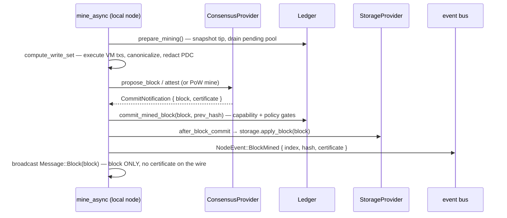
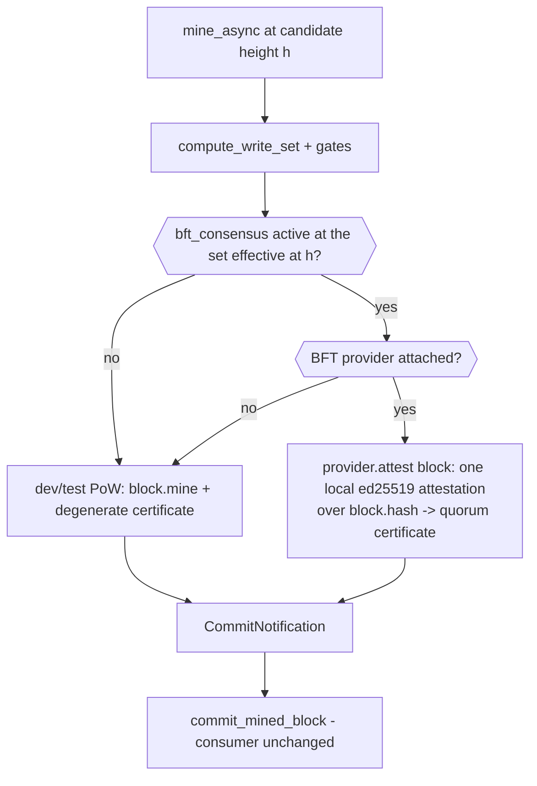

# Consensus — GlassChain

**What runs today, what is staged, and what is planned.** Written against the
shipped code at `main` (`fed76c7`), not against the ADR plan. Consensus is the
module where this repo has repeatedly burned itself by describing target state
as current state (ticket #42 review), so every claim below is verified against
source. Where something is staged, default-off, or gated, this document says so
in the same sentence.

## Status at a glance

| Row | Status | Where |
|---|---|---|
| Proof-of-Work dev/test consensus (working default) | **SHIPPED** | `PowConsensusProvider`, `crates/glasschain-core/src/providers.rs` |
| `ConsensusProvider` seam with quorum certificates (#38) | **SHIPPED** | `providers.rs`, `crates/glasschain-core/src/consensus.rs` |
| `BftConsensusProvider` — local attest + full certificate verification | **SHIPPED but default-off** (`bft` cargo feature; single-node scope) | `crates/glasschain-core/src/bft.rs` |
| Capability-gated engine selection (`bft_consensus` asset at candidate height) | **SHIPPED** (feature-gated) | `crates/glasschain-network/src/node.rs` `mine_async` |
| Network-wide vote gathering, certificate wire transport, BFT peer admission/sync/restart | **STAGED** — ADR-010 §7 adoption-gate work | not in code |
| Malachite (or another Tendermint-class Rust engine) behind the seam | **PLANNED** | ADR-002, ADR-010 §7, `.agents/memories/bft-at-scale.md` |
| BFT in production | **BLOCKED** — four explicit adoption gates | ADR-010 §7 |

The single most important fact: **the network currently runs Proof-of-Work.
BFT is staged and default-off.** A block committed by the BFT path is final
*locally*, but no peer will accept it, it will not survive a restart, and it
cannot be synced — for concrete, enumerable reasons (Section 5).

---

## 1. The decision and why

**ADR-002 (resolved 2026-08-20) selects Tendermint/CometBFT-class BFT. This is
settled. Do not re-propose PoW, Raft, or a finality gadget.** The decision was
driven by two requirement-owner answers:

1. **Zero trust is literal.** Every member organization operates a validator —
   commercial rivals included — so censorship or reordering by a validator must
   be defeated by the protocol, not by off-chain recourse. That eliminates Raft
   (crash-fault only) and PoW (no deterministic finality), leaving BFT.
2. **§8.2's "immediate" is literal.** The requirement is "immediate,
   deterministic transaction finality (preventing chain forks)": a block must be
   final *at the moment it commits*, not one quorum-round later. This is what
   rejected:
   - **Option A — keep PoW:** probabilistic finality. No amount of difficulty
     tuning makes it deterministic. Retained only as the dev/test
     implementation (Section 2), never as a production option.
   - **Option D — Thor-style finality gadget over production:** finality *lags*
     production by a quorum round; forks still form below the finality
     threshold and are resolved afterwards. The ledger would be fork-*tolerant*,
     not fork-*preventing*. "Immediate" literal is disqualifying. Applied
     literally to GlassChain the option is doubly bad: thor's production layer
     is PoA, GlassChain's is PoW, so "just add a justifier" is really two
     changes (replace PoW with PoA, *then* add the gadget).

Other rejected families recorded in ADR-002's grilling: **FBA (Stellar/SCP)** —
sacrifices liveness under partition (a halted ledger during a recall is
unacceptable) and safety depends on hand-maintained quorum-slice intersection
across 200+ orgs; **classic aBFT (Hashgraph, HoneyBadger)** — fixed known
validator sets with no production evidence at 200+; **FBA-edge + aBFT-core
hybrid** — solves an open-membership problem GlassChain does not have
(membership is permissioned) and contradicts full participation.

The chosen profile, settled: **Tendermint-class, partially synchronous
(safety independent of timing; liveness needs timeouts tuned for WAN), full
participation by every member org, permissioned-only in v1, 200+ validators,
seconds-level blocks, one globally ordered chain.** The validator-set family
supports per-height set changes, so bounding the set later (ADR-004) is
configuration, not redesign.

See [`docs/adr/adr-002-consensus-finality.md`](adr/adr-002-consensus-finality.md)
for the full record, including its open questions (voting power, validator-set
churn mechanics) — both are still unowned and are where the legitimacy risk
actually lives.

---

## 2. What actually runs today

### 2.1 Proof-of-Work is the working default

`Ledger` mines blocks with a SHA-256 hash that must start with `difficulty`
leading zero characters (`DEFAULT_DIFFICULTY = 2`,
`crates/glasschain-core/src/ledger.rs`; `Block::mine`, `has_valid_pow` in
`crates/glasschain-core/src/block.rs`). The consensus seam's provider is
`PowConsensusProvider` (`crates/glasschain-core/src/providers.rs`):

- `propose_block` mines a nonce and returns the block plus a **degenerate**
  quorum certificate — `PoW`'s "attestation" is the valid nonce carried by the
  block itself, so the certificate's attestation set is empty
  (`QuorumCertificate::pow`).
- `validate_block` checks chain linkage *and* `has_valid_pow(difficulty)`.
- `name()` returns `"proof-of-work"`.

This supplier survives deliberately: ADR-002's consequence explicitly retains
PoW as a second implementation so the seam is proven by more than one engine
(same pattern as Fabric's etcdraft+smartbft, Corda's multiple notaries, Thor's
PoA v1/v2). PoW is a dev/test driver, **not** a production option.

### 2.2 The staged BFT provider: live in code, off by default

`BftConsensusProvider` lives in `crates/glasschain-core/src/bft.rs`, compiled
only under the **`bft` cargo feature, default-off**:

- `crates/glasschain-core/Cargo.toml`: `bft = ["dep:ed25519-dalek"]`
  (`default = []`). The feature pulls `ed25519-dalek` for real signatures.
- `crates/glasschain-network/Cargo.toml`: `bft = ["glasschain-core/bft"]`
  forwards it so the node can attach the provider.

The module doc (bft.rs) is explicit about the staged scope:

> Staged scope: `attest` signs with the local key, so a produced certificate
> carries exactly one attestation — a 1-validator set is its own quorum.
> Gathering attestations from remote validators over the network, wire
> transport of certificates, and commit-path certificate verification for
> received/synced blocks are the explicit ADR-010 testnet adoption gates, not
> part of this delivery.

**`attest(block)` produces ONE local ed25519 attestation.** It signs
`block.hash` with the provider's local `SigningKey`, wraps that single
`Attestation` in a `QuorumCertificate`, and returns the `CommitNotification`.
There is **no network vote gathering and no "gathering attestations from the
configured validator set"** — the README once claimed that and it is false (it
was the #42 review's hard finding). The `ponytail:` comment at bft.rs:96 states
it plainly:

```rust
// ponytail: single local attestation; a 1-validator set is its own
// quorum. Multi-validator vote gathering over the network is the
// ADR-010 testnet adoption gate — add a round driver there.
```

The quorum math makes the pun concrete: `quorum() = n*2/3 + 1` (integer
division), so a one-validator set needs 1 attestation (its own), a
three-validator set needs 3, a four-validator set needs 3.

**`verify_certificate` IS the real verification function.** It is production
quality in the sense that it is the actual ⅔+-distinct-validator check, and it
fails closed:

1. Structural check via `QuorumCertificate::validate(block)` (index and hash
   must match the block; attestations must be well-formed — non-empty
   validator, 32-byte key, 64-byte signature).
2. Rejects any **degenerate** (empty) certificate — `PoW` certificates are not
   final under BFT.
3. For every attestation: the public key must belong to a **configured
   validator** (unknown validators are rejected, fail-closed), the key must
   parse as a valid ed25519 `VerifyingKey`, and the signature must verify
   **over `block.hash`**.
4. Validator keys are collected into a **`HashSet`**, so duplicate attestations
   never inflate the count; the distinct count must reach `quorum()`.

The honest caveat is *where* `verify_certificate` runs: **not on any wire or
commit path.** `ConsensusProvider::validate_block` receives no certificate (the
seam hands it a bare block), so the BFT provider's `validate_block`
(bft.rs:180) only does the structural chain check (`block.chains_to(previous)`).
`verify_certificate` is exercised by the unit tests in bft.rs and by the
node-level finality scenario `crates/glasschain-network/tests/bft_finality.rs` —
nothing else calls it yet.

### 2.3 The engine-switch invariant

Whatever the engine, the commit consumer is identical: a `CommitNotification`
carrying a `QuorumCertificate`. BFT blocks are **not PoW-mined** — the BFT
invariant is "the nonce stays 0", not "the hash lacks a PoW prefix" (a hash can
start with `0` by chance; see `bft_finality.rs:119`).

---

## 3. The `ConsensusProvider` seam

Defined in `crates/glasschain-core/src/providers.rs`:

```rust
pub trait ConsensusProvider: Send + Sync {
    fn propose_block(&self, index: u64, transactions: Vec<Transaction>,
                     previous: &Block) -> Result<CommitNotification, CoreError>;
    fn validate_block(&self, block: &Block, previous: &Block) -> Result<(), CoreError>;
    fn name(&self) -> &str;
}
```

And the certificate types in `crates/glasschain-core/src/consensus.rs`:

- `Attestation { validator: String, public_key: Vec<u8>, signature: Vec<u8> }`
  — one validator's ed25519 signature over the block hash.
- `QuorumCertificate { block_index, block_hash, attestations }` — the ADR-002
  attestation set. `pow(block)` builds the degenerate (`attestations: []`)
  certificate; `is_degenerate()` detects it; `validate(block)` checks structural
  well-formedness / index / hash match.
- `CommitNotification { block, certificate }` — the unit every commit consumer
  receives: "the committed block plus the `QuorumCertificate` attesting it. No
  consumer may depend on 'the leader said so'."

### How a block commits

There are three commit paths in `crates/glasschain-network/src/node.rs`:



1. **Local mining** (`mine_async`): attested/mined block → `commit_mined_block`
   (re-validates canonical records, capability activations, and policy updates
   under the sets effective at that height) → `after_block_commit` persists via
   `storage.apply_block` and mirrors the world-state cache → the event bus
   carries the certificate on `NodeEvent::BlockMined`. The broadcast to peers is
   `Message::Block(block)` — **the certificate never leaves the local event
   bus**, because there is no certificate transport on the wire yet.
2. **Peer block admission** (`Message::Block`): chains-to + `has_valid_pow` +
   capability-history check → endorsement enforcement → `append_peer_block`
   (atomic re-check + push) → `after_block_commit` → the receiving node
   **derives and validates the degenerate PoW certificate itself**
   (`QuorumCertificate::pow`), emitted as `NodeEvent::BlockReceived`.
   BFT-attested blocks are not admissible here yet (Section 5).
3. **Chain sync** (`Message::RequestChain` / `Message::Chain`): the candidate
   chain is endorsement-checked whole, then adopted via
   `Ledger::try_replace_chain`, persisted block-by-block, and every adopted
   block is re-emitted with a degenerate PoW certificate. Certificate replay on
   sync is adoption-gate work (Section 5).

### What the quorum-certificate work retired (#38)

With the seam carrying certificates, the manual fork machinery was removed:

- **`MineBlock` RPC — retired.** The proto
  (`crates/glasschain-rpc/proto/glasschain/v1/glasschain.proto`) now defines
  only `GetNodeStatus` and `GetPeers` on `NodeService`; there is no `MineBlock`
  RPC. (One stale row listing `MineBlock` remains in `PLUGIN_KIT.md`'s gRPC
  table — flagged here for cleanup; it is not in the proto.)
- **`mine` / `mine-async` REPL commands — retired.** Block production is
  consensus-driven, not manual; the dev/test driver remains programmatic as
  `Node::mine()` / `Node::mine_async()`.
- **The fork-following test was retired.** `test_concurrent_mining_longest_chain_wins`
  (which asserted that concurrent mining forks and the longest chain wins) is
  gone. The madsim chaos suite
  (`crates/glasschain-network/tests/madsim_chaos.rs`) now asserts the **no-fork
  model**: commits are final at commit and carry certificates, and joining nodes
  *converge* — "convergence is liveness, not fork resolution"
  (`test_madsim_partition_reference_implementation`, madsim_chaos.rs:627).

One nuance worth being precise about: `Ledger::try_replace_chain` still exists
and is still the sync-admission path (a longer candidate chain can replace the
local one wholesale). What was retired is fork resolution *as a consensus
property* — the concurrent-mining fork test and the manual mining commands.
`try_replace_chain` remains **PoW-coupled** and is one of the adoption gates
(Section 5).

---

## 4. Capability-gated engine selection (ADR-010)

Consensus-visible behavior changes only through the **network-wide committed
capability set** — never through a local flag. The model, from
`crates/glasschain-core/src/capability.rs` and ADR-010:

- A `CapabilityActivation` is a signed, append-only control-plane record naming
  a capability's immutable `(id, version, hash)` identity and a **strictly
  future** activation height. Validated under the set active *before* the
  transition; the new set starts exactly at the declared height and never
  changes rules midway through its own block.
- Historical validation is **height-based**: validation selects the set
  effective at each block's height, so old blocks keep their meaning, and replay
  derives the same history from committed blocks.
- `bft_consensus` (`BFT_CONSENSUS_CAPABILITY_ID`) is registered in
  `CAPABILITY_V1` but is **not** in `GENESIS_CAPABILITIES` — dormant from
  genesis until an activation record is committed.
- Peers advertise supported capabilities in the `Hello` handshake
  (`CapabilityAdvertisement`); a peer that cannot support the active set is
  **downgraded to a read-only observer** — it may parse and validate history but
  may not propose, vote, or relay active writes. `is_read_only` peers are
  rejected at transaction and block admission and excluded from relay targets.

### Engine selection in `mine_async`

`crates/glasschain-network/src/node.rs` (`mine_async`, feature-gated):



Concretely (node.rs:1483-1513):

- Under `#[cfg(feature = "bft")]`, the node rebuilds the capability history from
  its chain and checks
  `history.effective_set(index).is_active(BFT_CONSENSUS_CAPABILITY_ID)`. If the
  capability is active *and* a provider is attached, it calls
  `provider.attest(block)`; otherwise `block.mine(difficulty)` runs and the
  degenerate PoW certificate is used.
- If the capability history is somehow invalid, BFT **stays dormant**
  (`log::warn!("Capability history invalid at height {index}; BFT stays
  dormant: {e}")`) — it degrades to PoW rather than guessing.
- Without the `bft` feature the BFT branch does not compile; the PoW path is
  unconditional.
- `set_bft_consensus(provider)` (node.rs:1092, also `#[cfg(feature = "bft")]`)
  attaches the provider to `NodeState.consensus`. Attaching a provider before
  the capability activates is legal and tested: the engine stays PoW until the
  declared height, producing a single tip across the engine swap
  (`bft_finality.rs` asserts exactly this).

The activation record that flips the engine is itself a committed
transaction — in `bft_finality.rs` the harness submits a `CapabilityActivation`
for `bft_consensus` at height 2 in block 1, and block 2 onward carries real
certificates; every block stays strictly chained (no fork across the swap).
Note the governance subtlety from ADR-010 §4: activation must be authorized
under the network's governance policy, and in v1 (every member is a validator)
the electorate and validator set coincide. The activation `signatures` field is
currently **presence-only** (see the `ponytail:` note at capability.rs:116 —
binding them to MSP keys needs its own decision), so a real network activation
needs governance work that does not exist yet.

---

## 5. The adoption gates — critical section

**BFT is not production-ready, and the reasons are specific and enumerable.**
Enabling the `bft` feature today gives you a node that can locally attest and
locally verify certificates — and nothing else. Every network-facing path is
still PoW-coupled. These are verified in `crates/glasschain-network/src/node.rs`
and `crates/glasschain-core/src/ledger.rs`:

| # | Gate | Verified in source | Consequence today |
|---|---|---|---|
| 1 | Peer `Message::Block` admission still requires `has_valid_pow` | node.rs:2643-2646 — `block.chains_to(prev).is_ok() && block.has_valid_pow(diff) && capability-history ok` | A BFT-attested block broadcast to peers is **rejected** as invalid (unless its hash happens to satisfy PoW, in which case the PoW path accepts it and derives a degenerate certificate). Comment at node.rs:2693-2699: "BFT-attested blocks are not admissible here yet: certificate wire transport and peer-path quorum verification are ADR-010 adoption-gate work." |
| 2 | `try_replace_chain` (sync) is PoW-coupled | ledger.rs:246-291 — every candidate block must pass `has_valid_pow(self.difficulty)`, genesis included | A BFT chain cannot be synced to a joining node. Comment at node.rs:2745-2749: certificates are not persisted with blocks yet; BFT certificate replay on sync is adoption-gate work. |
| 3 | `restore_ledger` / `validate_chain` (restart) are PoW-coupled | node.rs:524-530 (`chain[0].has_valid_pow(difficulty)` and every window `w[1].chains_to(&w[0]).is_ok() && w[1].has_valid_pow(difficulty)`); ledger.rs:211-242 | A node whose persisted chain contains BFT-attested blocks fails restart validation and **falls back to a fresh empty ledger** ("Stored chain failed validation; starting fresh") — BFT-held state is silently dropped on restart today. |
| 4 | Quorum certificates are **not persisted with blocks** | `StorageProvider::put_block(&Block)` / `apply_block(&Block)` take only the block (providers.rs); the sync path calls `storage.put_block(block)` (node.rs:2739); `mine_async`'s event carries the certificate but storage never sees it | There is nowhere for a certificate to be replayed from — this is why gates 2 and 3 cannot verify BFT blocks after the fact. |
| 5 | `verify_certificate` runs nowhere on a wire or commit path | Called only in bft.rs unit tests and the `bft_finality.rs` scenario | A receiving node has nothing to check and no certificate to check with, even if gate 1 were relaxed. |

So, operationally: a BFT-attested block is final only in the memory of the node
that produced it. It is rejected by peers, cannot be synced, and vanishes on
restart.

### The four ADR-010 §7 adoption gates

Beyond the code-level gates above, ADR-010 §7 requires four things before BFT
can be adopted in production. For someone considering enabling the feature, this
is what each one means:

1. **A GlassChain testnet at the target validator count (200/300) running the
   compact ADR-010 §7 workload.** This is the *sizing* gate: it replaces every
   extrapolated number (Section 7) with measured commit latency, block size, and
   the O(n²) vote-gossip ceiling at the real count. The in-process capacity gate
   (Section 7) is explicitly **not** a substitute — it measures no vote gossip.
   Removing this gate means claiming a production capacity number no one has
   measured.
2. **API and stability evidence.** Malachite (or whichever engine lands) must
   cross a stable, non-alpha release with a stable engine/ABCI API before the
   highest-stakes component of the system depends on it. Pre-1.0 API churn is
   expected breakage against an engine still moving.
3. **Licensing and stewardship review.** Malachite is Apache-2.0 but its
   maintainers moved to Circle, which is building a competing L1 ("Arc") — a
   vendor-custody risk. The review must conclude the dependency can be
   self-maintained if abandoned or forked in an unwanted direction.
4. **A security audit.** Malachite's README says it is alpha and "has not been
   externally audited". A consensus bug is catastrophic and hard to test out;
   this gate exists precisely because of that asymmetry.

ADR-010 also fixes what "enable the feature" *should* look like: a committed,
governance-authorized `CapabilityActivation` at a future height — never an
operator-only CLI switch, and never a silent local flag.

---

## 6. Scale and the membership ladder

### 6.1 The topology decision (ADR-004)

ADR-004 settles the scale model: **one globally ordered core chain, no
execution sharding.** Raw events live off-chain (ADR-003 PDCs and counterparty
infrastructure); the chain carries commitments (Merkle root + MSP
multi-signatures), public custody facts, NF-e hashes, certification/audit
anchors, and explicitly public write sets. On-chain load is commitments, not
events (~2k events/s at 70M entities becomes tens of commitments/s after
aggregation).

The membership ladder: every member is MSP-identified; members who operate
validators vote, the rest are **authenticated light clients**. Full
participation holds while the validator count is within the practical BFT
ceiling (**~300**); beyond it the validator set is a **bounded institutional
set**. Identity is a **hierarchical MSP** (consortium root CA in v1,
intermediate CAs — banks, cooperatives, ERP vendors — delegate issuance;
ICP-Brasil e-CNPJ/e-CPF certificates are onboarding credentials, not the
ledger's root of trust). The consensus family is unchanged at every rung:
bounding the set is configuration, not redesign.

### 6.2 "Validate" means four different things

From `.agents/memories/participation-model.md` — the key conceptual point,
rediscovered by three separate design passes, each of which first converged on
a wrong "tiers" model:

| Sense | What it is | Cost shape | Who |
|---|---|---|---|
| **Propose** | Choose the contents and order of a block | 1 node per height | rotating proposer |
| **Vote** | Cast prevote/precommit counted toward the ⅔+ quorum that finalizes a block | **O(n²)** — all-to-all gossip | the (bounded) validator set |
| **Verify** | Independently recheck a block: signatures, hashes, policies, schema, state transition | **O(block)** per node, purely local | anyone holding the data |
| **Endorse** | Sign that a specific business transaction is authorized (ADR-008) | per-transaction | **every member org** |

These are **overlapping roles, not tiers.** A validating cooperative is
simultaneously proposer, voter, verifier, and endorser; a smallholder is an
endorser and optionally a verifier. Every member sits in the same *Endorse*
column — the one that authorizes business. Governance standing attaches to
membership, never to validation; validating confers no read access, no write
authorization, and no fee advantage.

**Voting is the only bounded role, but *why* it is bounded depends on which
question you are asking.** Two different arguments get conflated here, and only
one of them is about the number 300.

**Why voting can't be universal: liveness.** Tendermint-class BFT needs **⅔+ of
the validator set online and responsive to commit anything**. If every member
were a voter, a third of members being offline would halt the chain — and at the
70M-entity horizon, with Tier-3 smallholders transacting from phones, a third
offline is the normal state of the world. Universal voting is self-defeating: the
standard fix is jailing absent validators, and evicting the absent *is* the split
it was meant to avoid. Bounding the set is a liveness requirement, not an
exclusion mechanism. This argument is a correctness argument rather than a budget
one, which is why it beats the O(n²) cost argument for *this* question.

**Why the bound sits near 300 is a different question, and liveness does not
answer it.** Among institutional validators, per-node offline probability is well
under ⅓, and Chernoff makes a ⅔ quorum *easier* to reach as `n` grows. The real
bounds there are **correlated failure** (one BGP event or cloud region takes many
orgs at once — quorum availability tracks the min-cut of correlated sets, not the
organization count), **heavy-tailed latency** (the round timeout tracks the ⅔n-th
order statistic, growing roughly as `n^(1/α)` under Pareto tails), **governance**,
and — for CometBFT's all-to-all gossip specifically — **O(n²) bytes per round**,
which is a genuine wall, just further out than 300. Reaching 300 *reliably* is
therefore liveness engineering (provider and geographic diversity requirements,
per-org SLA expectations, monitored participation rates), not protocol work.

Two corollaries worth keeping straight:

- **Signature aggregation (BLS) does not escape the bound** — but it is the
  highest-value optimization *below* it. It creates aggregators (a *tier* under a
  new name), does not deliver single-slot finality (Ethereum finalizes in ~2
  epochs via committee sampling — the sortition ADR-002 rejected), is a primitive
  swap away from the pinned ed25519, and does nothing for the liveness threshold.
  None of that makes it unattractive: the quorum certificate lands in every block
  forever and in every light-client proof, and BLS collapses ~79 KB to ~0.15 KB
  while turning 201 verifications into one. See §10 — it is ADR-004's ladder, not
  round latency, that pays for certificate size.
- **A light client is not a verifying member.** A light client takes validity
  on trust from the quorum's signatures; it cannot detect an invalid state
  transition because it does not hold the state. "Light clients can publish
  fraud proofs" is a claim that has been asserted and is false — only full nodes
  can.

Per ADR-002, the validator set orders blocks and nothing more: it cannot read a
private payload (PDC membership, ADR-003), cannot authorize a business change
(ADR-008 endorsement — colluding validators still cannot manufacture a custody
transfer), and must not carry governance standing or settlement privilege.
Every design pass that collapsed these axes produced a wrong answer; keep them
separate.

---

## 7. Measured evidence

### 7.1 The capacity gate (ticket #48)

`crates/glasschain-network/tests/consensus_capacity.rs` is the committed
capacity harness; results recorded in
[`docs/benchmarks/consensus-capacity.md`](benchmarks/consensus-capacity.md)
(gate executed 2026-09-01, in-process; reproduce with
`cargo test -p glasschain-network --test consensus_capacity -- --ignored --nocapture`).

Method: **star topology** (every validator dials the mining leader;
200 validators = 133 connected + 67 partitioned; 300 = 200 connected + 100
partitioned); the compact ADR-010 §7 workload (20 canonical records per round —
anchored lots, `state_commitment` batch anchors, certification anchors — mined
per round, 10 rounds); metrics for submit/mine latency, serialized block size,
certificate size, pending-pool depth at mine, propagation fan-out, partition
recovery, and separate PDC dissemination.

| Metric | 200 validators | 300 validators |
|---|---|---|
| Leader mine/commit latency | p50 **36 ms**, p95 **113 ms** | p50 **33 ms**, p95 **148 ms** |
| Block size (20 compact records) | **11 567 B** avg | **11 567 B** avg |
| Quorum certificate size | **115 B** (degenerate PoW attestation) | **115 B** (degenerate PoW attestation) |
| Pending-pool depth at mine | 20 | 20 |
| Fan-out to 100% of connected | median **0 ms** | median **11 ms** |
| Partition recovery | **1 257 ms** (67 join) | **1 717 ms** (100 join) |
| PDC dissemination (every 10th member) | **73.5 ms**, 20/20 | **102.6 ms**, 30/30 |

**Certificate honesty — read this carefully.** The measured 115 B certificate
is the **degenerate PoW attestation (empty attestation set)**. The staged BFT
engine's real one-attestation certificate measures **508 B leader-side** (a
variant run, from the local `BlockMined` event). The mesh validators run PoW
admission, so a BFT-attested mesh measurement requires the ADR-010 adoption-gate
peer work and was not attempted. There are **no vote-gossip claims here or
anywhere**: the "vote traffic" proxy is per-block certificate size, **not**
gossip bandwidth. No cross-validator vote rounds exist to measure. Do not cite
these numbers as BFT network capacity.

**Nor as BFT finality latency.** The mine/commit row above is *Proof-of-Work mine
latency on the dev/test engine* — it contains no attestation round, no vote, and
no quorum. It is not a lower bound, an upper bound, or an estimate of BFT
finality. Producing a real finality measurement is step 0 of §10.4, and it is
blocking for every performance claim in this document.

The evidence doc's own scoping caveats: recovery models an application-layer
partition (validators that never dialed join late), not severed TCP sessions;
no WAN delay is injected; and **no production capacity claim is made or
implied** — this gate evidences that the compact workload executes and converges
at 200/300 in-process validators with the stated engine.

**The fan-out thresholds measure the harness, not the network.** The three polls
are sequential with independent start times, and each sweeps every connected
validator taking a lock on its ledger before sleeping 20 ms — so the 50% poll
absorbs the lock contention from ongoing commit work while the later polls find
the block already delivered. The raw output shows it: the 50% column grows
496 → 16 354 ms across nine rounds while the 100% column stays at 0–98 ms in the
same rounds, which cannot describe propagation. Cite the recovery-convergence
figure instead, and see §10.5 — fixing this instrument is a prerequisite for the
finality measurement that §10.4 step 0 calls for.

### 7.2 External production data point

From `.agents/memories/bft-at-scale.md` (live primary data): **Cosmos Hub ran
200 bonded validators at ≈ 5.5–5.6 s blocks** when read on 2026-08-24 — the
largest continuously running Tendermint/CometBFT production deployment, and the
strongest production data point for the 200-validator target. **Re-read
2026-09-02, `max_validators` is `180`**: the cap moved *down*. It is
demand-limited, not a stress test, so it demonstrates feasibility, not a ceiling
— but note that the largest production deployment shrank rather than grew.

**No public benchmark exists at 180–300 validators for any Tendermint-class
engine** — the "10k TPS" CometBFT README figure has no disclosed methodology or
validator count, and Malachite's ~50k tps is an extrapolation from ~13.5 MB/s at
100 validators in unpublished experiments. Every number in that range is
extrapolation until GlassChain's own testnet (ADR-010 §7 gate 1) measures it.

---

## 8. Rejected alternatives — do not re-propose

Each of these was evaluated against primary sources and rejected for a recorded
reason (ADR-002, `.agents/memories/bft-at-scale.md`,
`.agents/memories/external-review-verdicts.md`). Reopening one requires
reopening the ADR, not a sidebar comment.

| Alternative | Why rejected |
|---|---|
| **Keep PoW** (Option A) | Probabilistic finality — fails §8.2's immediate, deterministic finality. Retained only as the dev/test engine. |
| **Raft / CFT** (Option B) | Validators must be trusted not to misbehave; the validator set includes commercial rivals by design (zero trust), so a crash-fault-only protocol is out. |
| **Thor-style finality gadget over production** (Option D) | Finality lags production by a quorum round — "immediate" is literal. Forks still form below the threshold; the ledger would be fork-tolerant, not fork-preventing. |
| **FBA (Stellar/SCP)** | Liveness sacrificed under partition (a halted ledger during a recall is unacceptable, §5.2); safety depends on hand-maintained quorum-slice intersection across 200+ orgs. |
| **Classic aBFT (Hashgraph, HoneyBadgerBFT)** | Fixed known validator sets; no production evidence at 200+ (largest deployments ≤ ~40–100). |
| **FBA-edge + aBFT-core tiered hybrid** | Its edge solves an open-membership problem GlassChain does not have (permissioned); the bounded anchor core contradicts full participation. |
| **Algorand VRF sortition / committee sampling** | Random subset actually votes — contradicts full participation; samples members who are not validators into agreement roles. |
| **DAG-BFT as a family swap (Narwhal/Bullshark/Mysticeti)** | *Narwhal is a mempool layer*, not an ordering family: it composes with partial-sync BFT ordering (Narwhal–HotStuff) and could sit *behind* `ConsensusProvider` — orthogonal to the family decision, and carried as step 6 of §10.4 under a measured trigger. Bullshark/Mysticeti *are* DAG-order family changes, and there is **no reusable standalone Rust crate**: Sui's is monorepo-embedded (`consensus/core` is Sui-coupled), and `MystenLabs/narwhal` / `facebookresearch/narwhal` are archived. |
| **HotStuff-1 / SBFT fast paths** | In-family speculative latency optimizations, ADR-preserving — not a family swap, and **not rejected**: they are step 5 of the performance path in §10.4, sequenced behind measurement and the wire encoding. SBFT was geo-deployed at 209 replicas (f=64) at ~2× PBFT throughput — evidence *for* the validator ceiling, not against the family. |
| **Channel/sub-ledger sharding, regional chains, local-first consensus** | A recall must be traversable by parties who were never counterparties, and supply chains are inherently cross-region — nearly every transaction worth ordering is a cross-shard transfer, so sharding buys almost nothing and puts the hard problem in the safety-critical path. Channels remain the *privacy* boundary, a different axis. |

The one concept that keeps recurring under new names — "transition towards a
leaderless or optimistic fast-path consensus" — was assessed in the external
review and is **not** an ADR revision: fast paths are latency optimizations
within the settled family (§10.4), and DAG-based ordering is the
mempool-vs-family distinction above.

---

## 9. Implementation path

From `.agents/memories/bft-at-scale.md` (wayfinder #23) and ADR-010 §7:

- **Malachite is the only serious Rust Tendermint-class engine** — the natural
  successor/peer of CometBFT (same Informal Systems lineage), which matters
  because it produces exactly what the ADR-002 seam wants: a real quorum
  certificate, and it supports per-height validator-set changes.
- Its state, verified 2026-08-24 and confirmed 2026-09-02: **v0.5.0,
  alpha, not externally audited**, last commit 2025-10-21, and the project has
  moved under **Circle**, which is building a competing L1 ("Arc") — hence the
  stewardship review gate.
- `tendermint-rs` is **not** an engine — it is the client/light-client/ABCI
  toolkit (Hermes/IBC relayer lineage). Trying to "integrate tendermint-rs as
  `ConsensusProvider`" is a category error; its real role is complementary types
  and light-client tooling once GlassChain speaks Tendermint wire types.

**The plan is to integrate Malachite behind `ConsensusProvider` as a staged,
default-off path while retaining PoW** (mirroring how `BftConsensusProvider`
already sits behind the seam today). The go/no-go gate: adopt once Malachite is
audited and crosses a stable (non-alpha) release, and once Circle's stewardship
is judged acceptable. If the gate fails, the fallback is to **build-own** a
Tendermint-class engine on `tendermint-rs` types + Malachite's public spec —
the seam makes that a contained swap, not a rewrite. Either way, network-wide
adoption additionally requires the four ADR-010 §7 gates (Section 5):
GlassChain's own 200/300-validator testnet with the compact workload, API and
stability evidence, licensing/stewardship review, and a security audit.

`GlassChain/protocol.rs` comment notes the wire protocol is currently
`glasschain/4`; the `/2` bump marked the BFT consensus seam. The seam itself is
feature-gated (`glasschain-core/bft`, default-off), so both feature
configurations stay green in CI — BFT ships behind the same default-off
discipline it will be adopted under.

---

## 10. Performance — the target, the baseline, and the ordered path

Latency and scalability are **sell factors**: GlassChain should be best-in-class
on both, subject to zero trust between validators, Brazilian legal compliance,
and ICP-Brasil interoperability. Full plan:
[`.agents/plans/performance.md`](../.agents/plans/performance.md)
([#62](https://github.com/dbbvitor/GlassChain/issues/62)).

### 10.0 The class we compete in — and the baseline we lack

**On scalability our peers are Fabric and Corda, and the constraint is the
advantage.** Fabric's default ordering service is Raft — crash-fault-tolerant
only, which assumes orderers do not lie, exactly the assumption a consortium of
commercial rivals cannot make. Ordering sets in both Fabric and Corda are
typically a handful of nodes. So the claim is not "limited to 300 validators" but
**300 mutually-distrusting validators with deterministic finality, plus an
authenticated light-client ladder to the 70M-participant horizon** — a
scalability claim our zero-trust constraint *creates*.

**On latency the bar is sub-second, and it is reachable inside ADR-002's
family.** The in-family datum is Malachite's own experiments: **~780 ms
finalization at 100 validators with 1 MB blocks** (§7.2). Our blocks are 11.5 KB.
No family swap is needed to be best in class.

**But there is currently no latency evidence for the real consensus path.**
§7.1's benchmark measures the dev/test **Proof-of-Work** engine: the p50 33–36 ms
figure is *mine* latency, the certificate is the degenerate 115 B PoW attestation,
and in that document's own words "**no cross-validator vote rounds exist to
measure**." It is an honest capacity and convergence gate; it is not a BFT
latency benchmark. Until a harness drives real attestation rounds, every
performance claim below is a projection.

### 10.1 What the constraints permit and forbid

Worth stating precisely, because "zero trust" and "ICP compliance" are usually
invoked to forbid things they do not actually forbid.

| Constraint | Forbids | Permits |
|---|---|---|
| **Zero trust** | Raft/CFT ordering; accepting a leader's aggregate unverified; skipping verification on a received commit | Batch signature verification *with a sequential fallback for attribution*; BLS aggregation; separating dissemination from ordering |
| **ICP-Brasil / MP 2.200-2** | Anything on the consensus hot path | ICP-Brasil as an **onboarding and attestation credential** — Art. 10 §2º expressly preserves other means "desde que admitido pelas partes" |
| **LGPD** | PII on-chain | Everything we already do — and it *helps* latency, since commitment-only blocks are small |

**The load-bearing rule:** ICP-Brasil certificates are RSA X.509 with revocation
semantics, and revocation checking (OCSP/CRL) is a **network round trip**. Either
on the block path would cost more than every optimization here saves. Keep
ICP-Brasil at the identity boundary; the hot path stays ed25519. Compliance and
speed are compatible *only if that boundary holds*.

### 10.2 Why no optimization raises the validator ceiling

The evidence is empirical: **no production system runs deterministic per-round ⅔
finality with all `n` participating beyond roughly 209.** Every larger network got
there by *not having all `n` vote every round*.

| Network | n | How it gets there |
|---|---|---|
| Cosmos Hub | 180 (live, 2026-09-02) | It doesn't — hard `max_validators` cap |
| SBFT (published evaluation) | 209, f=64 | Leader + collectors + threshold sigs + fast path |
| Aptos | ~130 | Jolteon/Jellyfish (HotStuff-class) |
| Sui | ~100–160 | Narwhal → Mysticeti DAG |
| Polkadot / Kusama | ~297 / ~1000 | **GRANDPA is a separate finality gadget with coarse rounds**, decoupled from block production |
| Ethereum | ~1M | **Committee sampling** (~128×64 per slot) + per-committee BLS |
| Algorand | ~10k | **VRF-sampled committee** per step |
| Avalanche / Solana | ~1.6k / ~3.4k | Subsampling; **non-deterministic finality** |

Everything above ~300 bought its `n` by changing the participation model or
weakening finality — both already ruled out in §8.

The conclusion to draw is **not** "stop optimizing." It is that **`n` is the
wrong axis to sell on.** Nobody buys a supply-chain ledger because it has 1,000
validators; they buy finality latency, throughput, and the number of participants
who can verify. Validator count is an input to trust, not a performance metric —
and at 300 mutually-distrusting validators the trust argument is already won
(§10.0). Compete on latency, throughput, and ladder reach; treat 300 as the
designed operating point.

### 10.3 The wire protocol is JSON — the biggest structural tax

Every peer message and every gossipsub payload is `serde_json`
(`crates/glasschain-network/src/peer.rs`, `libp2p_swarm.rs`). Two costs: bytes on
the wire, and encode/decode CPU on every hop.

The pathological case is byte arrays. `serde_json` renders `Vec<u8>` as an array
of decimal numbers, so `Attestation`'s 32-byte key plus 64-byte signature — 96
bytes — becomes roughly 393 bytes of `[12,34,255,…]`. Measured: a
one-attestation certificate is 508 B against a 115 B empty baseline. Projected to
a ⅔+ quorum (201 of 300) against a measured 11 567 B block:

| Encoding | Certificate at n=300 | vs. block | Change required |
|---|---|---|---|
| Today (JSON decimal arrays) | **~79 KB** | ~7× the block | — |
| `serde_bytes` / base64 | **~34 KB** | ~3× | A serde attribute and a wire-version bump |
| Binary codec (bincode/postcard) | ~20 KB | ~1.7× | Codec swap behind `peer.rs`; needs an ADR |
| BLS threshold signature | **~0.15 KB** | negligible | Primitive swap + DKG |

**Certificates are not persisted with blocks yet** (§5, an open ADR-010 gate), so
the format is free to change now and expensive to change once it is in committed
history and in light-client proofs. `serde_bytes` is a serde attribute and fixes
the worst of it without touching the codec; the full binary swap trades away
human-debuggable wire dumps and is a separate ADR-sized decision.

Note the re-siting: certificate size is a **storage, replay, and
light-client-proof cost**, not per-round bandwidth. In a leader-based protocol
per-round bytes are ~`n · (payload + signature)` regardless of certificate size.
That makes it matter more for ADR-004's ladder than for round latency.

### 10.4 The ordered path

The ordering is deliberate: free structural wins before sophisticated ones,
because a speculative fast path saving one network hop over a JSON wire protocol
is optimizing the wrong layer by an order of magnitude.

| # | Step | What it buys | State |
|---|---|---|---|
| 0 | **Measure real attestation rounds** | p50/p95/p99 finality at 100/200/300, and a citable competitive bar | **Blocking** — everything below is a projection without it |
| 1 | **Wire encoding** (`serde_bytes`, then a binary codec) | ~5× smaller certificates; less encode/decode CPU on every hop | Do it before certificates are persisted |
| 2 | **Batch signature verification** | ~2× on the ~10 ms spent verifying a 201-attestation quorum | Needs a sequential fallback to name the bad signer (§10.1) |
| 3 | ~~Quadratic validator lookup~~ | Removed the only quadratic term on the verification path | **Done** — `verify_certificate` now indexes the set once |
| 4 | **BLS aggregation** | O(1) certificates; one light-client verification instead of 201 | The enabler of the ladder claim. Primitive swap — sequence with/after the Malachite decision (§9). Needs an ADR |
| 5 | **Speculative fast paths** (HotStuff-1, SBFT) | Two network hops | Candidate once step 0 lands — a sub-second requirement now exists |
| 6 | **Narwhal DAG mempool** | Throughput and latency stability under load | Gated on a measured trigger: pending pool failing to drain in one round, or propagation dominating p99 |

Two honest caveats. **No Narwhal-family paper claims improved validator-count
scaling** — each block still needs 2f+1 availability votes, so the quadratic
authenticator pattern persists, just in *small* messages. And BLS **verification**
saves almost no round CPU (~1–3 ms for an aggregate versus tens of ms to
batch-verify 200 ed25519 signatures); its win is bytes, storage, and third-party
proof size.

### 10.5 Tail at scale

Assessed against the shipped code. **The built paths are structurally sound, the
dangerous one is unbuilt, and we are blind.**

- **Broadcast is tail-tolerant.** `Node::broadcast` `try_send`s into per-peer
  bounded channels, each drained by its own writer task — the broadcaster never
  awaits a peer, so one slow validator cannot stall fan-out to the rest. The cost
  is that the tail becomes *silent message loss*: a full channel logs a warning
  and drops. There is no counter and no per-peer metric, so **the straggler is
  invisible**.
- **The quorum wait does not exist yet.** Gathering attestations from remote
  validators is an ADR-010 adoption gate (§5), so the classic "wait for the 201st
  of 300" exposure is unbuilt rather than absent. Worth carrying forward: a ⅔
  quorum is *inherently a partial hedge* (you discard the slowest 99), and
  Tendermint's round timeout already **is** the hedge — the risk is re-deriving
  it badly, not omitting it.
- **One path is exposed.** `reconcile_private_payloads` picks exactly one target
  peer and fires every request at it with no timeout, retry, or failover. Small
  blast radius (an operator action), cheap fix (fan across all member peers).
  Note more generally that **there are no timeouts anywhere on the peer path**.
- **The propagation instrument measures itself** — see §7.1 and the benchmark
  document's caveat 2. Fixing it is a prerequisite for step 0 above meaning
  anything.

Full assessment and ranked actions:
[`.agents/plans/performance.md`](../.agents/plans/performance.md) §5.

### 10.6 What actually gets us to 300 reliably

Not protocol work. The bounds that bite among institutional validators are
correlated failure, heavy-tailed latency, and governance (§6.2). The work is
geographic and provider diversity requirements for the validator set, per-org SLA
expectations, and monitored participation rates — governance documentation that
belongs with the federation trust model
([#57](https://github.com/dbbvitor/GlassChain/issues/57)).

---

## References

- [`docs/adr/adr-002-consensus-finality.md`](adr/adr-002-consensus-finality.md) — the settled family decision, "immediate" ruling, rejected options.
- [`docs/adr/adr-004-scale-topology.md`](adr/adr-004-scale-topology.md) — one chain, off-chain events, membership ladder, hierarchical MSP.
- [`docs/adr/adr-010-capability-versioning-policy.md`](adr/adr-010-capability-versioning-policy.md) — the capability model and the four adoption gates (§7).
- [`docs/benchmarks/consensus-capacity.md`](benchmarks/consensus-capacity.md) — ticket #48 measured evidence, with its honest-scope caveats.
- `crates/glasschain-core/src/consensus.rs`, `bft.rs`, `block.rs`, `ledger.rs`, `capability.rs`, `providers.rs` — the seam and its implementations.
- `crates/glasschain-network/src/node.rs` — engine selection, commit paths, admission gates.
- `crates/glasschain-network/tests/bft_finality.rs`, `consensus_capacity.rs`, `madsim_chaos.rs` — the scenarios the claims above are tested against.
- [`.agents/plans/performance.md`](../.agents/plans/performance.md) — the §10 evaluation in full, with its step list and sources.
- `.agents/memories/participation-model.md`, `bft-at-scale.md`, `external-review-verdicts.md`, `debt-gap-handoff.md` — design and evidence records.

*Note: this document cross-links only files that exist at `main`.*