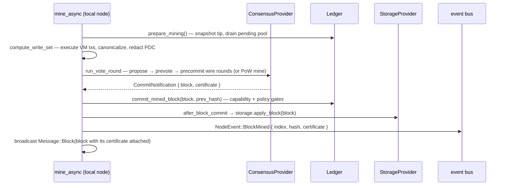

# Consensus — GlassChain

**What runs today, what is staged, and what is planned.** Written against the
shipped code at `main` (`fed76c7`), not against the ADR plan. Consensus is the
module where this repo has repeatedly burned itself by describing target state
as current state (ticket #42 review), so every claim below is verified against
source. Where something is staged, default-off, or gated, this document says so
in the same sentence.

## Status at a glance

| Row | Status | Where |
|---|---|---|
| Proof-of-Work dev/test consensus (working default) | **SHIPPED** | `PowConsensusProvider`, `crates/glasschain-core/src/providers.rs` |
| `ConsensusProvider` seam with quorum certificates (#38) | **SHIPPED** | `providers.rs`, `crates/glasschain-core/src/consensus.rs` |
| BFT: BLS vote round driver (prevote/precommit), multi-signer aggregate certificates, equivocation detection (#77) | **SHIPPED but default-off** (`bft` cargo feature) — dev/test round driver, **not an audited engine** | `crates/glasschain-core/src/bft.rs`, `crates/glasschain-network/src/rounds.rs`, node.rs `run_vote_round` |
| Capability-gated engine selection (`bft_consensus` active at the candidate height) | **SHIPPED** (feature-gated) | `crates/glasschain-network/src/node.rs` `mine_async` |
| BFT peer-block admission (certificate verified against the derived validator set) | **SHIPPED** (feature-gated; only while the capability is active) | node.rs `Message::Block` admission |
| Certificate replay on chain sync / restart — structural admission only, no aggregate verification | **STAGED** — ADR-010 §7 adoption-gate work | `Ledger::block_consensus_admissible`, `try_replace_chain` |
| Malachite (or another Tendermint-class Rust engine) behind the seam | **PLANNED** | ADR-002, ADR-010 §7, `.agents/memories/bft-at-scale.md` |
| BFT in production | **BLOCKED** — four explicit adoption gates | ADR-010 §7 |

The single most important fact: **the network currently runs Proof-of-Work.
BFT is staged and default-off.** The shipped round driver is a dev/test build:
it gathers votes and produces real multi-signer BLS certificates on the wire,
`bft`-built peers admit certificate-bearing blocks while the capability is
active, and certificate-bearing chains survive restart and sync — but the
sync/restart checks are *structural only*, the round driver is un-audited, and
production adoption still waits on the four ADR-010 §7 gates (Section 5).

---

## 1. The decision and why

**ADR-002 (resolved 2026-08-20) selects Tendermint/CometBFT-class BFT. This is
settled. Do not re-propose PoW, Raft, or a finality gadget.** The decision was
driven by two requirement-owner answers:

1. **Zero trust is literal.** Every member organization operates a validator —
   commercial rivals included — so censorship or reordering by a validator must
   be defeated by the protocol, not by off-chain recourse. That eliminates Raft
   (crash-fault only) and PoW (no deterministic finality), leaving BFT.
2. **§8.2's "immediate" is literal.** The requirement is "immediate,
   deterministic transaction finality (preventing chain forks)": a block must be
   final *at the moment it commits*, not one quorum-round later. This is what
   rejected:
   - **Option A — keep PoW:** probabilistic finality. No amount of difficulty
     tuning makes it deterministic. Retained only as the dev/test
     implementation (Section 2), never as a production option.
   - **Option D — Thor-style finality gadget over production:** finality *lags*
     production by a quorum round; forks still form below the finality
     threshold and are resolved afterwards. The ledger would be fork-*tolerant*,
     not fork-*preventing*. "Immediate" literal is disqualifying. Applied
     literally to GlassChain the option is doubly bad: thor's production layer
     is PoA, GlassChain's is PoW, so "just add a justifier" is really two
     changes (replace PoW with PoA, *then* add the gadget).

Other rejected families recorded in ADR-002's grilling: **FBA (Stellar/SCP)** —
sacrifices liveness under partition (a halted ledger during a recall is
unacceptable) and safety depends on hand-maintained quorum-slice intersection
across 200+ orgs; **classic aBFT (Hashgraph, HoneyBadger)** — fixed known
validator sets with no production evidence at 200+; **FBA-edge + aBFT-core
hybrid** — solves an open-membership problem GlassChain does not have
(membership is permissioned) and contradicts full participation.

The chosen profile, settled: **Tendermint-class, partially synchronous
(safety independent of timing; liveness needs timeouts tuned for WAN), full
participation by every member org, permissioned-only in v1, 200+ validators,
seconds-level blocks, one globally ordered chain.** The validator-set family
supports per-height set changes, so bounding the set later (ADR-004) is
configuration, not redesign.

See [`docs/adr/adr-002-consensus-finality.md`](adr/adr-002-consensus-finality.md)
for the full record, including its open questions (voting power, validator-set
churn mechanics) — both are still unowned and are where the legitimacy risk
actually lives.

---

## 2. What actually runs today

### 2.1 Proof-of-Work is the working default

`Ledger` mines blocks with a SHA-256 hash that must start with `difficulty`
leading zero characters (`DEFAULT_DIFFICULTY = 2`,
`crates/glasschain-core/src/ledger.rs`; `Block::mine`, `has_valid_pow` in
`crates/glasschain-core/src/block.rs`). The consensus seam's provider is
`PowConsensusProvider` (`crates/glasschain-core/src/providers.rs`):

- `propose_block` mines a nonce and returns the block plus a **degenerate**
  quorum certificate — `PoW`'s "attestation" is the valid nonce carried by the
  block itself, so the certificate's attestation set is empty
  (`QuorumCertificate::pow`).
- `validate_block` checks chain linkage *and* `has_valid_pow(difficulty)`.
- `name()` returns `"proof-of-work"`.

This supplier survives deliberately: ADR-002's consequence explicitly retains
PoW as a second implementation so the seam is proven by more than one engine
(same pattern as Fabric's etcdraft+smartbft, Corda's multiple notaries, Thor's
PoA v1/v2). PoW is a dev/test driver, **not** a production option.

### 2.2 The staged BFT provider: live in code, off by default

`crates/glasschain-core/src/bft.rs` (the cryptographic layer) and
`crates/glasschain-network/src/rounds.rs` + `Node::run_vote_round` (the round
driver), all compiled only under the **`bft` cargo feature, default-off**:

- `crates/glasschain-core/Cargo.toml`: `bft = ["dep:bls-signatures",
  "dep:bls12_381"]` (`default = []`) — the pure-Rust `bls-signatures`
  backend (the `blst` C backend stays out of the workspace).
- `crates/glasschain-network/Cargo.toml`: `bft = ["glasschain-core/bft"]`
  forwards it so the node can attach the provider and run the round driver.

**The BFT signature scheme is BLS12-381, not ed25519** (ADR-014). Every
validator registers a BLS key plus a proof of possession
(`ValidatorInfo { name, public_key, pop }`), and `BftConsensusProvider::new`
verifies each PoP at registration — the rogue-key defense for plain n-of-n
aggregation. Transaction and identity signatures stay ed25519; only BFT votes
and quorum certificates are BLS.

**A BFT round is Tendermint-shaped, two phases**, driven by `Node::run_vote_round`
(node.rs:2119) using the round messages in `crates/glasschain-network/src/protocol.rs`:

1. **Propose + prevote** — the round leader (deterministic round-robin,
   `rounds::proposer_index`) broadcasts `Message::Proposal { block, round }`.
   Each validator checks the candidate (chains to the local tip, capability
   rules on a scratch history, its own lock) and answers with a phase-tagged
   BLS vote (`Message::Vote`, `VotePhase::Prevote`). The leader verifies every
   vote against the derived set (`verify_vote`), then aggregates collected votes
   into a prevote `QuorumCertificate`. Duplicate-voter handling and phase
   deadlines remain explicit safety/liveness test requirements.
2. **Precommit** — the leader re-broadcasts the candidate with that prevote
   certificate (`Message::Precommit { block, round, prevote_certificate }`).
   Validators that verify the prevote quorum **lock** the hash (the
   Tendermint locking rule: a locked validator prevotes its locked hash in
   later rounds) and answer with a `VotePhase::Precommit` vote. A precommit
   quorum commits: the leader aggregates it into the final certificate and
   attaches it to the block (`block.certificate = Some(...)`) before
   `commit_mined_block`.

Vote messages are domain-separated per phase (`BftVote::vote_message`, prefix
`glasschain-bft-vote:`), so an aggregate over any phase verifies as an
ADR-014 certificate over the block hash — phase is enforced by message flow,
not by the signed bytes. On phase timeout the round increments and the proposer
rotates (view change; `rounds::MAX_ROUNDS = 4`), and the per-phase budget
scales with the set size (`rounds::phase_timeout`).

The quorum math is unchanged and concrete: `quorum() = n*2/3 + 1` (integer
division), so a one-validator set needs 1 vote, three needs 3, four needs 3.

**`attest(block)` still exists** (bft.rs) as the *single-local-signer* helper:
it signs the block hash with the provider's local key and sets exactly one
bitmap bit — the bootstrap path for a 1-validator set and the
`ConsensusProvider::propose_block` implementation. Multi-signer certificates
are the round driver's job, not `attest`'s.

**`verify_certificate` is the real verification function and it runs on wire
paths now.** It fails closed:

1. Structural check via `QuorumCertificate::validate(block)` (index and hash
   must match the block; the bitmap well-formed).
2. Rejects any **degenerate** (empty-bitmap) certificate — `PoW` certificates
   are not final under BFT.
3. The bitmap must name a **quorum of configured validators**, with no bits
   beyond the set (fail-closed on unknown validators); duplicate bits cannot
   inflate the count.
4. The one aggregate signature verifies over the block hash in a **single
   IETF `PopScheme` same-message multisig check** — `e(-g1, agg) · ∏ e(pk_i, hash) = id`
   (`verify_same_message_multisig`, bft.rs) — run as an O(quorum)-pairing
   multi-miller loop on the pure-Rust backend.

It is called by the peer `Message::Block` admission path (node.rs:3323-3330)
and by `handle_precommit` (node.rs:2692), and is exercised by the bft.rs unit
tests, `bft_finality.rs`, and the four-validator wire scenario
`crates/glasschain-network/tests/bft_vote_rounds.rs`. The one path that does
**not** cryptographically verify certificates is chain **sync** (§5, gate 2):
the ledger has no validator set, so consensus-admissibility there is structural.

**Equivocation support is partial, not established end-to-end** (#77).
`VoteReceipts` can detect two different hashes from the same key in one
`(height, round, phase)` when kept across calls, and proof/event types exist.
However, `handle_vote` creates a new tracker for each message and re-seeds only
from already-detected proofs, not ordinary prior votes. Moreover,
`BftVote::vote_message` signs the hash, **not** height/round/phase; verification
of two signatures does not authenticate their alleged shared voting context.

Context binding, bounded persistent receipt state and a real two-conflicting-vote
network regression are prerequisites to governance attribution. See
[zero-trust §8](../.agents/plans/zero-trust.md). No automatic ejection or complete
equivocation-detection guarantee is claimed.

**The validator set is on-chain state** (ADR-009/ADR-010):
`derive_validator_provider` (node.rs:2717) rebuilds the provider from
world-state entries under `ws:governance:validator-registry/<name>` (replayed
like every projection), PoP-verifies them, and falls back to the attached
provider's static set while the registry is empty (bootstrap).
`bft_vote_rounds.rs` drives four validators through a full round on the wire
and asserts a multi-signer certificate.

### 2.3 The engine-switch invariant

Whatever the engine, the commit consumer is identical: a `CommitNotification`
carrying a `QuorumCertificate`. BFT blocks are **not PoW-mined** — their
invariant is "the nonce stays 0", not "the hash lacks a PoW prefix" (a hash
can start with `0` by chance; `bft_finality.rs` asserts `block.nonce == 0` on
BFT blocks).

---

## 3. The `ConsensusProvider` seam

Defined in `crates/glasschain-core/src/providers.rs`:

```rust
pub trait ConsensusProvider: Send + Sync {
    fn propose_block(&self, index: u64, transactions: Vec<Transaction>,
                     previous: &Block) -> Result<CommitNotification, CoreError>;
    fn validate_block(&self, block: &Block, previous: &Block) -> Result<(), CoreError>;
    fn name(&self) -> &str;
}
```

And the certificate and vote types in `crates/glasschain-core/src/consensus.rs`
and `bft.rs`:

- `BftVote { height, round, phase, block_hash, public_key, signature, algorithm }`
  — one validator's BLS vote over a candidate hash, phase-tagged
  (prevote/precommit), base64 key and signature on the wire.
- `QuorumCertificate { block_index, block_hash, signers_bitmap, aggregate_signature, algorithm }`
  — the ADR-014 certificate: a signer bitmap over the validator set's canonical
  order plus one BLS12-381 aggregate signature. `pow(block)` builds the
  degenerate (`signers_bitmap: []`) Proof-of-Work certificate; `is_degenerate()`
  detects it; `validate(block)` checks structural well-formedness / index / hash match.
- `EquivocationProof { height, round, phase, public_key, first_signature, second_signature, … }`
  — two signed, distinct hashes with claimed `(height, round, phase)` context;
  authenticating that context remains a gap (bft.rs; see §2.2).
- `CommitNotification { block, certificate }` — the unit every commit consumer
  receives: "the committed block plus the `QuorumCertificate` attesting it. No
  consumer may depend on 'the leader said so'."

### How a block commits

There are three commit paths in `crates/glasschain-network/src/node.rs`:



1. **Local mining** (`mine_async`): with the `bft` feature and the capability
   active, the candidate goes through `run_vote_round` — leader proposes,
   validators prevote and precommit over the wire, and the leader attaches the
   aggregated precommit quorum to the block; otherwise PoW mining produces a
   degenerate certificate. Either way → `commit_mined_block` (re-validates
   canonical records, capability activations, and policy updates under the sets
   effective at that height) → `after_block_commit` persists via
   `storage.apply_block` and mirrors the world-state cache → the event bus
   carries the certificate on `NodeEvent::BlockMined`. The broadcast to peers is
   `Message::Block(block)` — **for BFT the certificate travels inside the
   block** (`block.certificate`), and the round messages (`Proposal`, `Vote`,
   `Precommit`) carry certificates too.
2. **Peer block admission** (`Message::Block`): chains-to + capability-history
   check; consensus admission is then feature-gated — with `bft`, a
   certificate-bearing block is verified against the derived validator set when
   the `bft_consensus` capability is active at the expected height, and PoW is
   the fallback; without `bft`, PoW only. Then endorsement enforcement →
   `append_peer_block` (atomic re-check + push) → `after_block_commit`. The
   `NodeEvent::BlockReceived` event currently re-derives a **degenerate** PoW
   certificate regardless of how the block was admitted (node.rs:3374-3384) —
   an event-level wart; the block itself keeps its real certificate.
3. **Chain sync** (`Message::RequestChain` / `Message::Chain`): the candidate
   chain is endorsement-checked whole, then adopted via
   `Ledger::try_replace_chain`, persisted block-by-block, and every adopted
   block is re-emitted with a degenerate PoW certificate. `try_replace_chain`
   now accepts certificate-bearing blocks through `block_consensus_admissible`,
   but that check is **structural** — the ledger has no validator set, so no
   aggregate is verified on this path; BFT certificate replay verification on
   sync is adoption-gate work (Section 5).

### What the quorum-certificate work retired (#38)

With the seam carrying certificates, the manual fork machinery was removed:

- **`MineBlock` RPC — retired.** The proto
  (`crates/glasschain-rpc/proto/glasschain/v1/glasschain.proto`) now defines
  only `GetNodeStatus` and `GetPeers` on `NodeService`; there is no `MineBlock`
  RPC. (One stale row listing `MineBlock` remains in `PLUGIN_KIT.md`'s gRPC
  table — flagged here for cleanup; it is not in the proto.)
- **`mine` / `mine-async` REPL commands — retired.** Block production is
  consensus-driven, not manual; the dev/test driver remains programmatic as
  `Node::mine()` / `Node::mine_async()`.
- **The fork-following test was retired.** `test_concurrent_mining_longest_chain_wins`
  (which asserted that concurrent mining forks and the longest chain wins) is
  gone. The madsim chaos suite
  (`crates/glasschain-network/tests/madsim_chaos.rs`) now asserts the **no-fork
  model**: commits are final at commit and carry certificates, and joining nodes
  *converge* — "convergence is liveness, not fork resolution"
  (`test_madsim_partition_reference_implementation`, madsim_chaos.rs:627).

One nuance worth being precise about: `Ledger::try_replace_chain` still exists
and is still the sync-admission path (a longer candidate chain can replace the
local one wholesale). What was retired is fork resolution *as a consensus
property* — the concurrent-mining fork test and the manual mining commands.
`try_replace_chain` accepts PoW blocks or certificate-bearing blocks through
`block_consensus_admissible` — structural only, no aggregate verification — and
is one of the adoption gates (Section 5, gate 2).

---

## 4. Capability-gated engine selection (ADR-010)

Consensus-visible behavior changes only through the **network-wide committed
capability set** — never through a local flag. The model, from
`crates/glasschain-core/src/capability.rs` and ADR-010:

- A `CapabilityActivation` is a signed, append-only control-plane record naming
  a capability's immutable `(id, version, hash)` identity and a **strictly
  future** activation height. Validated under the set active *before* the
  transition; the new set starts exactly at the declared height and never
  changes rules midway through its own block.
- Historical validation is **height-based**: validation selects the set
  effective at each block's height, so old blocks keep their meaning, and replay
  derives the same history from committed blocks.
- `bft_consensus` (`BFT_CONSENSUS_CAPABILITY_ID`) is registered in
  `CAPABILITY_V1` but is **not** in `GENESIS_CAPABILITIES` — dormant from
  genesis until an activation record is committed.
- Peers advertise supported capabilities in the `Hello` handshake
  (`CapabilityAdvertisement`); a peer that cannot support the active set is
  **downgraded to a read-only observer** — it may parse and validate history but
  may not propose, vote, or relay active writes. `is_read_only` peers are
  rejected at transaction and block admission and excluded from relay targets.

### Engine selection in `mine_async`

`crates/glasschain-network/src/node.rs` (`mine_async`, feature-gated):


Concretely (node.rs:1600-1622):

- Under `#[cfg(feature = "bft")]`, the node rebuilds the capability history from
  its chain and checks
  `history.effective_set(index).is_active(BFT_CONSENSUS_CAPABILITY_ID)`. If the
  capability is active *and* a provider is attached, it calls
  `run_vote_round(block)` (the wire round driver); otherwise
  `block.mine(difficulty)` runs and the degenerate PoW certificate is used.
- If the capability history is somehow invalid, BFT **stays dormant**
  (`log::warn!("Capability history invalid at height {index}; BFT stays
  dormant: {e}")`) — it degrades to PoW rather than guessing.
- Without the `bft` feature the BFT branch does not compile; the PoW path is
  unconditional.
- `set_bft_consensus(provider)` (also `#[cfg(feature = "bft")]`) attaches the
  provider to `NodeState.consensus`. Attaching a provider before
  the capability activates is legal and tested: the engine stays PoW until the
  declared height, producing a single tip across the engine swap
  (`bft_finality.rs` asserts exactly this).

The activation record that flips the engine is itself a committed
transaction — in `bft_finality.rs` the harness submits a `CapabilityActivation`
for `bft_consensus` at height 2 in block 1, and block 2 onward carries real
certificates; every block stays strictly chained (no fork across the swap).
Note the governance subtlety from ADR-010 §4: activation must be authorized
under the network's governance policy, and in v1 (every member is a validator)
the electorate and validator set coincide. The activation `signatures` field
is **advisory metadata** — `CapabilityHistory::apply` requires it to be
non-empty (capability.rs:253-257), but the bytes are never verified. The
security control is the endorsement layer: when the `endorsement` capability
is active, the operation default (ADR-012) requires a verified carrier from
the `network-governance` principal. Binding activation authorization to MSP
keys is that mechanism, not the field.

---

## 5. The adoption gates — critical section

**BFT is not production-ready, and the reasons are specific and enumerable.**
Enabling the `bft` feature today gives you a dev/test round driver that gathers
votes and produces real multi-signer BLS certificates on the wire — and the
gaps below are what still stand between that and production. Each claim is
verified in the named source (`crates/glasschain-network/src/node.rs`,
`crates/glasschain-core/src/ledger.rs`):

| # | Gate | Verified in source | Consequence today |
|---|---|---|---|
| 1 | BFT is gated behind the `bft` build feature **and** the committed `bft_consensus` capability | node.rs:3323-3330 — certificate-bearing blocks verify against the derived set only when the capability is active at the expected height; otherwise `has_valid_pow`; `#[cfg(not(feature = "bft"))]` is PoW unconditionally | A default-built node (no `bft`) rejects BFT blocks as PoW-invalid; a `bft`-built node accepts them only after a committed activation. Nodes never straddle engines silently. |
| 2 | Chain **sync** (`Message::Chain`) admission is structural only | ledger.rs:215-222 `block_consensus_admissible` — PoW *or* a structurally valid non-degenerate `certificate.validate(block)`; ledger.rs:261-301 `try_replace_chain`; sync re-emits degenerate PoW events (node.rs:3431-3440) | A joining node can adopt a BFT-attested chain, but the ledger never verifies the aggregate — it has no validator set. Cryptographic certificate replay on sync is ADR-010 gate work. |
| 3 | Restart (`restore_ledger` / `validate_chain`) is structural only | node.rs:582-610 and ledger.rs:229-256 — `block_consensus_admissible` per window; **genesis must still satisfy PoW** | BFT-attested blocks survive restart — the old "silently dropped" failure is gone — but the load check is shape, not quorum: a stored certificate is not re-verified against the set at load. |
| 4 | Genesis must satisfy PoW on every load/sync path | ledger.rs `validate_chain` and `try_replace_chain` genesis branches (ledger.rs:246-256, 293-300) | A BFT bootstrap does not exist; the first certificate-bearing block enters through the capability activation (as in `bft_finality.rs`). |
| 5 | The round driver is dev/test, not an audited engine | rounds.rs:16-18 ("the minimal locking rule that prevents two conflicting quorums at one height **in the dev/test setting**"), `MAX_ROUNDS`/`phase_timeout` dev knobs; bootstrap falls back to the attached provider's static set | No liveness/safety guarantees beyond what its tests exercise. The four ADR-010 §7 gates below are unchanged: testnet, API/stability, licensing/stewardship, security audit. |

So, operationally: a committed BFT block is final at commit for the nodes that
ran or received the round. It is admitted by `bft`-built peers once the
capability is active, it travels inside the block, and it survives restart and
sync *structurally* — but the sync/restart paths never verify the aggregate and
the round driver is un-audited. Production adoption still waits on the four
gates below.

### The four ADR-010 §7 adoption gates

Beyond the code-level gates above, ADR-010 §7 requires four things before BFT
can be adopted in production. For someone considering enabling the feature, this
is what each one means:

1. **A GlassChain testnet at the target validator count (200/300) running the
   compact ADR-010 §7 workload.** This is the *sizing* gate: it replaces every
   extrapolated number (Section 7) with measured commit latency, block size, and
   the O(n²) vote-gossip ceiling at the real count. The in-process capacity gate
   (Section 7) is explicitly **not** a substitute — it measures no vote gossip.
   Removing this gate means claiming a production capacity number no one has
   measured.
2. **API and stability evidence.** Malachite (or whichever engine lands) must
   cross a stable, non-alpha release with a stable engine/ABCI API before the
   highest-stakes component of the system depends on it. Pre-1.0 API churn is
   expected breakage against an engine still moving.
3. **Licensing and stewardship review.** Malachite is Apache-2.0 but its
   maintainers moved to Circle, which is building a competing L1 ("Arc") — a
   vendor-custody risk. The review must conclude the dependency can be
   self-maintained if abandoned or forked in an unwanted direction.
4. **A security audit.** Malachite's README says it is alpha and "has not been
   externally audited". A consensus bug is catastrophic and hard to test out;
   this gate exists precisely because of that asymmetry.

ADR-010 also fixes what "enable the feature" *should* look like: a committed,
governance-authorized `CapabilityActivation` at a future height — never an
operator-only CLI switch, and never a silent local flag.

---

## 6. Scale and the membership ladder

### 6.1 The topology decision (ADR-004)

ADR-004 settles the scale model: **one globally ordered core chain, no
execution sharding.** Raw events live off-chain (ADR-003 PDCs and counterparty
infrastructure); the chain carries commitments (Merkle root + MSP
multi-signatures), public custody facts, NF-e hashes, certification/audit
anchors, and explicitly public write sets. On-chain load is commitments, not
events (~2k events/s at 70M entities becomes tens of commitments/s after
aggregation).

The membership ladder: every member is MSP-identified; members who operate
validators vote, the rest are **authenticated light clients**. Full
participation holds while the validator count is within the practical BFT
ceiling (**~300**); beyond it the validator set is a **bounded institutional
set**. Identity is a **hierarchical MSP** (consortium root CA in v1,
intermediate CAs — banks, cooperatives, ERP vendors — delegate issuance;
ICP-Brasil e-CNPJ/e-CPF certificates are onboarding credentials, not the
ledger's root of trust). The consensus family is unchanged at every rung:
bounding the set is configuration, not redesign.

### 6.2 "Validate" means four different things

From `.agents/memories/participation-model.md` — the key conceptual point,
rediscovered by three separate design passes, each of which first converged on
a wrong "tiers" model:

| Sense | What it is | Cost shape | Who |
|---|---|---|---|
| **Propose** | Choose the contents and order of a block | 1 node per height | rotating proposer |
| **Vote** | Cast prevote/precommit counted toward the ⅔+ quorum that finalizes a block | **O(n²)** — all-to-all gossip | the (bounded) validator set |
| **Verify** | Independently recheck a block: signatures, hashes, policies, schema, state transition | **O(block)** per node, purely local | anyone holding the data |
| **Endorse** | Sign that a specific business transaction is authorized (ADR-008) | per-transaction | **every member org** |

These are **overlapping roles, not tiers.** A validating cooperative is
simultaneously proposer, voter, verifier, and endorser; a smallholder is an
endorser and optionally a verifier. Every member sits in the same *Endorse*
column — the one that authorizes business. Governance standing attaches to
membership, never to validation; validating confers no read access, no write
authorization, and no fee advantage.

**Voting is the only bounded role, but *why* it is bounded depends on which
question you are asking.** Two different arguments get conflated here, and only
one of them is about the number 300.

**Why voting can't be universal: liveness.** Tendermint-class BFT needs **⅔+ of
the validator set online and responsive to commit anything**. If every member
were a voter, a third of members being offline would halt the chain — and at the
70M-entity horizon, with Tier-3 smallholders transacting from phones, a third
offline is the normal state of the world. Universal voting is self-defeating: the
standard fix is jailing absent validators, and evicting the absent *is* the split
it was meant to avoid. Bounding the set is a liveness requirement, not an
exclusion mechanism. This argument is a correctness argument rather than a budget
one, which is why it beats the O(n²) cost argument for *this* question.

**Why the bound sits near 300 is a different question, and liveness does not
answer it.** Among institutional validators, per-node offline probability is well
under ⅓, and Chernoff makes a ⅔ quorum *easier* to reach as `n` grows. The real
bounds there are **correlated failure** (one BGP event or cloud region takes many
orgs at once — quorum availability tracks the min-cut of correlated sets, not the
organization count), **heavy-tailed latency** (the round timeout tracks the ⅔n-th
order statistic, growing roughly as `n^(1/α)` under Pareto tails), **governance**,
and — for CometBFT's all-to-all gossip specifically — **O(n²) bytes per round**,
which is a genuine wall, just further out than 300. Reaching 300 *reliably* is
therefore liveness engineering (provider and geographic diversity requirements,
per-org SLA expectations, monitored participation rates), not protocol work.

Two corollaries worth keeping straight:

- **Signature aggregation (BLS) does not escape the bound** — but it is the
  highest-value optimization *below* it. It creates aggregators (a *tier* under a
  new name), does not deliver single-slot finality (Ethereum finalizes in ~2
  epochs via committee sampling — the sortition ADR-002 rejected), and does
  nothing for the liveness threshold. None of that makes it unattractive: the
  quorum certificate lands in every block forever and in every light-client
  proof, and BLS replaces ~79 KB of individual ed25519 signatures at 300 with
  one 96-byte aggregate plus a `ceil(n/8)`-byte signer bitmap — the *signature*
  is fixed-size, the *certificate* is not constant-size as `n` grows — while
  turning 200+ individual verifications into one aggregate check (at the price
  of an O(quorum)-pairing check on the pure-Rust backend, §10). It is
  ADR-004's ladder, not round latency, that pays for certificate size.
- **A light client is not a verifying member.** A light client takes validity
  on trust from the quorum's signatures; it cannot detect an invalid state
  transition because it does not hold the state. "Light clients can publish
  fraud proofs" is a claim that has been asserted and is false — only full nodes
  can.

Per ADR-002, the validator set orders blocks and nothing more: it cannot read a
private payload (PDC membership, ADR-003), cannot authorize a business change
(ADR-008 endorsement — colluding validators still cannot manufacture a custody
transfer), and must not carry governance standing or settlement privilege.
Every design pass that collapsed these axes produced a wrong answer; keep them
separate.

---

## 7. Measured evidence

### 7.1 The capacity gate (ticket #48)

`crates/glasschain-network/tests/consensus_capacity.rs` is the committed
capacity harness; results recorded in
[`docs/benchmarks/consensus-capacity.md`](benchmarks/consensus-capacity.md)
(gate executed 2026-09-01, in-process; reproduce with
`cargo test -p glasschain-network --test consensus_capacity -- --ignored --nocapture`).

Method: **star topology** (every validator dials the mining leader;
200 validators = 133 connected + 67 partitioned; 300 = 200 connected + 100
partitioned); the compact ADR-010 §7 workload (20 canonical records per round —
anchored lots, `state_commitment` batch anchors, certification anchors — mined
per round, 10 rounds); metrics for submit/mine latency, serialized block size,
certificate size, pending-pool depth at mine, propagation fan-out, partition
recovery, and separate PDC dissemination.

| Metric | 200 validators | 300 validators |
|---|---|---|
| Leader mine/commit latency | p50 **36 ms**, p95 **113 ms** | p50 **33 ms**, p95 **148 ms** |
| Block size (20 compact records) | **11 567 B** avg | **11 567 B** avg |
| Quorum certificate size | **115 B** (degenerate PoW attestation) | **115 B** (degenerate PoW attestation) |
| Pending-pool depth at mine | 20 | 20 |
| Fan-out to 100% of connected | median **0 ms** | median **11 ms** |
| Partition recovery | **1 257 ms** (67 join) | **1 717 ms** (100 join) |
| PDC dissemination (every 10th member) | **73.5 ms**, 20/20 | **102.6 ms**, 30/30 |

**Certificate honesty — read this carefully.** The measured 115 B certificate
is the **degenerate PoW attestation (empty signer bitmap)**. The old "508 B"
figure for a one-attestation BFT certificate was a **pre-BLS** (ed25519)
measurement and is superseded by ADR-014: a current BFT certificate is one
96-byte BLS aggregate plus a `ceil(n/8)`-byte signer bitmap (plus
index/hash/algorithm, base64 on the wire). The mesh validators in this gate run
PoW admission, so a BFT-attested mesh measurement requires the ADR-010
adoption-gate peer work and was not attempted. There are **no vote-gossip
claims here or anywhere**: the "vote traffic" proxy is per-block certificate
size, **not** gossip bandwidth. Cross-validator vote rounds exist *in code*
(`bft_vote_rounds.rs`, node.rs `run_vote_round`) — but this gate does not
measure them. Do not cite these numbers as BFT network capacity.

**Nor as BFT finality latency.** The mine/commit row above is *Proof-of-Work mine
latency on the dev/test engine* — it contains no vote round and no quorum. It is
not a lower bound, an upper bound, or an estimate of BFT
finality. Producing a real finality measurement is step 0 of §10, and it is
blocking for every performance claim in this document.

The evidence doc's own scoping caveats: recovery models an application-layer
partition (validators that never dialed join late), not severed TCP sessions;
no WAN delay is injected; and **no production capacity claim is made or
implied** — this gate evidences that the compact workload executes and converges
at 200/300 in-process validators with the stated engine.

**The fan-out thresholds measure the harness, not the network.** The three polls
are sequential with independent start times, and each sweeps every connected
validator taking a lock on its ledger before sleeping 20 ms — so the 50% poll
absorbs the lock contention from ongoing commit work while the later polls find
the block already delivered. The raw output shows it: the 50% column grows
496 → 16 354 ms across nine rounds while the 100% column stays at 0–98 ms in the
same rounds, which cannot describe propagation. Cite the recovery-convergence
figure instead — fixing this instrument is a prerequisite for the finality
measurement that §10's step 0 calls for.

### 7.2 External production data point

From `.agents/memories/bft-at-scale.md` (live primary data): **Cosmos Hub ran
200 bonded validators at ≈ 5.5–5.6 s blocks** when read on 2026-08-24 — the
largest continuously running Tendermint/CometBFT production deployment, and the
strongest production data point for the 200-validator target. **Re-read
2026-09-02, `max_validators` is `180`**: the cap moved *down*. It is
demand-limited, not a stress test, so it demonstrates feasibility, not a ceiling
— but note that the largest production deployment shrank rather than grew.

**No public benchmark exists at 180–300 validators for any Tendermint-class
engine** — the "10k TPS" CometBFT README figure has no disclosed methodology or
validator count, and Malachite's ~50k tps is an extrapolation from ~13.5 MB/s at
100 validators in unpublished experiments. Every number in that range is
extrapolation until GlassChain's own testnet (ADR-010 §7 gate 1) measures it.

---

## 8. Rejected alternatives — do not re-propose

Each of these was evaluated against primary sources and rejected for a recorded
reason (ADR-002, `.agents/memories/bft-at-scale.md`,
`.agents/memories/external-review-verdicts.md`). Reopening one requires
reopening the ADR, not a sidebar comment.

| Alternative | Why rejected |
|---|---|
| **Keep PoW** (Option A) | Probabilistic finality — fails §8.2's immediate, deterministic finality. Retained only as the dev/test engine. |
| **Raft / CFT** (Option B) | Validators must be trusted not to misbehave; the validator set includes commercial rivals by design (zero trust), so a crash-fault-only protocol is out. |
| **Thor-style finality gadget over production** (Option D) | Finality lags production by a quorum round — "immediate" is literal. Forks still form below the threshold; the ledger would be fork-tolerant, not fork-preventing. |
| **FBA (Stellar/SCP)** | Liveness sacrificed under partition (a halted ledger during a recall is unacceptable, §5.2); safety depends on hand-maintained quorum-slice intersection across 200+ orgs. |
| **Classic aBFT (Hashgraph, HoneyBadgerBFT)** | Fixed known validator sets; no production evidence at 200+ (largest deployments ≤ ~40–100). |
| **FBA-edge + aBFT-core tiered hybrid** | Its edge solves an open-membership problem GlassChain does not have (permissioned); the bounded anchor core contradicts full participation. |
| **Algorand VRF sortition / committee sampling** | Random subset actually votes — contradicts full participation; samples members who are not validators into agreement roles. |
| **DAG-BFT as a family swap (Narwhal/Bullshark/Mysticeti)** | *Narwhal is a mempool layer*, not an ordering family: it composes with partial-sync BFT ordering (Narwhal–HotStuff) and could sit *behind* `ConsensusProvider` — orthogonal to the family decision, and carried as a later step of the ordered path in [`.agents/plans/performance.md`](../.agents/plans/performance.md) under a measured trigger. Bullshark/Mysticeti *are* DAG-order family changes, and there is **no reusable standalone Rust crate**: Sui's is monorepo-embedded (`consensus/core` is Sui-coupled), and `MystenLabs/narwhal` / `facebookresearch/narwhal` are archived. |
| **HotStuff-1 / SBFT fast paths** | In-family speculative latency optimizations, ADR-preserving — not a family swap, and **not rejected**: they are a later step of the ordered path in [`.agents/plans/performance.md`](../.agents/plans/performance.md), sequenced behind measurement and the wire encoding. SBFT was geo-deployed at 209 replicas (f=64) at ~2× PBFT throughput — evidence *for* the validator ceiling, not against the family. |
| **Channel/sub-ledger sharding, regional chains, local-first consensus** | A recall must be traversable by parties who were never counterparties, and supply chains are inherently cross-region — nearly every transaction worth ordering is a cross-shard transfer, so sharding buys almost nothing and puts the hard problem in the safety-critical path. Channels remain the *privacy* boundary, a different axis. |

The one concept that keeps recurring under new names — "transition towards a
leaderless or optimistic fast-path consensus" — was assessed in the external
review and is **not** an ADR revision: fast paths are latency optimizations
within the settled family (§10), and DAG-based ordering is the
mempool-vs-family distinction above.

---

## 9. Implementation path

From `.agents/memories/bft-at-scale.md` (wayfinder #23) and ADR-010 §7:

- **Malachite is the only serious Rust Tendermint-class engine** — the natural
  successor/peer of CometBFT (same Informal Systems lineage), which matters
  because it produces exactly what the ADR-002 seam wants: a real quorum
  certificate, and it supports per-height validator-set changes.
- Its state, verified 2026-08-24 and confirmed 2026-09-02: **v0.5.0,
  alpha, not externally audited**, last commit 2025-10-21, and the project has
  moved under **Circle**, which is building a competing L1 ("Arc") — hence the
  stewardship review gate.
- `tendermint-rs` is **not** an engine — it is the client/light-client/ABCI
  toolkit (Hermes/IBC relayer lineage). Trying to "integrate tendermint-rs as
  `ConsensusProvider`" is a category error; its real role is complementary types
  and light-client tooling once GlassChain speaks Tendermint wire types.

**The plan is to integrate Malachite behind `ConsensusProvider` as a staged,
default-off path while retaining PoW** (mirroring how `BftConsensusProvider`
already sits behind the seam today). The go/no-go gate: adopt once Malachite is
audited and crosses a stable (non-alpha) release, and once Circle's stewardship
is judged acceptable. If the gate fails, the fallback is to **build-own** a
Tendermint-class engine on `tendermint-rs` types + Malachite's public spec —
the seam makes that a contained swap, not a rewrite. Either way, network-wide
adoption additionally requires the four ADR-010 §7 gates (Section 5):
GlassChain's own 200/300-validator testnet with the compact workload, API and
stability evidence, licensing/stewardship review, and a security audit.

The wire protocol is currently `glasschain/6`
(`glasschain-network/src/protocol.rs`); the `/2` bump marked the BFT consensus
seam, `/5` the base64 signature encoding and algorithm discriminants, and `/6`
the BLS-aggregated certificate ([ADR-014](adr/adr-014-bls-aggregated-certificates.md)).
The BFT round messages (`Proposal`, `Vote`, `Precommit`) ride the same version.
The seam itself is feature-gated (`glasschain-core/bft`, default-off), so both
feature configurations stay green in CI — BFT ships behind the same default-off
discipline it will be adopted under. The shipped BLS round driver is the
**dev/test stand-in**; the plan is to replace it behind the seam with an
audited engine once the ADR-010 §7 gates pass.

---

## 10. Performance — the target, the baseline, the plan

The performance goal is unchanged from the design: **sub-second deterministic
finality at the designed validator count, with the smallest verifiable
certificate we can ship** — subject to zero trust between validators and
ICP-Brasil staying at the identity boundary. What is honest to claim, and what
is not:

- **The baseline is local evidence, not a production proof.** Published measurements are
  the internal harness results in
  [`docs/benchmarks/consensus-capacity.md`](benchmarks/consensus-capacity.md):
  PoW-mine latency on the dev/test engine (in-process, no WAN) — never a BFT
  finality claim — plus the vote-round/finality harnesses whose current numbers
  are the plan's baseline. **No public testnet, no third-party benchmark, and
  no best-in-class proof exists.**
- **A BLS quorum certificate is not constant-size.** It is one fixed-size
  BLS12-381 aggregate signature (96 bytes) plus a signer bitmap of
  `ceil(n/8)` bytes over the set's canonical order — the *signature* is fixed,
  the *certificate* grows with `n` — plus index/hash/algorithm, base64 on the
  JSON wire. (The old "~0.15 KB / O(1) certificate" phrasing was wrong on both
  counts.)
- **Verification is one aggregate check, but it is O(quorum) pairings on the
  pure-Rust backend.** `verify_same_message_multisig` is a multi-miller loop
  over every signer key (bft.rs); that cost is why the 300-validator finality
  gate does not pass today. `blst` is the recorded candidate follow-up
  ([#85](https://github.com/dbbvitor/GlassChain/issues/85)) — its speedup is
  **unmeasured, not guaranteed**.
- **Revocation and ICP-Brasil stay off the hot path.** OCSP is a live network
  round trip per presentation; CRL checks are *local* once the CRL has been
  fetched — neither belongs on the consensus path, so identity stays at the
  identity boundary and the hot path stays ed25519/BLS. This is a performance
  boundary, not a compliance statement: **the off-chain/PDC design does not by
  itself constitute or imply LGPD or other regulatory compliance.**
- **The validator ceiling is a design point, not a theorem.** No production
  Tendermint-class network runs all-`n` deterministic per-round finality past
  ~209 (Cosmos Hub currently caps at 180); reaching 300 reliably is liveness
  and governance engineering (failure-domain diversity, per-org SLAs, monitored
  participation), not protocol work — and it is gated on the ADR-010 §7
  testnet, like everything else in Section 5.

The ordered work — wire encoding → batch verification → BLS → speculative fast
paths → DAG mempool, each behind measurement — lives in
[`.agents/plans/performance.md`](../.agents/plans/performance.md), which is
being re-baselined to the current BLS round driver (WAN profiles, memory,
mempool behaviour) while preserving its step list. This section deliberately
does not duplicate it. The one invariant: **step 0 is measure real attestation
rounds** — every projection below it waits on that measurement.

---

## References

- [`docs/adr/adr-002-consensus-finality.md`](adr/adr-002-consensus-finality.md) — the settled family decision, "immediate" ruling, rejected options.
- [`docs/adr/adr-004-scale-topology.md`](adr/adr-004-scale-topology.md) — one chain, off-chain events, membership ladder, hierarchical MSP.
- [`docs/adr/adr-010-capability-versioning-policy.md`](adr/adr-010-capability-versioning-policy.md) — the capability model and the four adoption gates (§7).
- [`docs/benchmarks/consensus-capacity.md`](benchmarks/consensus-capacity.md) — ticket #48 measured evidence, with its honest-scope caveats.
- `crates/glasschain-core/src/consensus.rs`, `bft.rs`, `block.rs`, `ledger.rs`, `capability.rs`, `providers.rs` — the seam, BLS votes/certificates, and implementations.
- `crates/glasschain-network/src/node.rs`, `rounds.rs` — engine selection, the vote-round driver, commit paths, admission gates; `protocol.rs` for the round messages.
- `crates/glasschain-network/tests/bft_finality.rs`, `bft_vote_rounds.rs`, `consensus_capacity.rs`, `madsim_chaos.rs` — the scenarios the claims above are tested against.
- [`.agents/plans/performance.md`](../.agents/plans/performance.md) — the §10 evaluation in full, with its step list and sources.
- `.agents/memories/participation-model.md`, `bft-at-scale.md`, `external-review-verdicts.md`, `debt-gap-handoff.md` — design and evidence records.

*Note: this document cross-links only files that exist at `main`.*