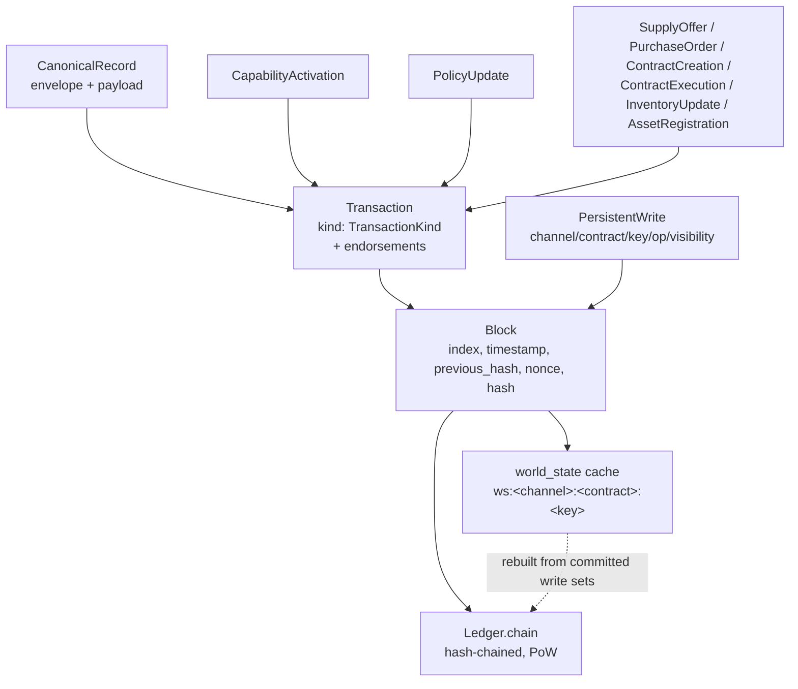

# GlassChain data model

**Audience:** engineers and domain-literate analysts who need to know exactly what
GlassChain stores, in what shape, and what is enforced.

This document is written against the shipped code at `crates/glasschain-core`
(mainly `canonical.rs`, `transaction.rs`, `block.rs`, `write_set.rs`,
`capability.rs`, `asset.rs`, `schema.rs`, `ledger.rs`), the read-path projection
in `crates/glasschain-indexer` (`indexer.rs`, `flattener.rs`, `event_bus.rs`),
and the node admission/commit paths in `crates/glasschain-network/src/node.rs`.
Every rule below is implemented in the sources cited; where behaviour is
partial or deliberately deferred, the document says so explicitly.

Sibling documents: [architecture](architecture.md) · [consensus](consensus.md) ·
[privacy-and-identity](privacy-and-identity.md) ·
[workflows-and-contracts](workflows-and-contracts.md) · [operations](operations.md).
Decisions: [ADR-006 canonical schema v1](adr/adr-006-canonical-schema-v1.md) ·
[ADR-005 certification and audit](adr/adr-005-certification-and-audit.md) ·
[ADR-007 VM state semantics](adr/adr-007-vm-state-semantics.md) ·
[ADR-010 capability versioning](adr/adr-010-capability-versioning-policy.md).

---

## 1. The layered model

GlassChain stores data in four nested layers. The vocabulary matters: each layer
has its own validation rules and its own place in the consensus boundary.

1. **Transactions** carry payloads. A `Transaction` (`transaction.rs`:
   `pub struct Transaction`, fields `id`, `timestamp`, `kind`, `endorsements`)
   is the smallest unit of submission. Its `kind` is a `TransactionKind` — a
   serde internally-tagged union (`#[serde(tag = "type", content = "payload")]`,
   `transaction.rs`) — so every transaction has exactly one payload.
2. **Blocks** carry transactions *plus* a **write set**. A `Block`
   (`block.rs`) commits an ordered `Vec<Transaction>` together with the
   canonical `Vec<PersistentWrite>` of the accepted persistent VM writes
   (ADR-007 decision 2). The write set is inside the block hash — see
   [§6](#6-blocks-and-write-sets).
3. **Canonical records** are a *transaction kind* with strict schema validation.
   `TransactionKind::CanonicalRecord(CanonicalRecord)` (`transaction.rs`) wraps
   the ADR-006 record envelope; `canonical.rs` contains the immutable v1
   registry and the deterministic validator that every peer applies.
4. **The derived world state** is not stored in blocks at all. The node's
   `NodeState.world_state` cache (`node.rs`) — a `HashMap<String, Vec<u8>>`
   keyed by `ws:<channel>:<contract>:<key>` — is materialized from committed
   write sets. The chain is authoritative; the cache is a derived read model.



Records and write sets are deliberately distinct (ADR-006 §3, ADR-007): canonical
records are the network's data vocabulary; VM write sets are execution-state
scope/visibility/atomicity. A `state_commitment` record *anchors* off-chain or
private state; it is not a write set.

---

## 2. `TransactionKind` — every variant

`TransactionKind` (`transaction.rs`, enum at the bottom of the file) has nine
variants. `#[serde(tag = "type", content = "payload")]` means the JSON wire
shape is `{"type": "<Variant>", "payload": <inner>}` (see §5.2 for a full
example).

| Variant | Payload type | Meaning |
|---|---|---|
| `SupplyOffer` | `SupplyOffer` | A seller posts an offer: `product_id`, `product_name`, `seller_id`, `quantity_available` (`u64`), `price_per_unit` (`u64`, minor units), `lead_time_days` (`u32`), `currency` (ISO-4217). |
| `PurchaseOrder` | `PurchaseOrder` | A purchase order, raised manually or by a contract: `product_id`, `buyer_id`, `seller_id`, `quantity`, `agreed_price_per_unit`, `currency`, optional `contract_id`. |
| `ContractCreation` | `SmartContractDef` | On-ledger contract definition: `contract_id`, `buyer_id`, `product_id`, `conditions` (`PurchaseConditions`), optional `wasm_code_b64` (base64 WASM). |
| `ContractExecution` | `ContractExecution` | Recorded when a contract executes a purchase: `contract_id`, `purchase_order_tx_id`, `buyer_id`, `seller_id`, `product_id`, `quantity`, `total_price`, `currency`. |
| `InventoryUpdate` | `InventoryUpdate` | `product_id`, `owner_id`, `quantity_delta` (`i64`: positive = added, negative = consumed), `reason`. |
| `AssetRegistration` | `TraceableAssetRegistration` | Phase-3 on-chain registration of a `TraceableAsset` (see [§9](#9-domain-conventions-that-bite)) plus `event_type`, `originator_id`, optional `purchase_order_ref`. |
| `CanonicalRecord` | `CanonicalRecord` | An ADR-006 v1 record, schema-validated ([§3](#3-canonical-schema-v1--the-13-families)). |
| `CapabilityActivation` | `CapabilityActivation` | Control-plane record activating a capability at a future height ([§7](#7-capabilities)). |
| `PolicyUpdate` | `PolicyUpdate` | Endorsement-policy replacement for a channel/contract scope (ADR-008 decision 4). |

`Transaction.endorsements` (`Vec<TransactionEndorsement>`) is
`#[serde(default, skip_serializing_if = "Vec::is_empty")]` — absent and empty
are equivalent, so pre-endorsement transaction JSON (and therefore block
hashes) is unchanged when no carriers exist (ADR-008 §4).

**Adding a variant is a cross-crate change.** Exhaustive `match` statements over
`TransactionKind` live in four places (verified):

- `crates/glasschain-indexer/src/indexer.rs` — `kind_name` (maps a transaction
  to its indexer discriminant string).
- `crates/glasschain-indexer/src/event_bus.rs` — `publish_block` (routes each
  transaction kind to a named event).
- `crates/glasschain-rpc/src/server.rs` — `build_transaction_protos`.
- `crates/glasschain-node/src/main.rs` — the REPL transaction listing.

A new variant breaks all four. `crates/glasschain-core/src/capability.rs`
(`validate_block`) and `endorsement.rs` (`PolicyHistory`) match only the
subsets they handle and fall through on `_`, so those two degrade gracefully.

---

## 3. Canonical schema v1 — the 13 families

The heart of the data model. `SCHEMA_V1` (`canonical.rs`) is a static
`&[SchemaDescriptor]` of exactly 13 families (a unit test asserts the count and
uniqueness). Every family shares one envelope:

```rust
pub struct CanonicalRecord {           // canonical.rs
    record_id: String,                 // globally unique; Uuid::new_v4() in CanonicalRecord::new()
    schema_id: String,                 // one of the 13 family ids
    schema_version: u32,               // must be SCHEMA_VERSION_V1 == 1 in v1
    commitment: Option<String>,        // required iff the family is anchored
    occurred_at: u64,                  // unix seconds of record creation
    issuer: String,                    // issuing MSP identity
    signatures: Vec<RecordSignature>,  // at least one required (see §8)
    pdc_ref: Option<String>,           // optional channel/PDC reference
    extensions: BTreeMap<String, ExtensionValue>, // registered namespaces (§5)
    payload: BTreeMap<String, Value>,  // family fields, validated against the descriptor
}
```

Envelope rules enforced for **every** family (`validate_record_with`,
`canonical.rs`):

- `record_id` and `issuer` must be non-empty.
- `signatures` must not be empty ("at least one signature is required").
- `schema_version` must not be 0; the `(schema_id, schema_version)` pair must
  resolve in the registry.
- Payload keys are a whitelist: anything outside the family's
  `required + optional` catalog rejects the record ("unknown payload field …
  use a registered extension namespace"). This is the consensus-boundary rule
  of ADR-006 decision 4 / ADR-010 decision 1 — private quantities, pricing,
  raw evidence, and telemetry cannot ride on public records.
- Payloads shaped like a legacy `TraceableAsset` (≥ 3 of these 6 keys: `gtin`,
  `batch_number`, `expiry_date`, `serial_number`, `anvisa_registration`,
  `manufacturer_id`) are rejected as smuggled legacy assets with a pointer to
  `migrate_legacy_asset`.
- Anchored families must carry `commitment == sha256(canonical_form)`; the
  field must be **absent** on non-anchored families.
- When a family declares `status_values`, the `status` payload value must be in
  that closed vocabulary.

### 3.1 The family table

| # | `schema_id` | Anchored | Required payload fields | Optional | `status` vocabulary | Extra cross-field rules |
|---|---|---|---|---|---|---|
| 1 | `party_identity` | no | `org_id`, `legal_name` | — | — | — |
| 2 | `product` | no | `product_id`, `gtin`, `product_name` | — | — | `gtin` must be 13 or 14 numeric digits |
| 3 | `lot` | **yes** | `lot_id`, `product_id`, `batch_number` | `expiry_date` | — | the canonical lot/batch anchor; other families reference it via `lot_ref` |
| 4 | `inventory_threshold` | no | `trigger_id`, `product_id`, `owner_id`, `reorder_threshold` | — | — | policy record, not a custody event (ADR-006 §1) |
| 5 | `purchase_order` | no | `product_id`, `buyer_id`, `seller_id`, `quantity`, `currency` | — | — | — |
| 6 | `shipment` | no | `lot_ref`, `from_org`, `to_org` | — | — | — |
| 7 | `transit_event` | no | `shipment_ref`, `event_type`, `location` | — | — | — |
| 8 | `delivery_receipt` | no | `shipment_ref`, `receiver_id`, `received_at` | — | — | `received_at` must be ISO-8601 `YYYY-MM-DD` |
| 9 | `inventory_transformation` | no | `lot_ref`, `transformation_type` | — | — | e.g. `"split"` (fixtures); emitted by quarantine/dispute flows |
| 10 | `recall` | no | `lot_ref`, `reason`, `status`, `issued_by` | — | `issued` / `active` / `completed` | append-only status trail (recall workflow) |
| 11 | `quality_certification` | **yes** | `lot_ref`, `issuer`, `scope`, `valid_from`, `valid_to`, `status`, `evidence_manifest` | — | `valid` / `suspended` / `revoked` | dates ISO-8601; `valid_to >= valid_from`; `evidence_manifest` is an *object* with 64-hex `manifest_commitment` |
| 12 | `audit_attestation` | **yes** | same as #11 | — | `valid` / `suspended` / `revoked` | same rules as #11 |
| 13 | `state_commitment` | **yes** | `merkle_root`, `counterparties` | `aggregation_ratio` | — | `merkle_root` 64-hex; `counterparties` a non-empty array of non-empty org names; `signatures.len() >= counterparties.len()` (structural count check — authorization rides the ADR-012 operation default); `aggregation_ratio >= 1` when present |

### 3.2 The complex families in prose

**`product` (2).** `gtin` is the only payload field with a shape check at the
validator level: exactly 13 or 14 ASCII digits (`canonical.rs`,
`"product" =>` arm). `product_id` is the internal key; `gtin` is the global
trade item number (GTIN-14 / EAN-13). Both must be present and non-empty.

**`lot` (3).** The anchored lot record is the canonical batch commitment
(ADR-006 decision 2): `commitment` must equal the SHA-256 of the canonical
form. Every chain step that involves a batch references the lot by `lot_ref`
(shipping, transformation, recall, certification, audit). The migration helper
`migrate_legacy_asset` builds `lot_id` as `"{gtin}-{batch}"` and anchors it —
the only lot-id shape the code itself produces.

**`quality_certification` / `audit_attestation` (11, 12).** Both are anchored,
evidence-bearing records (ADR-005). The validator enforces:

- `valid_from` and `valid_to` must be ISO-8601 dates and `valid_to` must not
  precede `valid_from`;
- `evidence_manifest` must be an **object** whose `manifest_commitment` value
  is a 64-hex string. A string manifest or a manifest without the commitment
  key is rejected. `EvidenceManifest` is embedded, not a standalone entity
  (ADR-005; a test fixture carries
  `{"manifest_commitment": "abab…"}` and nothing else).
- status is a closed vocabulary: `valid`, `suspended`, `revoked`. A
  certification cannot use `issued` (that vocabulary belongs to `recall`).

**`state_commitment` (13).** The batch anchor for off-chain/private state
(ADR-004/006). `merkle_root` is a 64-hex commitment. `counterparties` must
name at least one non-empty organization, and the *envelope signature count*
must be at least the number of counterparties — see [§8](#8-signatures-on-records)
for what that check does and does not do. `aggregation_ratio`, when present,
must be ≥ 1; it is deliberately left configurable rather than assumed
(ADR-004 open question 1 — a test proves a ratio of 17 validates).

**`recall` (10).** The only non-anchored family with a status vocabulary
(`issued` / `active` / `completed`). The recall workflow appends records —
status changes are new records, never edits (ADR-005 principle applied).

### 3.3 Example: a signed, anchored record on the wire

Adapted from the canonical.rs test fixtures (a `quality_certification` built via
`CanonicalRecord::new`, `sign`, `anchor`, then wrapped in a `Transaction` — the
serde tag is `type` and the content key is `payload`):

```json
{
  "id": "tx-9a3f1c2d-0000-4000-8000-000000000001",
  "timestamp": 1767279600,
  "type": "CanonicalRecord",
  "payload": {
    "record_id": "cert-07891234100016-BATCH-001",
    "schema_id": "quality_certification",
    "schema_version": 1,
    "commitment": "abababababababababababababababababababababababababababababababab",
    "occurred_at": 1767279600,
    "issuer": "certifier-1",
    "signatures": [
      { "signer": "certifier-1", "signature_bytes": [66, 66, 66, 66, 66, 66, 66, 66] }
    ],
    "pdc_ref": null,
    "extensions": {
      "anvisa": { "schema_version": 1, "value": {} }
    },
    "payload": {
      "lot_ref": "07891234100016-BATCH-001",
      "issuer": "certifier-1",
      "scope": "GMP",
      "valid_from": "2026-01-01",
      "valid_to": "2027-01-01",
      "status": "valid",
      "evidence_manifest": {
        "manifest_commitment": "abababababababababababababababababababababababababababababababab"
      }
    }
  }
}
```

(The `signature_bytes` array of `66`s mirrors the test fixtures' opaque
`vec![0x42; 8]`; `RecordSignature` bytes are never interpreted by core.)

---

## 4. Schema identity and the registry

### 4.1 The immutable `(schema_id, version, hash)` triple

The registry (`Registry`, `canonical.rs`) is keyed by `(schema_id,
schema_version)` and each entry carries the derived `schema_hash`:

- `SchemaDescriptor` is the field catalog: `required`, `optional`, `anchored`,
  `status_values` (the validator's input).
- `descriptor_hash` produces a deterministic canonical text
  `"{schema_id}|v{version}|required={...}|optional={...}|anchored={bool}|status={:?}"`
  and takes its SHA-256. This is the immutable third registry-key component
  (ADR-006 decision 6). The hash is stable across processes (a test asserts a
  64-char stable hash for `lot`).
- `Registry::v1()` is a `LazyLock` static seeded from `SCHEMA_V1` and
  `NAMESPACE_V1` — immutable and shared by every node. `with_schema` /
  `with_namespace` build *extended* registries; they are used by tests and are
  the mechanism by which historical versions become **available for
  validation** (ADR-006 decision 6). Whether a version is **accepted for new
  blocks** is a capability decision — still ticket #36, so today the network
  registry accepts only v1.
- The record envelope carries only `(schema_id, schema_version)`; the hash is
  registry-side identity, not a field on the record.

Lookup is `lookup_schema(id, version) -> Option<SchemaEntry>` and
`lookup_namespace(name) -> Option<NamespaceDescriptor>`.

### 4.2 Where validation happens (all three paths verified)

`validate_record` (v1 registry) and `validate_record_with(registry, record)`
(extended registries) are the pure validators; `validate_record_under(set,
record)` (`capability.rs`) layers on the height-selected capability gate for
`state_commitment`. They are invoked at:

1. **Admission** — `Ledger::add_transaction` (`ledger.rs`): for a
   `CanonicalRecord`, it rebuilds the capability history from the committed
   chain and validates under the set **effective at the next height**
   (`validate_record_under(&history.effective_set(next_height), record)`). A
   `CapabilityActivation` is validated by `CapabilityHistory::apply` at the
   same point. A `PolicyUpdate` gets structural checks here (authorization is
   evaluated later, at the network commit path).
2. **Commit** — `Ledger::commit_mined_block` (`ledger.rs`): the commit gate
   re-validates every canonical record and capability activation in the block
   under the set effective at its height
   (`CapabilityHistory::build_from_blocks(&chain)?.validate_block(&block)`),
   plus every policy update under the replayed policy history (including the
   same-block policy/write conflict rule). A crafted block never commits
   invalid content.
3. **Peer-block path** — `Node::process_message` on `Message::Block`
   (`node.rs`): a peer-proposed block is admitted only if it chains
   (`block.chains_to(prev)`), satisfies PoW (`has_valid_pow(diff)`), and passes
   `CapabilityHistory::build_from_blocks(&chain).and_then(|mut h|
   h.validate_block(&block))`. The **chain-sync** path (`Message::Chain` →
   `Ledger::try_replace_chain`, `ledger.rs`) validates each candidate block the
   same way, and `Node::enforce_chain_endorsements` runs the endorsement gate
   over the whole candidate before adoption. Full revalidation on restart /
   `validate_chain` runs `CapabilityHistory::build_from_blocks` over the entire
   chain, then checks each block's hash and PoW.

So a canonical record is validated at least twice before it is committed —
once at admission under the next height's set, and again at the commit/peer
gate under its own height's set.

---

## 5. Extension namespaces

Partner-specific fields ride on records under registered namespaces
(ADR-006 decision 5). The shape:

```rust
pub struct ExtensionValue {            // canonical.rs
    schema_version: u32,               // must equal the namespace descriptor's version
    value: BTreeMap<String, Value>,    // field map; or a single "commitment" when private
}
```

Registered in v1: exactly one namespace — `anvisa`, version 1, `private:
false`, with an **empty** required/properties catalog
(`NAMESPACE_V1`, `canonical.rs`). The code comment notes the field catalog is
"filled by the Stage-5 SEFAZ adapter". In practice the `anvisa` descriptor
today validates nothing beyond the generic namespace rules — its values may
carry any non-core keys.

Enforced for every namespace (`validate_record_with`, `canonical.rs`):

- **Unknown namespaces are rejected** — a namespace not in the registry fails
  with "unknown extension namespace".
- **Version must match the descriptor** — an extension carrying a different
  `schema_version` is rejected.
- **Core fields cannot be overridden** — an extension key that shadows a name
  in `CORE_FIELD_NAMES` (the envelope names plus every v1 family payload key)
  fails with "shadows core field". The one sanctioned exception is the key
  `commitment`, which is the private-anchor shape described below.
- **Descriptor checks** — required extension fields must be present and
  non-empty (`is_present`); declared `properties` are type-checked against
  `ExtensionFieldType` (String, Integer, Number, Boolean, Object, Array).
- **Private namespaces** — when `private: true`, the record must carry a
  non-empty `pdc_ref` and the extension value must be *exactly* one key:
  `commitment`, a 64-hex hash. No private namespace is registered in v1; the
  shape is implemented and covered by a test (`test.pricing` in `canonical.rs`
  tests) for the ADR-003 PDC path.

Because `CanonicalRecord::canonical_form` serializes the payload *and*
extensions into the signed/committed tuple, extension values are anchored
exactly like core fields — an extension edit changes the commitment (§8).

---

## 6. Blocks and write sets

### 6.1 `Block`

```rust
pub struct Block {                     // block.rs
    index: u64,                        // genesis = 0
    timestamp: u64,                    // unix seconds
    transactions: Vec<Transaction>,
    write_set: Vec<PersistentWrite>,   // ADR-007 decision 2
    previous_hash: String,             // "0" for genesis
    nonce: u64,
    hash: String,                      // SHA-256 of the canonical content
}
```

**`calculate_hash` covers the write set.** The hash input is the JSON tuple
`(index, timestamp, transactions, write_set, previous_hash, nonce)`; any change
to any of those fields invalidates the stored hash. This is deliberate and
tested (`test_block_hash_covers_write_set` in `block.rs` mutates a write set
without recomputing and asserts `!b.is_valid()`). **Any test or tool that
tampers with a block's write set must recompute the hash.** Adjacent pieces:

- `new(index, transactions, previous_hash)` — an **unmined** block with an
  *empty* write set (delegates to `with_write_set(…, Vec::new())`).
- `with_write_set(index, transactions, previous_hash, write_set)` — the
  mining/commit path; the write set must already be validated, canonicalized,
  and in PDC-redacted block form.
- `mine(difficulty)` — PoW over the nonce (leading-zero target);
  `has_valid_pow(difficulty)` checks a stored hash against the target.
- `is_valid()` — stored hash equals a fresh `calculate_hash()`.
- `chains_to(previous)` — enforces `previous_hash` equality, exact
  `index + 1`, and hash validity.

**Genesis** is hand-built in `Ledger::new` (`ledger.rs`): `index: 0`,
`timestamp: 0` (fixed so every node derives the same genesis hash regardless of
wall clock — a precondition for `try_replace_chain`), empty transactions,
empty write set, `previous_hash: "0"`, then mined at the configured difficulty
(default `DEFAULT_DIFFICULTY = 2`). The genesis block carries no canonical
records and no capabilities beyond the genesis set (§7).

### 6.2 `PersistentWrite` and the world state

```rust
pub struct PersistentWrite {           // write_set.rs
    channel: String,
    contract: String,
    key: String,
    op: WriteOp,                       // Set(Vec<u8>) | Delete
    visibility: WriteVisibility,       // Public | Pdc(String)
}
```

There is no implicit global or cross-channel keyspace (ADR-007 decision 3);
every write is scoped. `ExecutionResult::canonicalize` is the single validation
point: `channel`, `contract`, and `key` must be non-empty; a `Pdc` visibility
must name a non-empty collection; a given `(channel, contract, key)` may appear
at most once per execution (duplicates are rejected, not disambiguated); the
returned copy is sorted by scope so the committed set has one canonical
serialization.

Three methods define the lifecycle of a write:

- **`block_form()`** — the version that enters the globally replicated block.
  Public writes pass through unchanged. A PDC-scoped `Set(value)` is redacted
  to `Set(sha256(value))` — the block carries the collection name and the
  value commitment, never the private value (ADR-007 decision 3; private
  payloads travel the ADR-003 dissemination path, tickets #46/#47). PDC
  deletes stay tombstones.
- **`state_key()`** — `format!("ws:{}:{}:{}", channel, contract, key)` — the
  world-state cache key. There is no other key space.
- **`apply_to_cache(cache)`** — materializes the write into the derived cache:
  `Set` inserts `state_key → value`, `Delete` removes the key. The node applies
  the *committed block's* write set (already `block_form`) into
  `NodeState.world_state` after commit (`after_block_commit`, `node.rs`), so a
  PDC-scoped value stays a SHA-256 commitment in the cache until the private
  payload path delivers the real value. On failure the chain stays
  authoritative and `rebuild_world_state` heals the cache from committed
  blocks; WASM is never re-executed to rebuild state (ADR-007 §2).

---

## 7. Capabilities

Capabilities gate every consensus-visible or validation-affecting behavior
(ADR-010). The v1 registry `CAPABILITY_V1` (`capability.rs`) has five entries:
`canonical_schema_v1` v1, `state_commitment` v1, `pdc` v1, `endorsement` v1,
`bft_consensus` v1. **Active from genesis** (`GENESIS_CAPABILITIES`):
`canonical_schema_v1` and `state_commitment` — the behaviors the v1 ledger
already validates. `pdc`, `endorsement`, and `bft_consensus` activate later
via records.

Each capability has the same immutable identity shape as schemas: `(id,
version, hash)` where `capability_hash(id, version) = sha256("{id}|v{version}")`
(ADR-010 decision 4).

```rust
pub struct CapabilityActivation {      // capability.rs
    capability_id: String,
    version: u32,
    hash: String,                      // must equal capability_hash(capability_id, version)
    activation_height: u64,            // strictly future of the containing block
    signatures: Vec<RecordSignature>,  // presence-checked only (see below)
}
```

An activation is a `TransactionKind::CapabilityActivation` payload — a signed,
append-only control-plane record, *not* a fourteenth record family
(ADR-010 §3). `CapabilityHistory::apply` enforces: the capability is
registered; `version` matches the registry; `hash` matches
`capability_hash`; `activation_height` is **strictly greater** than the height
of the containing block (no same-block transitions); the capability is
activated at most once (append-only); `signatures` is non-empty.
`CapabilityHistory::build_from_blocks` / `validate_block` replay these rules
per block at the set effective for that block's height (§4.2), so old blocks
keep their historical meaning and replay is deterministic (ADR-010 decision 5).

**Height-selected validation.** `CapabilitySet::effective_set(height)` starts
from the genesis set and folds in every activation whose `activation_height <=
height`. `validate_record_under(set, record)` runs the v1 schema rules and then
gates `state_commitment` records on the `state_commitment` capability being
active at the record's height. The node additionally consults the set when
committing PDC-scoped writes (`pdc` at the candidate height, `node.rs`
`mine_async`) and when selecting the BFT engine (`bft_consensus`); the
`endorsement` capability gates endorsement enforcement (ADR-008 §4).

**Honest note — resolved (ADR-012, #60).** `CapabilityActivation.signatures` is
**advisory metadata** and is never cryptographically verified. Authorization is
the endorsement layer's job: when the `endorsement` capability is active, the
governance operation default requires a verified endorsement carrier from the
`network-governance` principal (fail-closed until a deployment commits a
`PolicyUpdate` naming its real governance principals). The decorative field
stays in the record shape for hash stability and ADR-006 schema identity.

---

## 8. Signatures on records

```rust
pub struct RecordSignature {           // canonical.rs
    signer: String,                    // human-readable MSP member / node identifier
    signature_bytes: Vec<u8>,          // opaque to core
}
```

`CanonicalRecord.signatures` is a `Vec<RecordSignature>` that appears on every
record. What the validator actually checks:

- **Every family:** `signatures` must be non-empty ("at least one signature is
  required").
- **`state_commitment` only:** the count must be at least the number of named
  counterparties ("signature set must carry at least one signature per
  counterparty").

That is the structural ceiling: schema validation checks shape and count, never
the bytes. **Authorization is a separate layer (ADR-012, resolving #60):** the
`signatures` field is advisory metadata — the bytes are opaque, a `signer` is a
label, and nothing binds them to MSP keys. When the `endorsement` capability is
active, the operation defaults do the real work with verified endorsement
carriers: `state_commitment` records require the issuer plus every named
counterparty as carriers, and `CapabilityActivation` requires the
`network-governance` principal. The count-only check remains as schema
validation, not as a security control.

Related precision: `CanonicalRecord::canonical_form` (the tuple that
signatures would cover, and that `commitment()` hashes) includes `record_id`,
`schema_id`, `schema_version`, `occurred_at`, `issuer`, `pdc_ref`, `payload`,
and `extensions` — it **excludes** `commitment` itself and `signatures`. So the
anchor commitment is computed over a form that deliberately leaves the
signature block out.

---

## 9. Domain conventions that bite

- **Currency is always an integer in minor units — never a float.** Every
  price field is a `u64` documented as "minor currency units (e.g., cents for
  USD)": `SupplyOffer.price_per_unit`, `PurchaseOrder.agreed_price_per_unit`,
  `PurchaseConditions.max_price_per_unit`, `ContractExecution.total_price`
  (`transaction.rs`); also `InventoryTrigger.price_per_unit`
  (`glasschain-workflows/src/watcher.rs`). The CLI parses `"12.50"` into `1250`
  with checked arithmetic (`parse_price` in `glasschain-node/src/main.rs`),
  and the contract engine tests use `1500 = $15.00`. The one **signed**
  integer is `InventoryUpdate.quantity_delta: i64` (positive = stock added,
  negative = consumed). `currency` strings are ISO-4217 codes at every site.
- **Identifiers are ≥ 2 characters.** This is enforced by clippy, not at
  runtime: `min-ident-chars-threshold = 2` in `clippy.toml`, so `id`, `tx`,
  `rx` are fine and `x` is not. Records and transactions get UUID v4 ids from
  the constructors; workflows instead use deterministic ids
  (`Transaction::with_id(record.record_id, …)`) so flow emissions are
  exactly-once — the ledger silently ignores duplicate transaction ids.
- **GTIN shape.** The `product` family enforces 13 or 14 numeric digits at
  validation time (`canonical.rs`). The legacy SNCM layer only documents this:
  `SNCM_SCHEMA`'s `gtin` regex hint `^\d{13,14}$` is informational and
  "not enforced at runtime" (`schema.rs`). GTIN-14 / EAN-13 naming comes from
  ADR-006 and the asset model.
- **Dates are ISO-8601 `YYYY-MM-DD` by structural check.** `is_valid_iso8601_date`
  (`asset.rs`) verifies length, separators, year ≥ 1900, month 1–12, day 1–31
  — it is deliberately lightweight and **accepts impossible dates like
  February 30** (documented in the code). `delivery_receipt.received_at` and
  cert/audit `valid_from`/`valid_to` are validated this way; `expiry_date` on
  `lot` is an optional field with no format check in the validator (the trust
  score and SNCM gate do format-check it).
- **Anvisa registration shape.** `TraceableAsset.anvisa_registration` is
  documented (and shown in fixtures) as `MS xxxxxx.xxxxxx`, e.g.
  `"MS 1.0000.0001.001-1"` (`asset.rs` test fixture; `schema.rs` description).
  It is **not runtime-validated** anywhere — the `anvisa_registration` SNCM
  field has no regex hint and canonical.rs does not check it. Same for the
  manufacturer CNPJ (`12.345.678/0001-99` in fixtures) — documented shape,
  no validator.
- **Legacy `TraceableAsset` is not a record.** An asset-shaped payload (≥ 3 of
  the 6 legacy keys) is rejected by the v1 validator; the sanctioned path is
  `migrate_legacy_asset` (`canonical.rs`), which produces a `product` record
  plus an anchored `lot` record with `lot_id = "{gtin}-{batch}"`.
- **Trust scoring is a nudge, not a gate.** `MetadataTrustScore::compute`
  (`asset.rs`): 4 core fields (gtin, batch, expiry, serial) × 20 points, 2
  bonus fields (anvisa registration, manufacturer id) × 10 points; `score >=
  80` is "standard". The SNCM `validate_asset` gate (`schema.rs`) separately
  flags missing mandatory fields as Critical violations (30% gas discount
  hint). Neither can make an invalid canonical record valid (ADR-006 §4) — the
  gate lives on the legacy asset path only.

---

## 10. The flattened analytics projection (read path)

The indexer and flattener (`crates/glasschain-indexer`) are a **derived,
query-shaped view of the chain — not the source of truth.** The chain is
authoritative; the projection is rebuilt from it.

The indexer stores two denormalized shapes (`indexer.rs`,
`indexed_transactions_of`):

- `IndexedBlock { index, hash, previous_hash, timestamp, transaction_count,
  transaction_ids }` — a summarised block.
- `IndexedTransaction { id, block_index, timestamp, kind, payload_json }` —
  where `kind` is a **String discriminant** produced by the exhaustive
  `kind_name` match over `TransactionKind` (§2), and `payload_json` is the
  full serialized `Transaction` JSON — the exact format the flattener parses.

`AnalyticalFlattener` (`flattener.rs`) converts every `AssetRegistration`
transaction into a `FlatAssetRecord`: a fully denormalized, no-nested-JSON row
for SQL/ClickHouse-style ingestion. It has 22 fields:

```
block_index, block_hash, block_timestamp, transaction_id, transaction_timestamp,
gtin, batch_number, expiry_date, serial_number, anvisa_registration, manufacturer_id,
product_name, custodian_id, country_of_origin, storage_temp_celsius, quantity,
event_type, originator_id, purchase_order_ref, trust_score, is_standard_compliant,
missing_core_fields
```

(the `to_csv_header()` constant in `flattener.rs` is exactly this list).
Behaviour worth knowing:

- **Only `AssetRegistration` transactions are flattened**; every other kind is
  silently skipped, and malformed `payload_json` is logged at `warn` and
  skipped.
- The `trust_score`, `is_standard_compliant`, and `missing_core_fields`
  columns are **computed at flatten time** via
  `MetadataTrustScore::compute(&reg.asset)` — they are not on-chain fields.
- Query methods over the in-memory record set: `records_by_gtin`,
  `records_by_custodian`, `records_by_batch`, `standard_compliant_records`
  (`trust_score >= 80`), `low_trust_records` (`trust_score < 80`),
  `total_quantity_for_gtin`.
- `VerifiableLineage::build(asset_id, provenance, flattener)` powers the
  `GetVerifiableLineage` gRPC endpoint: it combines the custody chain from the
  `ProvenanceIndex` with the matching flat records. Canonical asset-id formats
  are `GTIN:<gtin>`, `GTIN:<gtin>:SN:<serial>`, and
  `GTIN:<gtin>:BATCH:<batch>` (`extract_gtin`); `is_complete` is true when the
  custody-event count equals the flat-record count, and `trust_score_avg` is
  the mean. The RPC query path matches these ids boundary-anchored so a short
  GTIN never cross-matches a longer one (server-side comment, `server.rs`).
- CSV export: 22-column header plus RFC 4180 quoting (fields containing commas,
  quotes, or newlines are double-quoted).

Nothing in this layer changes what the chain stores; the projection can be
rebuilt from committed blocks at any time.

---

## 11. What v1 deliberately does NOT model

Two gaps are *by design*, and there is no code behind them — do not "fix" them
by inventing records.

**1. No rfq / quote / acceptance / dispute / settlement record families.**
The registry has exactly the 13 families above; there is no
`request_for_quote`, `quote`, `acceptance`, `dispute`, or `settlement`
`schema_id` anywhere in `SCHEMA_V1` (or in the transaction kinds other than
those in §2). The purchase-to-settlement and dispute mechanics
(`glasschain-workflows/src/purchase_flow.rs`, `recall_flow.rs`,
`dispute_flow.rs`) model those chain steps as **flow states — record-less by
design**: the flow runner emits and consumes the record families that exist
(`purchase_order`, `shipment`, `delivery_receipt`, `inventory_transformation`,
`recall`, …), while RFQ/quote/settlement exist only as workflow state. This is
recorded in `.agents/memories/debt-gap-handoff.md` ("Don't 'fix' this by
extending SCHEMA_V1"). The dispute *reason* stays off-chain precisely because
the `inventory_transformation` whitelist rejects extra payload keys (§3).

**2. No account, balance, or fee ledger.** There is no account record family,
no balance state, and no fee metering anywhere in the workspace. The only
"fee" artifacts are pure functions: `MetadataTrustScore::fee_multiplier()`
(`asset.rs`, 0.5 for standard assets, 1.0 otherwise) and
`SchemaValidationReport::gas_fee_multiplier` (`schema.rs`, 0.7/1.0) — computed
per transaction as a gas-adjustment hint; the node REPL prints the multiplier
but nothing meters or deducts fees. ADR-010 lists "Accounts, balances,
settlement economics, or fee sponsorship" as explicitly out of scope for v1.
An "asset fee" comment in `asset.rs` says fee scaling "is enforced at the node
layer" — that enforcement does not exist; treat the multipliers as advisory
signals, not a ledger.

---

## Appendix: source map

| Topic | File | Symbols |
|---|---|---|
| Record envelope, registry, validator | `crates/glasschain-core/src/canonical.rs` | `CanonicalRecord`, `SCHEMA_V1`, `NAMESPACE_V1`, `Registry`, `validate_record(_with)`, `migrate_legacy_asset` |
| Transaction kinds | `crates/glasschain-core/src/transaction.rs` | `TransactionKind`, `Transaction`, payload structs |
| Blocks | `crates/glasschain-core/src/block.rs` | `Block`, `calculate_hash`, `mine`, `chains_to` |
| Write sets / world state | `crates/glasschain-core/src/write_set.rs` | `PersistentWrite`, `ExecutionResult`, `block_form`, `state_key`, `apply_to_cache` |
| Capabilities | `crates/glasschain-core/src/capability.rs` | `CAPABILITY_V1`, `GENESIS_CAPABILITIES`, `CapabilityActivation`, `CapabilityHistory`, `validate_record_under` |
| Ledger / validation gates | `crates/glasschain-core/src/ledger.rs` | `Ledger::new` (genesis), `add_transaction`, `commit_mined_block`, `try_replace_chain`, `validate_chain` |
| Legacy asset / trust score | `crates/glasschain-core/src/asset.rs`, `schema.rs` | `TraceableAsset`, `MetadataTrustScore`, `is_valid_iso8601_date`, `SNCM_SCHEMA`, `validate_asset` |
| Node admission / peer paths | `crates/glasschain-network/src/node.rs` | `submit_transaction`, `mine_async`, `process_message` (`Message::Block`, `Message::Chain`), `after_block_commit` |
| Analytics projection | `crates/glasschain-indexer/src/indexer.rs`, `flattener.rs` | `IndexedBlock`, `IndexedTransaction`, `kind_name`, `FlatAssetRecord`, `VerifiableLineage`, `to_csv_*` |
| Cross-crate kind matches | `indexer.rs`, `event_bus.rs`, `server.rs`, `node/src/main.rs` | exhaustive `TransactionKind` matches |