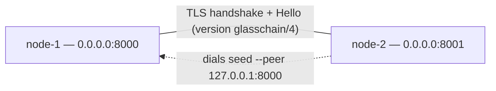

# GlassChain operations

A practical operator's guide to GlassChain: what it is, how to build it, how
to start a federation, how to talk to it, and what you are actually looking at
when it runs.

Everything here is derived from the shipped source in this repository
(2026-09-02 state), not from the plan; where `README.md` or `PLUGIN_KIT.md`
disagree with the code, the code wins. Stale claims found in those files are
listed in Section 14.

Companion docs: [`architecture.md`](architecture.md) (big picture, crate map,
provider seams, lifecycle), [`data-model.md`](data-model.md) (transaction
kinds, canonical schema v1, blocks/write sets, capabilities),
[`consensus.md`](consensus.md) (what runs today, staged BFT, capability
gating, adoption gates), [`benchmarks/consensus-capacity.md`](benchmarks/consensus-capacity.md)
(200/300-validator gate evidence), and the ADRs — especially
[`adr-002-consensus-finality.md`](adr/adr-002-consensus-finality.md),
[`adr-003-privacy-model.md`](adr/adr-003-privacy-model.md),
[`adr-007-vm-state-semantics.md`](adr/adr-007-vm-state-semantics.md),
[`adr-008-endorsement-policy-model.md`](adr/adr-008-endorsement-policy-model.md),
[`adr-010-capability-versioning-policy.md`](adr/adr-010-capability-versioning-policy.md).

---

## 1. Prerequisites and build

### What you need

| Requirement | Notes |
|---|---|
| **Rust 1.95** | Pinned in `rust-toolchain.toml`; rustup picks it up automatically. Edition 2021. |
| **`protoc`** | **Required to build.** `glasschain-rpc` compiles
  `proto/glasschain/v1/glasschain.proto` at build time (`build.rs` via
  `tonic-prost-build`); `protoc` is **not vendored**. CI installs it
  (`arduino/setup-protoc`); `make setup` installs it via brew/apt/dnf/pacman
  (may prompt for sudo). |

Install the pinned toolchain, rustfmt/clippy, and `protoc` in one step
(requires `rustup` and a package manager; sudo may be prompted):

```bash
cd /home/dbbase/Projects/GlassChain
make setup
```

Verify the toolchain and compiler are visible:

```bash
rustc --version      # 1.95.x
protoc --version     # any recent release
```

### Build

```bash
cargo build              # debug (fast iteration)
cargo build --release    # release — use this to actually run nodes/peers
```

A first clean build downloads and compiles `wasmtime`, `libp2p`, and `tonic`;
expect several minutes. Subsequent builds are fast.

The two binaries you get: `target/{debug,release}/glasschain-node` (P2P +
REPL, optionally gRPC) and `target/{debug,release}/glasschain` (the CLI:
`identity-gen`, `contract-deploy`, `ledger-inspect`).

---

## 2. Running a node

`glasschain-node` is an **interactive** program: after startup it drops you
into a REPL that reads commands from stdin. **Never run it in an automated
step** — it blocks on stdin. The non-interactive way to exercise a node is the
integration test suite in `crates/glasschain-network/tests/`.

### All CLI flags

Verified from the argument parser in `crates/glasschain-node/src/main.rs`
(usage text at `main.rs:43–96`, parser at `main.rs:330–401`).

| Flag | Meaning | Default | Repeatable? |
|---|---|---|---|
| `--id <NODE_ID>` | Node identifier, used in peer messages and logs | `node-1` | no |
| `--listen <ADDR>` | Address the P2P TCP listener binds | `0.0.0.0:8000` | no |
| `--peer <ADDR>` | Seed peer address to dial at startup (`"host:port"`) | none | **yes** — pass it once per seed |
| `--difficulty <N>` | Proof-of-Work difficulty: number of leading zero hex characters required in a block hash | `2` | no |
| `--storage-path <PATH>` | Directory for persistent Sled block storage. When provided, the chain is reloaded from disk on restart; when omitted, storage is in-memory only | none (in-memory) | no |
| `--org <NAME>` | Organization name. Causes the node to create an organization Root CA and issue an identity-backed TLS certificate | none (anonymous self-signed cert) | no |
| `--identity-node-id <ID>` | Node ID embedded in the issued TLS identity certificate (CN) | value of `--id` | no |
| `--trust-store <PATH>` | PEM file or directory of `*.pem` files holding the Root CA certificates of the peer organizations to trust (ADR-011). **Requires `--org`.** Without it, peer organizations are not certificate-verified (logged at startup) | none | no |
| `--rpc-addr <ADDR>` | Address to bind the gRPC server (e.g. `0.0.0.0:50051`). **When omitted, the gRPC server is not started** | none | no |
| `--help`, `-h` | Print usage text and exit | — | — |

Parser quirks: unknown flags are **silently ignored**; `--difficulty garbage`
falls back to `2`; a flag with a missing value is treated as not passed; an
invalid `--rpc-addr` only logs a warning and the node continues without gRPC.

### Worked example 1 — a single node

```bash
cargo run --release -p glasschain-node -- --id node-1 --listen 0.0.0.0:8000
# or: make node id=node-1 port=8000   (same command)
```

You get a `GlassChain node 'node-1' is running on 0.0.0.0:8000` banner, then a
`> ` prompt:

```text
> peers
No connected peers.
> supply seller-1 SKU-001 Acetaminophen 1000 12.50 14 USD
Supply offer submitted.
> pending
Pending transactions: 1
  <tx-id> [SupplyOffer]
```

**What a stock node does and does not do.** `glasschain-node` accepts
transactions into the pending pool, broadcasts them to peers, and appends
blocks and chains *received from peers* — but **no shipped binary ever
produces a block itself**. The mining driver (`Node::mine()` /
`Node::mine_async()`) exists only on the `Node` API and is exercised by the
integration tests; the `mine`/`mine-async` REPL commands and the `MineBlock`
RPC were retired (ticket #38). So on a stock node, submitted transactions
stay `pending` indefinitely unless a peer that actually mines sends you a
block — see Section 13.

### Worked example 2 — a two-node federation

```bash
# Terminal 1 — the seed node
cargo run --release -p glasschain-node -- --id node-1 --listen 0.0.0.0:8000
# Terminal 2 — joins node-1 (--peer is repeatable)
cargo run --release -p glasschain-node -- --id node-2 --listen 0.0.0.0:8001 --peer 127.0.0.1:8000
```



What happens: node-2 dials node-1; both sides exchange TLS certificates,
upgrade to TLS, then swap `Hello` messages carrying node ID, TLS-certificate
fingerprint, chain length, protocol version, capabilities, and organization.
Each side cross-checks the fingerprint against the one observed during the
TLS handshake and records the identity in an in-memory TOFU (Trust On First
Use) registry. A transaction submitted on either node is admitted to its
local pending pool and broadcast to the other (cross-node replication of
*pending* state); blocks travel the same way, but only if one endpoint
actually mines one.

On node-2, `> peers` shows `127.0.0.1:8000`; on node-1, `> peers` shows
`127.0.0.1:8001` — the peer's **advertised listen address**, not the ephemeral
TCP source address.

### Worked example 3 — identity-backed TLS + gRPC server

```bash
cargo run --release -p glasschain-node -- \
  --id node-1 \
  --listen 0.0.0.0:8000 \
  --org PharmaCorp \
  --identity-node-id node-1 \
  --rpc-addr 0.0.0.0:50051
```

- `--org PharmaCorp` creates the organization (self-signed Root CA) and
  issues a member certificate for `node-1`; the peer-transport TLS
  certificate is generated from the same ed25519 identity key.
- `--rpc-addr 0.0.0.0:50051` additionally starts the gRPC server (all three
  services, Section 5). Without it, no gRPC server is started even with
  `--org`.

### Persistent storage

```bash
cargo run --release -p glasschain-node -- \
  --id node-1 --listen 0.0.0.0:8000 \
  --storage-path /var/lib/glasschain/node-1
```

The directory is created if it does not exist. On restart with the same path,
the chain is reloaded from disk (Section 7).

---

## 3. The interactive REPL

Commands are tokenized on whitespace; a blank line is ignored. Numeric
validation happens at parse time so bad input never reaches the ledger
(verified from `parse_command`, `main.rs:157–323`).

| Command | Syntax | What it does / validation |
|---|---|---|
| `help`, `?` | — | Print the full usage text. |
| `supply` | `supply <seller> <product_id> <product_name> <qty> <price> <lead_days> <currency>` | Submits a `SupplyOffer`. `qty`/`lead_days` integers; `price` decimal with ≤ 2 fractional digits, stored in minor units (`12.50` → `1250`); `currency` free-form (ISO-4217 by convention). |
| `order` | `order <buyer> <seller> <product> <qty> <price> <currency>` | Submits a manual `PurchaseOrder` transaction. Same price rules. Sets `contract_id: None`. |
| `contract` | `contract <contract_id> <buyer> <product> <max_price> <min_qty> <max_qty> <max_lead> <currency>` | Submits a `ContractCreation` with `auto_execute: true`, no WASM payload, no preferred seller. `max_price` uses the decimal rule above. |
| `inventory` | `inventory <owner> <product> <delta> <reason>` | Submits an `InventoryUpdate`. `delta` is a **signed** integer (`-50` works); the `reason` is every remaining word after the fourth, joined back with spaces. |
| `asset` | `asset <originator> <product_name> <gtin> <batch> <expiry> <serial> <qty> <event_type>` | Submits an `AssetRegistration`. Use `-` for `gtin`/`batch`/`expiry`/`serial` to leave them empty. Prints the **Metadata Trust Score** and fee multiplier (e.g. `Metadata Trust Score: 80 (fee multiplier: 50%)`) before submitting. |
| `chain` | — | Prints the chain summary: block count, then per block `[index] hash… txns=… prev=…`. |
| `pending` | — | Lists pending (unmined) transactions with their kinds. |
| `peers` | — | Lists known peer listen addresses; `No connected peers.` when empty. |
| `contracts` | — | Lists registered smart contracts with buyer, product, status, and `purchased/max` quantity. |
| `quit`, `exit` | — | Shuts the node down gracefully. |

Per-command usage errors print verbatim (e.g. `Usage: supply <seller>
<product_id> …`, `Invalid price`, `Unknown command: "frobnicate"…`). Arity is
a lower bound: extra trailing tokens are ignored for
`supply`/`order`/`contract`/`asset`; only `inventory` joins them into the
reason.

### Retired commands — do not look for them

- **`mine` and `mine-async` REPL commands are retired**, removed with the
  quorum-certificate seam (ticket #38; see `docs/consensus.md` §"What the
  quorum-certificate work retired"). Block production is consensus-driven,
  not manual.
- The **`MineBlock` RPC** was retired with the same work and does not exist in
  the proto (Section 5).
- The dev/test Proof-of-Work driver exists only **programmatically** as
  `Node::mine()` / `Node::mine_async()` (`glasschain-network`); no shipped
  binary drives it — only the integration tests do.

---

## 4. The `glasschain` CLI binary

`crates/glasschain-cli` builds a binary named `glasschain` (clap-based;
verified from `main.rs` and `src/commands/{identity,contract,inspect}.rs`).
`glasschain --help` prints the full tree shown below.

```text
Commands:
  identity-gen     Generate a new node identity (with optional org Root CA)
  contract-deploy  Deploy a smart contract to a GlassChain node
  ledger-inspect   Inspect the ledger state (blocks, assets, chain status)
  help             Print this message or the help of the given subcommand

Options:
  --log-level <LEVEL>  Log verbosity [default: info]  (error|warn|info|debug|trace)
  -h, --help           Print help
  -V, --version        Print version
```

### `identity-gen`

Generates an ed25519 key pair and writes a JSON document (public material
only) to `--output` or stdout, followed by a human-readable summary.

```bash
# Standalone key pair, no certificate
glasschain identity-gen --node-id warehouse-node-1

# Org-issued: creates a Root CA and issues a member X.509 certificate (PEM in the JSON)
glasschain identity-gen --node-id distributor-1 --org PharmaDistributors --output distributor-1-identity.json
```

Flags: `--node-id <ID>` (required), `--org <NAME>` (optional), `--output
<PATH>` (optional; defaults to stdout). The output document has `node_id`,
`public_key_hex` (64 hex chars), `has_certificate`, and — when org-issued —
`certificate_pem` and `organization`.

### `contract-deploy`

Builds a `SmartContractDef` transaction from the flags, serialises it to
pretty-printed JSON, and either prints it (`--dry-run`) or prints submission
instructions for `LedgerService.SubmitTransaction`. **It never submits anything
itself.** Flags: `--contract-id`, `--buyer-id`, `--product-id`, `--max-price`
(minor units), `--min-qty`, `--max-qty` (lifetime cap), `--max-lead-days`,
`--currency` (default `BRL`), `--dry-run`. The built contract always has
`auto_execute: true`, no `preferred_seller_id`, no WASM payload.

### `ledger-inspect`

Prints which gRPC call **would** be made against `--endpoint` (default
`http://localhost:9000`) — **no network I/O**, it is a flag validator and
request printer. Priority: `--block` > `--gtin` > (no query flags → chain
status).

```bash
glasschain ledger-inspect --endpoint http://127.0.0.1:50051
# … --block 42  |  --gtin 07891234567890 [--serial SN-00001]
```

---

## 5. The gRPC API

Authoritative definition: `crates/glasschain-rpc/proto/glasschain/v1/glasschain.proto`
(package `glasschain.v1`). `build.rs` regenerates bindings at compile time.
The server (`crates/glasschain-rpc/src/server.rs`) serves all three services on
one plain-HTTP/2 (no TLS) port — use `grpcurl -plaintext`.

### RPC reference

| Service | RPC | Request → Response | Stream | Implemented? |
|---|---|---|---|---|
| `LedgerService` | `GetBlock` | `GetBlockRequest{index}` → `GetBlockResponse` | unary | ✅ — errors `NOT_FOUND "block N not found"` out of range |
| `LedgerService` | `StreamBlocks` | `StreamBlocksRequest{start_index}` → `stream StreamBlocksResponse` | **server-streaming** | ✅ — replays existing blocks from `start_index`, then live as they are mined/received |
| `LedgerService` | `SubmitTransaction` | `SubmitTransactionRequest{transaction_json, signed_transaction_json}` → `SubmitTransactionResponse` | unary | ✅ — signed path (ed25519 verified) when `signed_transaction_json` is non-empty; otherwise unsigned `transaction_json` |
| `LedgerService` | `GetChainStatus` | `GetChainStatusRequest{}` → `GetChainStatusResponse{chain_length, tip_hash, pending_transactions}` | unary | ✅ |
| `LedgerService` | `QueryAssetHistory` | `QueryAssetHistoryRequest{gtin, serial_number}` → `QueryAssetHistoryResponse{transactions}` | unary | ✅ — answered from the in-memory provenance index, boundary-anchored canonical asset ids; each item is a custody event (`kind = "AssetRegistration"`) |
| `LedgerService` | `SubscribeToEvents` | `SubscribeToEventsRequest{}` → `stream SubscribeToEventsResponse` | **server-streaming** | ✅ — mapped from `NodeEvent`; event types: `transaction_accepted`, `private_payload_received`, `block_mined`, `block_received`, `peer_connected`, `peer_disconnected`, `contract_executed`, `autonomous_tx_generated` |
| `LedgerService` | `GetVerifiableLineage` | `GetVerifiableLineageRequest{asset_id}` → `GetVerifiableLineageResponse` | unary | ✅ — custody chain + flat-record completeness + average trust score from the provenance index / analytical flattener; `INVALID_ARGUMENT` on empty `asset_id` |
| `NodeService` | `GetNodeStatus` | `GetNodeStatusRequest{}` → `GetNodeStatusResponse{node_id, listen_addr, version, chain_length, peer_count}` | unary | ✅ — note `version` is currently hard-coded `"glasschain/1"` |
| `NodeService` | `GetPeers` | `GetPeersRequest{}` → `GetPeersResponse{peer_addresses}` | unary | ✅ |
| `IdentityService` | `ExchangeCertificate` | `ExchangeCertificateRequest{org_name, root_ca_cert_pem, node_id}` → `ExchangeCertificateResponse` | unary | ⚠️ implemented as **acknowledge-only**: always `accepted: true`, but `node_cert_pem` is empty ("populated once identity integration is complete"; no trust store is modified) |
| `IdentityService` | `VerifyEndorsement` | `VerifyEndorsementRequest{proposal_json}` → `VerifyEndorsementResponse` | unary | ✅ real evaluation — but only when an endorsement provider is attached (see Section 9); on a stock node it returns `approved: false` with `"no endorsement provider configured on this node"` |

All 11 RPCs defined in the proto are implemented — none are proto-only,
though `ExchangeCertificate` is stub-like in behaviour (it acknowledges and
stores nothing).

### Authentication: the MSP interceptor — ed25519 tokens, not X.509

`crates/glasschain-rpc/src/auth.rs` provides a tonic interceptor
(`MspAuthInterceptor`) that validates **MSP tokens built from ed25519 keys** —
it is **not** X.509/mTLS-based. Every authenticated call must carry three ASCII
metadata headers:

| Header | Value |
|---|---|
| `x-glasschain-node-id` | Caller's node ID string |
| `x-glasschain-auth-ts` | Current Unix timestamp, decimal seconds |
| `x-glasschain-auth-sig` | Lowercase hex of the 64-byte ed25519 signature over the bytes `"{node_id}:{timestamp}"` |

Verification: all three headers must be present (when any is); the timestamp
must be within **±60 s** of the server clock (replay window); the signature
must verify against the caller's registered ed25519 verifying key in a
`TrustedKeyRegistry`, else `UNAUTHENTICATED`. Two modes:
`MspAuthInterceptor::new(registry)` (permissive — headers validated if
present, absence allowed) and `MspAuthInterceptor::new_strict(registry)`
(every inbound RPC must carry valid headers).

Client-side, `AuthTokenBuilder::build_headers(signing_key_seed,
verifying_key_bytes, node_id)` produces the three header pairs.

**Operational reality:** the `glasschain-node` binary creates its gRPC server
with `GlasschainServer::new(node)` — **no auth interceptor is attached**. The
interceptor is wired only by embedders who call
`GlasschainServer::with_auth(node, registry, require_auth)`. Against the stock
binary, grpcurl needs no auth headers and the server is plaintext HTTP/2.

### Calling it — worked examples (grpcurl)

`grpcurl` is the easiest client; remember `-plaintext` (the server has no TLS).

```bash
grpcurl -plaintext 127.0.0.1:50051 glasschain.v1.LedgerService/GetChainStatus
grpcurl -plaintext -d '{"index": 0}' 127.0.0.1:50051 glasschain.v1.LedgerService/GetBlock
grpcurl -plaintext 127.0.0.1:50051 glasschain.v1.NodeService/GetNodeStatus
grpcurl -plaintext -d '{"start_index": 0}' 127.0.0.1:50051 glasschain.v1.LedgerService/StreamBlocks
```

Submit a transaction built by the CLI (the transaction JSON must be embedded
as a JSON string):

```bash
glasschain contract-deploy --contract-id C-001 --buyer-id buyer-1 \
    --product-id SKU-001 --max-price 5000 --min-qty 100 --max-qty 1000 --dry-run \
    > /tmp/contract.json
jq -cRs '{transaction_json: .}' /tmp/contract.json > /tmp/req.json   # needs jq
grpcurl -plaintext -d @ 127.0.0.1:50051 \
    glasschain.v1.LedgerService/SubmitTransaction < /tmp/req.json
```

Against a `with_auth(..., require_auth=true)` server, attach the three
`x-glasschain-*` headers to every call (grpcurl: `-H 'x-glasschain-node-id:
n1'` etc. per the table above).

---

## 6. The Rust SDK (`glasschain-sdk`)

Crate: `crates/glasschain-sdk` — public surface is `GlasschainClient`,
`GlasschainClientConfig`, `ChainStatus`, `SdkError`
(`crates/glasschain-sdk/src/{lib.rs,client.rs,error.rs}`).

**Be precise about what it does today:** every `build_*` associated function is
a **pure transaction-JSON builder** — no network I/O. `GlasschainClient::new`
does **not** open a gRPC channel (the crate has no `tonic` dependency); it
logs the endpoint and returns a client whose only live method is `endpoint()`.
The `SdkError::Transport` / `GrpcStatus` variants are declared for a future
wire client and are not produced today.

Builders (all return pretty-printed transaction JSON ready for
`LedgerService.SubmitTransaction`):

| Function (all pure builders, no I/O) | Builds |
|---|---|
| `build_supply_offer_tx(seller_id, product_id, product_name, quantity, price_per_unit, lead_time_days, currency)` | `SupplyOffer` |
| `build_purchase_order_tx(buyer_id, seller_id, product_id, quantity, agreed_price, currency)` | `PurchaseOrder` |
| `build_asset_registration_tx(originator_id, asset, event_type)` | `AssetRegistration` (logs a trust-score warning when core fields are missing) |
| `build_inventory_update_tx(owner_id, product_id, quantity_delta, reason)` | `InventoryUpdate` (negative delta = consumption) |
| `build_smart_contract_tx(contract_id, buyer_id, product_id, conditions)` | `ContractCreation` (no WASM payload) |
| `compute_trust_score(&asset)` | `MetadataTrustScore` (0–100; ≥ 80 → 50% fee discount) |

Config: `GlasschainClientConfig::new("http://127.0.0.1:50051")` and
`.with_node_id("node-1")`.

Usage example — build an asset registration for submission:

```rust,no_run
use glasschain_sdk::GlasschainClient;
use glasschain_core::TraceableAsset;

# fn main() -> Result<(), Box<dyn std::error::Error>> {
let asset = TraceableAsset {
    gtin: Some("07891234567890".into()),
    batch_number: Some("LOTE-001".into()),
    expiry_date: Some("2027-12-31".into()),
    serial_number: Some("SN-00001".into()),
    anvisa_registration: Some("MS 1.0000.0001.001-1".into()),
    manufacturer_id: Some("12.345.678/0001-99".into()),
    product_name: "Dipirona 500mg".into(),
    custodian_id: "my-node".into(),
    country_of_origin: Some("BR".into()),
    storage_temp_celsius: Some("15-30".into()),
    quantity: 1_000,
};

let tx_json = GlasschainClient::build_asset_registration_tx("my-node", asset, "MANUFACTURE")?;
println!("Submit to gRPC SubmitTransaction:\n{tx_json}");
# Ok(())
# }
```

---

## 7. Storage

`glasschain-storage` implements the `StorageProvider` trait from
`glasschain-core` (`crates/glasschain-storage/src/{lib.rs,sled_backend.rs,transient.rs}`).

### Backends

| Backend | When | Details |
|---|---|---|
| **In-memory** (`InMemoryStorageProvider`, in core) | default — no `--storage-path` | Ledger + world state in RAM; **everything lost on restart**. |
| **Sled** (`SledStorageProvider`) | `--storage-path <DIR>` | Pure-Rust embedded KV store; directory created if absent; two trees — `blocks` (serialized `Block` JSON, 8-byte big-endian index keys) and `state` (raw world-state bytes). `open()` is fallible (`CoreError::Storage`) and Sled takes an exclusive lock on the directory — one node per path. |

### The atomic block+state boundary: `apply_block`

`StorageProvider::apply_block(&Block)` is the one atomic persistence boundary
(ADR-007 decision 2; `sled_backend.rs:85–166`): tip check, block insert, and
write-set application run inside a **single sled multi-tree transaction**, so a
stale candidate (tip mismatch / failed `validate_tip_chain`) aborts whole as
`CoreError::InvalidBlock` and a partial write set can never be acknowledged.
The in-memory backend implements the same contract (block+state locks); the
default trait method is a sequential fallback.

World-state keys are `ws:<channel>:<contract>:<key>`. PDC-scoped writes
(`WriteVisibility::Pdc`) store only the SHA-256 commitment of the value on
chain and in the state mirror — the cleartext value never touches the
replicated store.

### What happens on restart

With `--storage-path`, on startup the node:

1. **Restores the chain** (`Node::restore_ledger`, `node.rs:510–540`): reads
   blocks back from index 0 to the stored tip, validating genesis (`is_valid`,
   valid PoW at the **current** difficulty, `previous_hash == "0"`) and every
   link (`chains_to` + PoW); on failure it logs `Stored chain failed
   validation; starting fresh` and starts an empty ledger.
2. **Rebuilds runtime state** (`rebuild_runtime_state_from_chain`): world state
   rebuilt from committed write sets in block order — **without re-executing
   WASM** — and watcher/contract runtime replayed from committed transactions.
3. **Persists any in-memory-only blocks** (e.g. a fresh node's genesis) via
   `apply_block` on start, so the on-disk chain and in-memory ledger agree.

Caveat: step 1 checks PoW against the `--difficulty` of the **current**
invocation, so restarting a persisted chain with a different `--difficulty`
can fail validation and start fresh — restart with the same flags.

### Private payloads (transient store)

Private payloads live in a `TransientStore` over the same backend, state keys
prefixed `transient:<collection>:<commitment>`, with per-collection retention
(`ChannelConfig.retention_secs`, **default 72 h**). Expired entries are not
readable and are removed by the purge sweep; the chain keeps the commitment
forever.

---

## 8. The peer wire protocol

Source: `crates/glasschain-network/src/protocol.rs`.

### Version

`PROTOCOL_VERSION` in `crates/glasschain-network/src/protocol.rs` is
`"glasschain/4"`. `/3` added the private-payload wire message (ADR-003); `/4`
added pull-based reconciliation (`RequestPrivatePayload`). **`glasschain/4` is
required on both ends** — a Hello with any other version is rejected at the
handshake and the connection is torn down (a wire-encoding gate, distinct from
capability gating; `node.rs:2395–2407`).

### Framing and encoding

- Messages are **JSON** (`serde` tagged `{"msg": "…", "data": {…}}`), framed
  with a **4-byte big-endian length prefix**; max frame **16 MiB**
  (`MAX_MESSAGE_SIZE`; larger → `NetworkError::MessageTooLarge`).
- Before the framed protocol, both peers exchange their TLS certificate
  (length-prefixed) and then upgrade the connection to TLS.

### Message types

| Message | Direction / purpose |
|---|---|
| `Hello` | Initial handshake: `node_id`, `tls_cert_fingerprint`, `chain_length`, `version`, `capabilities`, `org`, `certificate_pem` (org cert, optional), `listen_addr` (the peer's stable address — used for reconnects and the peer registry). |
| `Transaction` | Broadcast a new transaction. |
| `Block` | Announce a newly mined block. |
| `PrivatePayload` | Private-data payload, sent **point-to-point between collection members only** — never broadcast. |
| `RequestPrivatePayload` | A member asks a member peer for one missing payload by `(collection, commitment)`. |
| `RequestChain` / `Chain` | Chain sync: ask for / send the full chain. |
| `RequestPeers` / `Peers` | Peer discovery: ask for / send `"host:port"` list. |
| `Goodbye` | Graceful disconnect (`reason`). |

### Handshake verification and downgrade behaviour

On every connection (`node.rs`, `process_message` Hello branch), in order:

1. **Version gate** — `version != glasschain/4` → disconnect.
2. **Self-connection detection** — same TLS cert fingerprint → ignored.
3. **Session fingerprint check** — Hello fingerprint must equal the one
   observed during the TLS handshake, else disconnect.
4. **TOFU registration** — first contact records `listen_addr → (node_id,
   cert fingerprint, org)`; a returning peer whose node ID, fingerprint, or
   org changed is rejected as a potential impersonation.
5. **Capability recording** — the peer's advertised capabilities are stored.

**Downgrade behaviour:** version mismatch is a hard disconnect — there is no
wire downgrade. What *does* degrade is capability support: a peer advertising
insufficient capabilities for the set active at the current tip becomes a
**read-only observer** — it may parse and validate history but may not
propose, vote, or relay active writes; its `Transaction`/`Block` proposals are
ignored (`node.rs:2551–2559`).

---

## 9. Security posture for operators

### What is on by default

- **TLS on by default** — every peer connection negotiates TLS (rustls); both
  sides exchange self-signed certificates before the handshake.
- **Certificate-fingerprint verification** — the Hello fingerprint must match
  the certificate presented in the TLS session.
- **In-memory TOFU registry** — peer identity pinned at first contact per
  listen address, enforced on reconnect.

### The escape hatches — development only, never for deployments

- `GLASSCHAIN_INSECURE_TLS=1` — disables TLS certificate verification entirely
  (an accept-anything verifier, `node.rs:116–168`) and logs a warning.
- The `insecure-tls` cargo feature on `glasschain-network` does the same at
  compile time.

Both are local-debugging escapes — never use them in a deployment (features
feed `--all-features` builds).

### Honest warnings an operator must know before deploying

1. **Certificate-chain verification is inert in production (issue #57).**
   `Node::set_cert_verifier` exists and is exercised by tests, but **no shipped
   binary calls it** — neither `glasschain-node` nor `glasschain` attaches a
   `CertChainVerifier`. The handshake's org-verification step
   (`cert_verifier.is_some()`) therefore fails open: a peer's claimed `org` is
   **self-asserted** in production; identity rests on TOFU fingerprint pinning,
   not CA-verified identity.
2. **There is no certificate revocation (issue #58).** No CRL/OCSP anywhere; a
   compromised certificate stays "valid" until you stop trusting the peer out
   of band.
3. **Endorsement enforcement is dormant (issue #59).** No endorsement provider
   is attached at startup by any binary (`set_endorsement_provider` is called
   only in tests). All enforcement gates (submit, block, chain-sync, commit)
   short-circuit when `NodeState.endorsement` is `None`, and the
   `VerifyEndorsement` RPC errors with "no endorsement provider configured on
   this node". Enforcement engages only when an embedder attaches a provider
   AND the `endorsement` capability is active at the candidate height
   (ADR-008/ADR-010).
4. **Trust does not persist across restarts, and is address-bound.** The TOFU
   registry is in-memory; a restart forgets every peer, and a peer that
   changes its listen address is treated as brand-new. There is no shared CA
   between organizations. These are known, accepted limitations.
5. **The same caveat applies to private payloads** — with no org verifier
   configured, collection membership is verified against the self-asserted
   Hello `org`.

The transport itself (TLS + per-session fingerprint + TOFU) is the only trust
boundary fully live in the shipped binaries — treat a deployment as a
federation of peers that agree to trust each other's advertised identities on
first use, and verify identities out of band first.

---

## 10. Observability

Honest summary: **`log` crate only. No metrics, no tracing, no OpenTelemetry,
no admin API** (absent per the requirements trace in
`.agents/plans/requirements-alignment.md`).

- Libraries log through `log` (info/debug/warn/error). The binaries
  initialise `env_logger` reading `RUST_LOG`, defaulting to `info`
  (`glasschain-node`: `default_filter_or("info")`; `glasschain` CLI:
  `--log-level`, default `info`).
- Logs go to **stderr**; the REPL prompt/output goes to **stdout**. Redirect
  them separately:

```bash
RUST_LOG=debug cargo run --release -p glasschain-node -- \
  --id node-1 --listen 0.0.0.0:8000 2>node-1.log
```

Useful `info` lines to pattern-match on: `[event] Transaction accepted:`,
`[event] Block mined: index=… quorum_attestations=…`, `[event] Block received
from peer:`, `[event] Peer connected/disconnected`, `[event] Contract …
auto-executed`, `[event] Watcher trigger … generated tx=`, `[event] Private
payload received: collection=… commitment=…`, `Hello from …`, `TOFU: recorded
new peer identity …`, `Node … listening on …`, `Restored N blocks from
storage`, plus the rejection warnings listed in Section 13.

The same events are available programmatically via `Node::subscribe()`
(broadcast channel) and, with `--rpc-addr`, via the
`LedgerService.SubscribeToEvents` gRPC stream (Section 5).

---

## 11. Development workflow

### The four mandatory gates

Run from the repository root. CI runs these exactly; all four pass at `main`
(2026-09-02). Do not weaken them locally (`-D warnings` is the point).

```bash
cargo fmt --all --check
cargo check --workspace --all-targets --all-features --locked
cargo test  --workspace --all-targets --all-features --locked
cargo clippy --workspace --all-targets --all-features --locked -- -D warnings
```

### Feature configurations matter

Consensus work must be validated in **both** the default build and
`--all-features` (as the gates above do). The `bft` feature
(`glasschain-core/bft` + `glasschain-network/bft`, default **off**) gates real
code paths: `BftConsensusProvider`, `set_bft_consensus`, and the
`#[cfg(not(feature = "bft"))]` fallbacks — `--all-features` compiles the BFT
code, default builds the fallbacks, and both must stay green.

### What CI runs (`.github/workflows/ci.yml`)

| Job | Runner | Runs |
|---|---|---|
| `fmt` / `clippy` | ubuntu | `cargo fmt --all --check`; clippy with `RUSTFLAGS=-D warnings` |
| `test` | **matrix ubuntu / macOS / Windows** | `cargo check …` then `cargo test …` with `RUSTFLAGS=-D warnings`, `RUSTDOCFLAGS=-D warnings`, `RUST_TEST_THREADS=1` (serialised: the network integration tests use real loopback ports and TLS handshakes) |
| `coverage` | ubuntu | `cargo tarpaulin … --engine llvm --out xml` (llvm engine because wasmtime traps abort the default ptrace engine), upload to Codecov when a token exists |
| `audit` | ubuntu | `cargo audit --deny warnings --file Cargo.lock` (RustSec) |

All `protoc`-requiring jobs install it via `arduino/setup-protoc`, and the
workflow is path-filtered to code — **docs-only changes skip CI**.

### Makefile targets

| `make setup` | Install pinned toolchain + rustfmt/clippy + `protoc` (may need sudo) |
| `make build` / `build-release` | `cargo build` / `cargo build --release` |
| `make check` / `test` / `test-pkg pkg=…` / `test-one test=…` | Type-check / full workspace suite (CI gate, `RUST_TEST_THREADS=1`) / one crate / one test by substring |
| `make fmt` / `fmt-check` / `clippy` | Format (writes) / verify formatting (CI gate) / clippy `-D warnings` (CI gate) |
| `make ci` | CI gates in order: fmt-check → clippy → check → test |
| `make audit` / `coverage` / `coverage-xml` | `cargo audit --deny warnings` (needs `make tools`) / Tarpaulin HTML / Cobertura XML (CI shape) |
| `make node id=… port=…` | Interactive node REPL — never in automation (Section 2) |
| `make doc` / `clean` / `bench` | `cargo doc --workspace --no-deps` / `cargo clean` / criterion benches (see Section 12 caveat) |

### Current state (verified 2026-09-02, recorded in `.agents/handoff.md`)

All four gates pass; **546 tests** across 29 test harnesses + doctests (537
passing, 9 `#[ignore]`d — the capacity gate); clippy **zero diagnostics** at
`-D warnings`.

House rules that keep the gates green: no `unsafe`, no `unwrap`/`expect` in
library code, per-crate `thiserror` enums, `log` in libraries, JSON via serde,
currency in integer minor units, identifiers ≥ 2 chars, and — for
consensus-related work — validation in both feature configurations.

---

## 12. Running the benchmarks

### The consensus capacity gate (`#[ignore]`-gated test)

Harness: `crates/glasschain-network/tests/consensus_capacity.rs` (ticket #48) —
`#[ignore]`d by default because the full gate takes minutes. It runs the
compact ADR-010 §7 workload (anchored lots, certification anchors,
`state_commitment` batch records) at 200 and 300 in-process validators in a
star topology.

```bash
cargo test -p glasschain-network --test consensus_capacity -- --ignored --nocapture
# deterministic madsim run:
RUSTFLAGS="--cfg madsim" cargo test -p glasschain-network \
  --test consensus_capacity -- --ignored --nocapture
```

Interpretation is subtle: the degenerate PoW quorum certificate measures
115 B, the staged BFT one-attestation certificate 508 B, and there is **no
cross-validator vote gossip to measure**. Read the caveats before quoting
numbers: [`docs/benchmarks/consensus-capacity.md`](benchmarks/consensus-capacity.md).

### Criterion benchmarks

```bash
cargo bench -p glasschain-vm          # crates/glasschain-vm/benches/vm_throughput.rs
cargo bench -p glasschain-workflows   # crates/glasschain-workflows/benches/watcher_throughput.rs
```

- `vm_throughput.rs` — per-cost-centre WASM execution throughput (plan target:
  1,000+ autonomous inventory triggers/s).
- `watcher_throughput.rs` — `WatcherService` ECA throughput. **Note: this
  bench moved to `glasschain-workflows` in ticket #49, but its header comment
  still says `cargo bench -p glasschain-contracts`, and the `make bench`
  target likewise still names `glasschain-contracts` (which has no benchmark
  harness). Use the two commands above.**

---

## 13. Troubleshooting

| Symptom | Cause | What to do |
|---|---|---|
| `Failed to start node: I/O error: Address already in use` (exit 1) | The `--listen` port is taken, or a second node binds the same port | Pick a different port: `--listen 127.0.0.1:8001`. `TcpListener::bind` errors surface through `Node::start`. |
| `Rejecting peer <id> at <addr>: protocol version '<v>' is incompatible with 'glasschain/4'` | Peer runs a different wire version (e.g. a binary built before `/4`) | Run matching binaries on both ends; rebuild the outdated peer. This is a hard disconnect, not a downgrade. |
| `Rejecting peer <id> at <addr>: advertised TLS fingerprint does not match the observed session certificate` | Certificate changed mid-connection, or MITM | Check both endpoints' `--org`/restart state. The fingerprint is compared against the one observed during the TLS handshake. |
| `Rejecting peer <id> at <listen>: node_id changed` / `TLS certificate fingerprint changed` / `org changed` | TOFU record for that listen address no longer matches the returning peer (impersonation or re-key) | Verify peer identity out of band. TOFU records are in-memory and address-bound; a peer on a new address is treated as new. |
| `Failed to open storage at <path>: storage error: …` (exit 1) | Sled cannot open the directory — most often because **another node process already holds the exclusive lock** on the same `--storage-path` | Give each node its own `--storage-path` directory; stop the other process. |
| `Stored chain failed validation; starting fresh` on restart | Stored blocks fail `is_valid`/PoW/link checks — e.g. restarting with a **different `--difficulty`** than the chain was mined with | Restart with the same `--difficulty` (and flags) you used originally. |
| Build error inside `glasschain-rpc` about `protoc` (e.g. `protoc: No such file or directory`) | `protoc` missing from `PATH`; `tonic-prost-build` needs it at compile time | `make setup`, or install `protobuf-compiler`/`protobuf` with your package manager. Not vendored. |
| `Invalid --rpc-addr '<addr>': … — gRPC server not started` (warn) | `--rpc-addr` is not a valid `SocketAddr` | Use `host:port` (e.g. `0.0.0.0:50051`). The node keeps running without gRPC. |
| `Unknown command: "<cmd>". Type 'help' for usage.` | Typo or a retired command (`mine`, `mine-async` were removed) | Type `help`; see Section 3. |
| grpcurl fails with `Code: Unavailable` / connection refused | No server on that port — the node was started without `--rpc-addr`, or it failed to bind | Start the node with `--rpc-addr`; remember `-plaintext` (the server has no TLS). |
| `ERROR: Code: NotFound … block N not found` | `GetBlock` index beyond the current chain | The chain starts at genesis — check `GetChainStatus` first. |
| `VerifyEndorsement` returns `approved: false`, reason `no endorsement provider configured on this node` | No endorsement provider attached (true for every shipped binary — issue #59) | Expected on a stock node. Attach a provider and activate the `endorsement` capability to enable enforcement. |
| `message too large: N bytes (max 16777216)` | A frame exceeds the 16 MiB `MAX_MESSAGE_SIZE` | Don't send oversized messages; the cap is a protocol constant. |
| `Transactions never mined`; `pending` keeps growing | **Expected on stock binaries.** The shipped `glasschain-node` never drives mining: `Node::mine()`/`mine_async()` are programmatic and only the integration tests call them (the `mine` REPL commands and `MineBlock` RPC were retired). Transactions sit in the pending pool until a block arrives from a peer | Nothing is broken. Blocks appear only when a connected peer that actually mines broadcasts one; to exercise block production end-to-end use the integration tests in `crates/glasschain-network/tests/`, or embed the `glasschain-network` `Node` and call `Node::mine_async()` yourself |
| Everything lost after restart | No `--storage-path` (in-memory storage) | Use `--storage-path` for persistence; see Section 7. |
| `QueryAssetHistory` returns an empty list for a known GTIN | Provenance index is built from committed `AssetRegistration` transactions; only custody events ingested from committed blocks are returned | Confirm the asset registration was actually mined (not still `pending`), then re-query. |
| `WASM execution provider unavailable: …` (warn at startup) | Wasmtime failed to initialise | Rare; the node continues without VM execution (contracts with `wasm_code_b64` won't execute deterministically). |

---

## 14. Known stale claims in other docs (fix these separately)

Verified against the code while writing this document. These files were **not**
edited — they are tracked so they can be fixed by their owners:

| File / location | Stale claim | Reality in the code |
|---|---|---|
| `README.md` line 13 (Features table) | "Proof-of-Work consensus and **longest-chain resolution**" | Fork resolution was retired with the quorum-certificate work (ticket #38): the no-fork model means commits are final at commit and joining nodes converge (`docs/consensus.md` §"What the quorum-certificate work retired"). |
| `PLUGIN_KIT.md` line 1144 (`NodeService` gRPC table) | Lists a `MineBlock` RPC "(dev/testing only)" | No `MineBlock` RPC exists in `glasschain.proto`; it was retired with the same work. `NodeService` has only `GetNodeStatus` and `GetPeers`. |
| `PLUGIN_KIT.md` line 1191 (Repository Layout) | Describes `glasschain-contracts` as "ContractEngine, **WatcherService** (ECA triggers)" | `WatcherService` moved to `glasschain-workflows` in ticket #49; the plugin-summary table (line 58) already lists it there. |
| `Makefile` line 103 (`bench` target) | Runs `cargo bench -p glasschain-contracts` | `glasschain-contracts` has no criterion harness; the watcher bench lives in `glasschain-workflows` (see Section 12). |
| `crates/glasschain-workflows/benches/watcher_throughput.rs` lines 3–6 | Header comment says "Run with `cargo bench -p glasschain-contracts`" | Use `cargo bench -p glasschain-workflows`. |
| Requested cross-link targets | `docs/privacy-and-identity.md` and `docs/workflows-and-contracts.md` | These files do not exist in the repository; this document links only to the docs that do. |