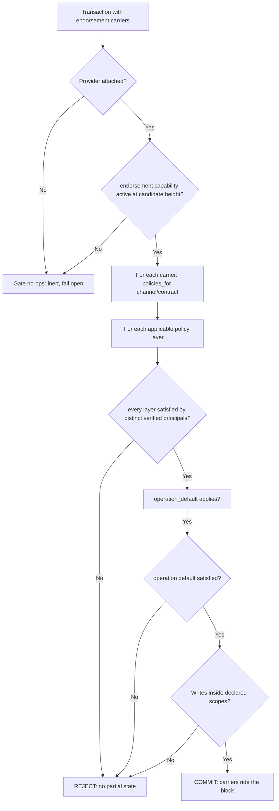

# Privacy and identity — security review reference

**Audience:** security reviewers, compliance officers, and engineers working on
identity, endorsement, or private data. **Read this document against the code,
not instead of it** — this repository has a documented, recurring review failure
of documentation claiming planned work as present, so every section states a
runtime status and names the exact source that supports it.

**Scope:** identity and membership (`glasschain-identity`), the endorsement
policy engine (`glasschain-core`), the peer trust/transport layer
(`glasschain-network`), the transient private-payload store
(`glasschain-storage`), and the regulatory context. Cross-references:
[`architecture.md`](architecture.md) (lifecycle and the "designed but not wired"
section), [`data-model.md`](data-model.md), [`consensus.md`](consensus.md), and
the ADRs in [`adr/`](adr/).

---

## Runtime status summary

A security reader must never be misled. The three columns are: **enforced at
runtime** (the control actually gates a production code path), **implemented but
inert** (the code exists, is tested, but no production binary activates it), and
**not implemented**.

| # | Control | Status | Where it lives |
|---|---|---|---|
| 1 | TLS transport encryption + connection-level fingerprint pinning | **Enforced at runtime** | `Node::build_tls`, `process_message` Hello Step 1, `connector_for_peer_cert` (`glasschain-network/src/node.rs`) |
| 2 | TOFU peer registry (identity pinned on first contact) | **Enforced at runtime**, with accepted limits — address-bound, in-memory, no persistence | `PeerRegistry` / `verify_or_register` (`node.rs`) |
| 3 | Wire-version gate (`glasschain/4`) | **Enforced at runtime** | `process_message` Hello Step 0 (`node.rs`) |
| 4 | Capability gates (`pdc`, `endorsement`, …) | **Enforced at runtime** (once a capability is activated in a committed block) | `CapabilityHistory::effective_set` (`glasschain-core/src/capability.rs`, `node.rs`) |
| 5 | `CertChainVerifier` — `VerificationLevel::Full` cryptographic chain check | **Implemented but inert** — `NodeState.cert_verifier` is `None` in all four `Node` constructors; `set_cert_verifier` is called only from integration tests | `cert_verifier.rs`; `node.rs` `with_components`/`set_cert_verifier` |
| 6 | Certificate-verified PDC org gate (reject self-asserted `Hello` org) | **Implemented but inert — fails open** outside tests: the gate is `cert_verifier.is_some()`, so a stock node accepts the self-asserted org | `process_message` PrivatePayload handler (`node.rs`) |
| 7 | Endorsement evaluation (carriers, `PolicyExpression`, operation defaults) | **Implemented but inert** — `NodeState.endorsement` is `None` in every production binary; `set_endorsement_provider` is called only from tests | `glasschain-core/src/endorsement.rs`; `node.rs` |
| 8 | Policy history replay, same-block policy/write rule | **Implemented; enforced only when a provider is attached and the `endorsement` capability is active** — the gates short-circuit on `endorsement: None` | `PolicyHistory`, `enforce_block_endorsements` (`node.rs`) |
| 9 | PDC membership gate (admission / transport / storage / replay) | **Implemented and enforced when collections are configured** — but no production binary calls `set_collections`; exercised by integration tests only | `Channel::is_member`, `node.rs`, `tests/pdc_boundary.rs` |
| 10 | Transient-store retention (default 72 h) + purge | **Implemented and enforced when wired**; expiry index is in-memory and lost on restart | `TransientStore` (`glasschain-storage/src/transient.rs`) |
| 11 | Pull reconciliation (`RequestPrivatePayload`) | **Implemented; operator-triggered API, no production caller** | `reconcile_private_payloads` (`node.rs`) |
| 12 | CRL / OCSP / any revocation check | **Not implemented** — no revocation path anywhere; chains are single-hop (no intermediates) | gap: issue #58 |
| 13 | Trust persistence across restarts (peer registry, CA store) | **Not implemented** — accepted limitation (`AGENTS.md`) | — |
| 14 | RBAC / role principals (regulator, auditor, logistics) | **Not implemented** — deferred by ADR-008; principals are org members only | ADR-008 "Out of scope" |

Two load-bearing facts behind rows 5–9, verified against the source:

- **`set_cert_verifier` is called from exactly two integration tests**
  (`tests/pdc_distribution.rs` and `tests/protocol_security.rs`); no production
  binary (neither `glasschain-node` nor `glasschain-cli`) calls it.
- **No production binary attaches an `EndorsementProvider`, configures a
  collection, or calls `set_collections`.** Every gate that depends on these
  degrees of freedom is therefore exercised only under test.

Everything below expands on this table. Where a control is inert, the section
says so and explains why it is not a one-line fix.

---

# Part 1 — Identity

## 1.1 The MSP model

`glasschain-identity` implements an organization-centric membership model
(`msp.rs`, `identity.rs`):

- **`Organization`** acts as a Root CA. `Organization::new(name)` generates a
  self-signed X.509 certificate at runtime via `rcgen` (`is_ca =
  Ca(BasicConstraints::Unconstrained)`), with a Distinguished Name of
  `CN = "<name> Root CA", O = "<name>"`. It keeps the CA key pair in an
  `rcgen::Issuer` and a member registry keyed by node ID.
- **`Identity`** is an ed25519 key pair (`ed25519-dalek`, generated from the OS
  entropy source) plus a human-readable `node_id` and an optional PEM
  certificate. `Organization::issue_identity(node_id)` generates a non-CA
  member certificate (`CN = node_id, O = org`) **signed by the Root CA**, and —
  importantly — derives the certificate key pair from the identity's own
  ed25519 signing key (`Identity::rcgen_key_pair`). The certificate's public
  key is therefore *identical* to the key that signs transactions: one key
  system, two representations.
- **`SignedTransaction`** wraps a transaction with a 64-byte detached ed25519
  signature over the canonical JSON serialization (the same bytes used in the
  block hash computation), the signer's public key, and the signer's node ID.
  Any peer can verify it with the embedded public key.

**No key or certificate is ever committed to the repository.** Identity
material is generated at runtime (`AGENTS.md`, "Security considerations":
"Never commit keys, certificates, or `.pem` files. Identity material is
generated at runtime by `glasschain-identity`."). The CLI's `identity` command
emits a generated identity document to stdout — it does not ship storage of
keys in the repo.

Membership is a *node-ID/org-name* concept today; see §1.3 for how that maps
onto network trust, and §2 for how it maps onto endorsement principals.

## 1.2 Certificate chain verification — `CertChainVerifier`

`cert_verifier.rs` implements CA-backed chain verification:

- Constructed from `from_org(&Organization)`, `from_pem(org_name, pem)`, or
  `from_der(org_name, der)`; the org's Root CA certificate becomes the trust
  anchor. `with_level(level)` overrides the default.
- `verify_cert_der` / `verify_cert_pem` run three checks in order:
  1. **Issuer DN byte-match.** The peer certificate's `Issuer` DN is
     re-encoded to DER and compared byte-for-byte with the Root CA's `Subject`
     DN (byte comparison avoids string-canonicalization ambiguity).
  2. **Validity window.** `now` must fall inside `notBefore`/`notAfter`.
  3. **Cryptographic anchoring** — *only at `VerificationLevel::Full` (the
     default)* — via `rustls-webpki`: the peer cert must verify as a
     single-hop path against the Root CA anchor, restricted to
     `ECDSA_P256_SHA256`, `ECDSA_P384_SHA384`, and `ED25519` (RSA and SHA-1 are
     deliberately excluded; nothing in the workspace issues them).

**The attack `Full` defends against**: a Distinguished Name is *attacker-chosen
data*, so any party can mint a certificate whose `Issuer` DN matches the
victim's org exactly — by simply self-signing their own CA with the same name.
`VerificationLevel::Structural` stops at check 1 (DN comparison only) and
**accepts that forgery** (test `test_structural_level_accepts_impostor`
documents this knowingly weaker mode). `Full` rejects it with
`SignatureInvalid` (test `test_impostor_ca_with_identical_dn_is_rejected`).
`Structural` exists for tests and DN-encoding diagnosis only; it "proves
nothing about issuance" (its own doc comment).

The verifier also exposes the certificate-verified **subject CN**
(`verified_subject_cn`, `verified_subject_cn_pem`) — the member identity
stamped at issuance. This is the load-bearing check for the private-payload
org gate (§Part 3): the `Hello`-carried org certificate must verify against the
Root CA **and** its subject CN must equal the claimed org, otherwise the
claimed org is not trusted (ticket #47 design; see §1.4 for runtime reality).

## 1.3 Peer trust: TOFU

The transport layer maintains a **Trust-On-First-Use peer registry**
(`PeerRegistry`, `node.rs`):

- On first contact from a peer, `verify_or_register` records
  `(node_id, TLS cert fingerprint, org, org_verified, advertised capabilities)`
  keyed by **the address the peer advertises in its `Hello`** (`listen_addr`),
  not the TCP source address of the connection.
- On reconnection, the identity must match: a changed `node_id` or a changed
  TLS certificate fingerprint is rejected as potential impersonation. A
  changed **org** (`org drift`) is also rejected — the org gates private-payload
  delivery, so a returning peer that suddenly claims a different organization is
  treated as a re-keyed node or an impersonation.
- Records are *not* removed on disconnect, so reconnecting peers are verified
  against their original identity.

**The address-bound footgun**: trust is keyed to the **advertised** listen
address, which is nothing more than a `Hello` field. An attacker controls what
they advertise, so the registry binds identity to a self-declared locator
rather than the observed connection. The receive path must use
`current_stable_addr` (the value captured from the peer's own `Hello`) for
registry lookups — never the connection address, which is ephemeral for inbound
connections. This is documented in the code and flagged in
`.agents/memories/debt-gap-handoff.md`; it is a deliberate, accepted shape of
the current model, not a bug in search of a silent fix.

`PeerRegistry.org_verified(addr, org)` answers whether the peer at `addr`
claimed `org` *with a certificate-verified identity* (ticket #47). Bare TOFU
leaves `org_verified == false`: the org is self-asserted.

## 1.4 Honest limitations — read this section first

These are the properties that actually decide what this system *is* today.
The first three are recorded in `AGENTS.md` as known and accepted. **The fourth
is the critical one, and it is also recorded — in `.agents/memories/` and
`architecture.md` §7.2 — because it was a recurring false-doc trap.**

1. **TOFU trust is address-bound.** See §1.3. Trust pins the *advertised*
   locator; there is no binding to a network-level identity independent of the
   peer's self-declaration.
2. **There is no shared CA across organizations.** Every `Organization`
   self-issues its own Root CA at runtime. No actor holds a single CA that
   spans the federation, and there is no cross-org trust-store exchange.
3. **Trust does not persist across restarts.** The peer registry is in-memory
   and only `Block`/world-state data is stored; a restarted node re-learns every
   peer from scratch (TOFU from first use again). A node whose certificate
   rotated across a restart will re-register as a "new" peer.
4. **Certificate verification is inert at runtime, and the PDC org gate
   consequently fails open.** `NodeState.cert_verifier` is initialized to
   `None` in every `Node::with_components` call (`node.rs`), and
   `Node::set_cert_verifier` is called from exactly two integration tests
   (`tests/pdc_distribution.rs`, `tests/protocol_security.rs`). In every
   production binary — `glasschain-node` builds an `Organization` for TLS
   identity purposes and then drops it; `glasschain-cli` never touches a node —
   the value stays `None`. Consequences:

   - The Hello handshake's org check (`process_message`, Step 2.5) computes
     `has_verifier = cert_verifier.is_some()` → `false`, so
     `org_verified = false` and **no peer is rejected for an unverifiable org**.
   - The private-payload gate computes
     `verification_required = cert_verifier.is_some()` → `false`, so the
     membership check accepts the **self-asserted `Hello` org** as-is:
     `sender_ok = membership && (!verification_required || sender_verified == Some(true))`.

   **This is not a one-line fix.** Each node self-issues its own org Root CA,
   so a single-org verifier (`CertChainVerifier::from_org(&own_org)`) would
   reject *every* cross-org peer — the "no shared CA" limitation above. Wiring
   verification into the binaries requires a federation trust-store /
   CA-distribution decision first. Installing a single-org verifier in
   `glasschain-node` is explicitly the wrong "fix" (it would disconnect the
   network); the work is tracked as **issue #57**, and the design intent
   (ticket #47: verify the Hello-carried org cert under a configured Root CA
   and require CN == claimed org) is fully implemented and integration-tested —
   it is the *wiring* that is absent.

5. **No revocation — issue #58.** There is no CRL, OCSP, or any revocation
   mechanism anywhere. `cert_verifier.rs` verifies signatures against the Root
   CA and explicitly documents that revocation is not checked. Chains are
   **single-hop**: `Organization::issue_identity` signs member certificates
   directly with the root; `verify_signature` builds a one-hop path with no
   intermediates. A decommissioned member's certificate stays valid until its
   expiry. `AGENTS.md` does not list this as accepted; it is a genuine open
   gap, and §4.3 notes the Brazilian legal pressure on it.

6. **Membership and endorsement are separate but neither is certificate-bound
   in production.** `MspEndorsementProvider` binds a public key to a
   `Principal` in an in-memory directory, with a module-level `ponytail:` note
   that the directory "stands in for certificate-bound MSP verification"
   (Stage 2 per ADR-008 consequences). The certificate machinery in §1.2 is
   the planned binding; it is not wired (see row 5 of the status table).

## 1.5 TLS transport

Peer connections are TLS-encrypted by default:

- Every node generates a **self-signed** TLS certificate at startup. With an
  identity, the TLS certificate and the transaction-signing key share the same
  ed25519 key pair (`Node::build_tls` uses `Identity::rcgen_key_pair`), and the
  certificate's CN is the node ID; without one, a throwaway `glasschain-node`
  self-signed cert is generated. Either way it is a **transport certificate**,
  distinct from the **organization certificate carried in `Hello`**
  (`Message::Hello.certificate_pem`).
- Before the TLS handshake, peers exchange raw certificate DERs with a 4-byte
  length prefix; the server observes the client's certificate and computes its
  SHA-256 fingerprint (`observed_cert_fingerprint`). The `Hello` then carries
  the *advertised* fingerprint, and Step 1 of the handshake rejects the
  connection if advertised ≠ observed — fingerprint pinning at the session
  level. The server uses `with_no_client_auth`; client identity at the TLS
  layer is the pre-TLS certificate-fingerprint exchange, not a client cert.
- Outbound connections normally build a per-peer connector whose root store
  contains exactly the peer's presented certificate
  (`connector_for_peer_cert`) — i.e. the TLS layer is transport-only
  encryption against a pinned self-signed peer cert, carrying no CA
  semantics. **Organization trust is not a TLS property**; it belongs to the
  application layer (cert_verifier, Hello org), which is inert per §1.4.
- `GLASSCHAIN_INSECURE_TLS=1` and the `insecure-tls` feature on
  `glasschain-network` replace pinning with `AcceptAnyCert`. Both are
  local-debugging escape hatches only — never the default, and never to be
  widened (`AGENTS.md` treats the secure path as an invariant).

---

# Part 2 — Endorsement

## 2.1 The policy model (ADR-008)

`glasschain-core/src/endorsement.rs` defines the v1 policy language — a
deterministic, Fabric-style signature-policy tree:

```rust
enum PolicyExpression {
    SignedBy(Principal),
    NOutOf { required: usize, rules: Vec<PolicyExpression> },
}
```

- Local `and(rules)` / `or(rules)` builders serialize to `NOutOf` (`required =
  rules.len()` / `required = 1`). There is no implicit `ANY`/`ALL`/`MAJORITY`
  language; the persisted/wire representation is deterministic `serde` data —
  the exact JSON shape is locked by a test (`test_expression_roundtrip_is_deterministic`),
  so it is never executable policy code.
- A **principal** is a verified MSP organization member identifier — "never a
  caller-supplied label" (see §1.4 row 6 for the runtime binding reality).
- `validate()` rejects allow-all shapes: an empty principal, an `NOutOf` with
  no rules, `required == 0`, or `required > rules.len()`. A channel without an
  explicit default is **not** allow-all; the v1 default is fail-closed:
  `NETWORK_GOVERNANCE_PRINCIPAL = "network-governance"` must sign
  (`.agents`/ADR-008 decision 1).

**The crucial semantic — `NOutOf` counts distinct principals.** Evaluation
(`MspEndorsementProvider::evaluate`) collects verified principals into a set
and `PolicyExpression::evaluate` counts set membership. Two signatures from the
same organization never satisfy two different `SignedBy` leaves, and a
duplicate/replayed signature never increases the count ("replayed or duplicate
signatures do not increase the count" — a malformed signature is skipped, not
counted). An AND over Org A and Org B therefore **cannot be satisfied by two
signatures from Org A**, and even two *nodes* of Org A count once
(`test_distinct_principal_counting_duplicates_do_not_inflate`). A claimed
principal that conflicts with the registered key is rejected
(`MspEndorsementProvider::evaluate` → "claimed principal … conflicts with
verified principal"), and an unregistered key is rejected outright.

Policy layers (`ScopedPolicies`) — channel default → optional stricter contract
default → optional PDC collection policy → optional per-key policy — all apply
to a scoped write; a transaction touching multiple keys must satisfy each key's
policy (`applicable(target)` returns every layer, in precedence order, and the
evaluator requires all of them). ADR-008 §1 states a more-specific policy "may
add constraints but may not weaken" a base requirement — see §2.4 for why this
is only aspiration in the current implementation.

## 2.2 How enforcement actually works

### The endorsement carrier

A signed transaction carries `TransactionEndorsement { target, signers }`
attached as `Transaction.endorsements`. Key facts, all from
`glasschain-core/src/endorsement.rs`:

- **The signed payload is never self-referential.** `TransactionEndorsement::payload(tx)`
  serializes the transaction with its endorsement carriers cleared, so a
  signature covers the transaction id, kind, and declared targets but not the
  carriers themselves. The signature covers the *transaction*; the *committed
  write set* is bound separately by the scope check.
- **Scope coverage.** `covers(write)` requires the write's channel, contract,
  and key to match the carrier's target, and requires the visibility to line up
  exactly: a public write needs `target.collection == None`; a PDC write needs
  `WriteVisibility::Pdc(name)` with `name == target.collection`. A write that
  falls outside every declared carrier rejects the transaction.
- **Operation defaults.** `operation_default(tx)` imposes record-family rules
  on top of scoped policies: `delivery_receipt` → sender **and** receiver
  (2-of-2); `recall` → envelope issuer **and** payload `issued_by` (2-of-2);
  `quality_certification`/`audit_attestation` → payload `issuer` (single).
  Families that carry a default but are missing their payload field **fail
  closed** (construction-time error, not a silent allow).

### Committed policy state

- **`PolicyUpdate`** is a signed transaction committing a **full replacement**
  `ScopedPolicies` for a `(channel, contract)` scope. It activates only after
  its containing block commits; evaluation always runs against the *pre-block*
  policy history.
- **`PolicyHistory`** is versioned, append-only, and derived by deterministic
  replay from committed blocks (`build_from_blocks`, `validate_block`). The
  effective set for `(channel, contract)` is the last exact-scope update, else
  the last channel-wide update, else the fail-closed `network-governance`
  default. Historical blocks keep the policy effective at their height by
  construction.
- **The same-block rule (ADR-008 decision 4).** `validate_block` rejects a
  block that both changes a key's policy **and** writes the same key — the
  write would commit under the old policy while the block installs a new one.
  A `PolicyUpdate`'s own carrier target names the keys it authorizes, not
  writes, so it is not caught by its own rule.
- A `PolicyUpdate` transaction must itself carry at least one endorsement
  carrier, evaluated under the current effective policy — policy changes are
  authorized by the policy they replace.

### The enforcement gates

The instruction to "read the gates" — here they are, all in
`glasschain-network/src/node.rs`, all additionally gated on the `endorsement`
capability being active at the candidate height (ADR-010):

1. **Admission** — `Node::submit_transaction`: if a provider is attached and
   the `endorsement` capability is active at the *next* height, the
   transaction's declared carriers are evaluated immediately against the
   pre-block policy history, with empty partial writes (write-scope binding
   happens at block admission). An unauthorized policy update or record is
   rejected before it can sit in a pending pool.
2. **Mining** — `Node::mine_async` → `enforce_block_endorsements` with
   per-transaction write attribution: every transaction's carriers are
   evaluated with *its own* writes, so scope binding is precise on the local
   mine path.
3. **Peer block** — `process_message` on `Message::Block` →
   `enforce_block_endorsements` with an empty per-tx slice: replay paths cannot
   attribute writes, so they get **aggregate** coverage instead — every
   committed write must sit inside *some* declared carrier in the block (§2.4).
4. **Sync** — `process_message` on `Message::Chain` → `enforce_chain_endorsements`:
   before a candidate chain is adopted wholesale, every candidate block is
   walked (capability history, policy history, carrier evaluation, aggregate
   coverage). The sync path was a full admission bypass before ticket #45; it
   now enforces.
5. **Structural replay at commit** — `enforce_block_endorsements` first
   validates the block's policy metadata and the same-block rule on a scratch
   history, and the node rebuilds `PolicyHistory` from the chain after every
   commit (`after_block_commit`) and on start. Policy metadata that would fail
   validation surfaces as an error on every path that adopts a block.

The evaluation flow, expressed as a decision tree:



(A flow, not a claim: every box in this diagram that reads "verified" is
backed by `MspEndorsementProvider`'s key directory only when a provider is
actually attached — §2.4.)

The full behavior is exercised end-to-end in
`crates/glasschain-network/tests/endorsement.rs` (real submit → mine → assert)
and unit-tested in `glasschain-core/src/endorsement.rs`.

## 2.3 Where policies come from — the false-doc trap

State it exactly, because this exact sentence has been documented wrongly
before and a review caught it (`.agents/memories/debt-gap-handoff.md`):

> **The authoritative collection endorsement policy is a `COMMITTED PolicyUpdate`
> with a collection-scoped `collection_policy`, evaluated by the endorsement
> engine at the commit path over verified principals (the #45 engine).**

> **`ChannelConfig.endorsement_policy` is a this-node LOCAL DECLARATION only.
> It is NOT an enforcement source.** It rides node configuration for
> bookkeeping/display purposes; enforcement reads the committed
> `PolicyHistory` (pre-block) for each carrier's target. `channel.rs` says as
> much verbatim: "the authoritative, enforced source is the committed
> `PolicyUpdate` carrying a collection-scoped `collection_policy` (ADR-008),
> which the endorsement engine evaluates at the commit path over verified
> principals."

The same separation holds for membership: `ChannelConfig.member_ids` plus the
default regulators define who may read/write/receive private payloads, but
**membership never satisfies an endorsement policy** — a member is not an
endorser (§3.6).

## 2.4 Honest gaps

All confirmed against the source (`.agents/memories/debt-gap-handoff.md`,
`architecture.md` §7.3, and the code):

1. **No production binary attaches an `EndorsementProvider` — issue #59.**
   `NodeState.endorsement` starts `None`; `set_endorsement_provider` is called
   only from tests (`tests/endorsement.rs`, the `glasschain-rpc` server
   integration test, and node unit tests). Every gate begins with
   `let Some(provider) = provider else { return Ok(()); }` — so in production
   the entire ADR-008 machinery is inert. The `VerifyEndorsement` gRPC method
   returns "no endorsement provider configured" on a stock deployment. Wiring a
   provider is a deployment decision (which org directory? whose key
   registrations?) and needs a node/CLI flag or network default; nothing in a
   binary currently makes that choice.
2. **`PolicyUpdate` is a full replacement — a more-specific scope can weaken a
   base layer.** ADR-008 §1's non-weakening rule ("a more-specific policy may
   add constraints but may not weaken a channel, contract, or collection
   requirement") is *not enforced*. `PolicyHistory::policies_for` returns the
   last update for the exact scope wholesale, and `ScopedPolicies::applicable`
   composes layers within one set — but a contract-scoped update replaces the
   whole `ScopedPolicies` for that contract, so a laxer `channel_default` in a
   more-specific update overrides a stricter channel-wide one.
3. **Record families have no channel/contract scope.** Committed policies
   cannot reach `CanonicalRecord` transactions; `operation_default` is the
   only record-level enforcement. In particular, the recall 2-of-2
   **degenerates to self-approval** when the envelope issuer equals the payload
   `issued_by` — the `ponytail:` comment in `endorsement.rs` calls it out;
   configured multi-party policies for record families await channel wiring.
4. **Peer-path write binding is aggregate, not per-transaction.** On replay
   paths (peer block, sync) `enforce_*_endorsements` checks only that every
   committed write is covered by *some* carrier in the block — it does not
   attribute each write to the transaction that produced it. A peer-sourced
   block whose write set is collectively covered by carriers of *different*
   transactions would pass aggregation. Precise per-transaction binding exists
   only on the local mining path.
5. **Capability gating interacts with the gates.** All gates are dormant until
   the `endorsement` capability is activated on-chain. Until then the behavior
   is exactly pre-#45 (writes commit without carriers), which is correct
   ledger-evolution semantics but worth stating plainly for a reviewer.

---

# Part 3 — Private Data Collections

## 3.1 The model (ADR-003)

One global, ordered chain for everyone; **public hash commitments** on-chain;
**private commercial payloads** disseminated point-to-point to authorized
collection members only. The public ledger carries *that a custody transfer
occurred*, custodian org identities, GTIN/batch/lot identifiers, timestamps,
and recall notices in full — plus a SHA-256 commitment per private payload. The
private side (pricing, payment terms, quantities, counterparties) travels only
inside the private-payload path. A non-member can verify that a transaction
occurred and was not tampered with, without reading its contents.
`architecture.md` §5 and `data-model.md` describe the chain side; this section
describes the private side.

## 3.2 The three subsystems

ADR-003 explicitly decomposes the feature (mirroring Fabric's
`privdata`/`gossip`/`transientstore` split) into three pieces with different
lifetimes and failure modes:

| Concern | GlassChain home | Verified at |
|---|---|---|
| Collection policy / membership | `glasschain-identity/src/channel.rs` (`Channel`, `ChannelConfig`) | §3.6 |
| Dissemination **and** reconciliation | `glasschain-network` (`submit_private_payload`, `reconcile_private_payloads`, payload handling in `process_message`) | §3.3, §3.4 |
| Ephemeral pre-commit storage | `glasschain-storage/src/transient.rs` (`TransientStore`) | §3.5 |

**Why reconciliation is not optional:** a peer that is offline at
dissemination time must still be able to obtain the payload, because a recall
or audit may later demand the private terms behind a committed commitment.
The chain's write set is the driver: `reconcile_private_payloads` scans the
committed chain for the collection's `WriteVisibility::Pdc` writes, computes
the commitments this member's transient store is missing, and sends one
`RequestPrivatePayload` per missing commitment to a connected member peer —
"nothing is invented and nothing leaks: the request names only a commitment
this node can already see" (its own doc comment). The answer travels the same
member-gated `PrivatePayload` path.

## 3.3 On the wire

`glasschain-network/src/protocol.rs` defines the JSON protocol (`Message`,
tagged `msg`/`data`, 4-byte big-endian length framing, `MAX_MESSAGE_SIZE` =
16 MiB). The privacy-relevant surface:

- **`Message::PrivatePayload { collection, commitment, payload }`** — the
  private payload, sent **point-to-point between collection members only,
  never broadcast**. The receiver verifies: the `pdc` capability is active at
  the *next* height; the sender completed a Hello; this node's org is a member;
  the sender's org (from the peer registry) is a member; and
  `commitment == sha256(payload)` before storing. The globally replicated chain
  carries only the commitment (via the block's redacted write set).
- **`Message::RequestPrivatePayload { collection, commitment }`** — pull
  reconciliation (ticket #47): only a member may ask, only a member holding the
  payload may answer, and the answer is an ordinary `PrivatePayload`, so every
  transport check applies to the answer too. Silence otherwise.
- **`Message::Hello` fields**: `node_id`, `tls_cert_fingerprint`,
  `chain_length`, `version`, `capabilities`, `org` (defaults keep pre-`/3`
  peers decodable), `certificate_pem` (the org-issued certificate, verified
  against the org Root CA when a verifier runs — ticket #47 design; see §1.4
  for runtime reality), and `listen_addr`.
- **Wire-version progression** (read from `protocol.rs`, exact):
  `PROTOCOL_VERSION = "glasschain/4"`. The `/2` bump marked the BFT consensus
  seam; `/3` added the `PrivatePayload` message and the `Hello` `org` field
  (ticket #46, ADR-003); `/4` added pull-based reconciliation via
  `RequestPrivatePayload` (ticket #47) — a `/3` peer "can neither request
  missing payloads nor answer requests, so the gate keeps such peers from
  silently missing private writes." The version gate disconnects incompatible
  peers at Hello Step 0.

The dissemination and reconciliation flows:

```mermaid
sequenceDiagram
    participant W as Writer (member, mines)
    participant M as Member peer
    participant O as Outsider (non-member)
    participant C as Chain (global)

    Note over W: submit_private_payload(collection, payload)<br/>gates: membership + pdc capability<br/>at NEXT height
    W->>W: store in TransientStore (retention window)
    W->>M: Message::PrivatePayload (collection, commitment, payload)
    W->>O: (no message — not a member target)
    Activate M
    M-->>M: transport gate: pdc active? both orgs members?<br/>sha256(payload)==commitment?
    Note over M: store in TransientStore
    Deactivate M
    W->>C: block with PDC write redacted to commitment
    C-->>O: outsider chain carries identical commitment,<br/>no payload bytes anywhere

    Note over M: offline during dissemination
    M->>C: sync chain (Message::Chain)
    M->>M: reconcile_private_payloads(collection):<br/>scan Pdc writes; missing = held?
    M->>W: Message::RequestPrivatePayload (collection, commitment)
    W-->>M: Message::PrivatePayload (member-gated answer)
    Note over M: now holds what it was missing
```

## 3.4 The four boundaries

Read `tests/pdc_boundary.rs` (and `tests/protocol_security.rs` for the raw-TLS
branches) — the boundaries are enforced exactly there:

1. **Admission** — `submit_private_payload` rejects a non-member local org and
   any submission while the `pdc` capability is inactive; `mine_async` drops a
   candidate **whole** if it contains a PDC-scoped write while `pdc` is
   inactive (nothing commits, nothing is held — `pdc_writes_require_the_active_capability`).
2. **Transport** — `Message::PrivatePayload` is accepted only when the local
   org is a member, the sender's registry org is a member, and the commitment
   matches the bytes. A payload pushed directly at a non-member over the raw
   wire is rejected (protocol_security's transport-leakage test); an
   unauthenticated peer (no successful Hello) is rejected before any of that;
   a commitment mismatch is never stored (`private_payload_with_commitment_mismatch_is_rejected`).
3. **Storage** — payloads live only in collection members' `TransientStore`,
   keyed by `(collection, sha256(payload))`; a member miner of a *relayed*
   PDC execution commits the public commitment and holds nothing
   (`non_member_miner_never_holds_private_cleartext`); the outsider's chain
   contains the identical commitment and no payload bytes in any encoding
   (the boundary test greps the serialized chain for raw and base64 payload
   bytes).
4. **Replay** — reconciliation gated on membership of both requester and
   holder, driven only by on-chain commitments; a non-member reconciles
   nothing (`offline_member_catches_up_via_reconciliation`, outsider case).

With a `cert_verifier` configured, boundary 2 additionally requires the sender
to be certificate-verified (`identity_verified_payload_delivery`,
`hello_with_unverified_org_certificate_is_disconnected`) — and per §1.4 that
additional requirement is off in production.

## 3.5 Retention and purge

- `ChannelConfig.retention_secs` — **default 72 hours**
  (`default_retention_secs() = 72 * 60 * 60`, `channel.rs`; ADR-003 decision 4
  calls the value "default, configurable — flagged by the owner as subject to
  change").
- `TransientStore::put` stores a `PayloadEnvelope { payload, expires_at }`
  where `expires_at = now + retention_secs`.
- **Retention is a read boundary, not just a background sweep**: `get` refuses
  expired-but-not-yet-purged entries.
- `purge_expired_private_payloads` (node) → `TransientStore::purge_expired`
  removes every expired entry the process knows about. Payloads vanish; the
  chain's hash commitments persist forever — a late auditor can prove
  existence and consistency but cannot read contents
  (`purge_removes_payloads_commitments_persist`).
- **The `ponytail:` limitation in `transient.rs`:** the expiry index is
  in-memory, filled on `put`. A restarted member cannot enumerate payloads
  written before the restart, so purge-after-restart requires a storage
  `list` capability that does not exist yet. A restarted node also loses its
  *knowledge* of what it holds — though the chain still drives reconciliation
  for anything committed (§3.2), uncommitted/never-committed payloads are
  simply stranded by the restart.

## 3.6 Membership vs endorsement

Collection configuration carries the two controls separately:

- `ChannelConfig.member_ids` (+ `DEFAULT_REGULATOR_ORGS` = `["anvisa", "mapa"]`,
  present in *every* collection by default — ADR-003 decision 2: regulators
  already receive full pricing through NF-e, so per-collection audit grants
  would only create recall blind spots) define **membership**: who may read,
  write, submit, and receive private payloads.
- `ChannelConfig.endorsement_policy` is a **local declaration** of the
  collection's optional endorsement policy — **not an enforcement source**
  (§2.3). The enforced collection policy is a committed `PolicyUpdate` with a
  `collection_policy`.

A member is never an endorser by virtue of membership; a PDC write does not
automatically require a multi-party quorum (ADR-008: "no blanket quorum
rule"). `channel.rs`'s own test (`test_endorsement_policy_is_separate_from_membership`)
asserts the separation.

## 3.7 Capability gating subtlety — the NEXT height

Private payloads are **pre-commit artifacts**: a payload accompanies a write
that will land at `tip + 1` (the next height), and it may arrive at a peer
*before its block does*. Both gates therefore use the capability set effective
at the **next height**, not at the tip:

- `submit_private_payload`: `effective_set(chain.len())` (next height) must
  have `pdc` active.
- The receive path (`process_message`, `PrivatePayload`): the same
  `effective_set(chain.len())` check, "matching the submission gate", in one
  lock scope so the chain cannot advance mid-check.

This mirrors the general ADR-010 rule that a block is validated under the set
active at its *own* height — the payload gate just has to look one block ahead
because it precedes the block. The `endorsement` admission gate uses the same
next-height reasoning (`submit_transaction` evaluates at `effective_set(next)`).

---

# Part 4 — Regulatory context

**This section is context, not legal advice.** It summarizes how the system's
actual design interacts with Brazilian law; verify any compliance position
with counsel. Source: `.agents/memories/external-review-verdicts.md`, which
records an external architecture review dated 2026-09-02 against this working
tree.

### 4.1 LGPD (Lei 13.709/2018)

The tension is real but moot here by construction:

- **Art. 18 III/VI** give data subjects rights to *correction* and *erasure*
  of their personal data; an immutable chain cannot edit or delete committed
  records.
- **Art. 16-I** resolves the tension for retention that serves a legal duty:
  data may be kept beyond the treatment purpose where retention is required by
  law/regulation — and a supply-chain custody ledger's retention is a legal
  record-keeping duty (ADR-003 decision 3 ties payload retention to the
  product class's legal shelf life).
- **And it is moot here**: no PII is written on-chain. Verified: certificate
  material lives in memory (`Organization` root CA, `Identity.certificate_pem`)
  and on the wire in `Hello.certificate_pem`; the peer registry stores only
  fingerprint + org; **nothing certificate-shaped is ever committed to a
  block** — blocks carry hash commitments only (ADR-003; `compute_write_set`
  redacts PDC values to commitments before inclusion). The indexer and
  analytics operate on public write sets, not private payloads.

### 4.2 ICP-Brasil / MP 2.200-2

**MP 2.200-2, Art. 10 §2º** expressly preserves *other* means of proving
authorship and integrity — including non-ICP-Brasil certificates — "desde que
admitido pelas partes" (as agreed between the parties). A private federated
ledger therefore does **not** require an ICP-Brasil certificate chain; the
federation's own ed25519 signatures + shared chain are a defensible
"admitted by the parties" mechanism. (The review record flags that the
"ICP-Brasil required" claim reads as real law that cuts the *other* way.)

### 4.3 Lei 14.063/2020

**Art. 13** mandates a *qualified* electronic signature for controlled-substance
e-prescriptions; **Art. 4º §2º** mandates the existence of revocation mechanisms
for digital signatures. The latter is direct external pressure on the
identity gap in §1.4 item 5 (no CRL/OCSP — issue #58): a deployment signing
regulated documents will eventually need a revocation story even though the
ledger itself does not today. The former is a domain constraint for
pharmaceutical e-prescription flows, not a ledger-architecture requirement;
do not extrapolate an ICP-Brasil chain requirement from it (Art. 2º scopes the
law to public-sector interactions; GlassChain's federation is private).

---

## Appendix — verification map for reviewers

The status table's claims, with the exact places to re-verify them:

| Claim | Re-verify at |
|---|---|
| `cert_verifier` starts `None`; `set_cert_verifier` test-only | `node.rs` `with_components`; grep `set_cert_verifier` across `crates/` (only `tests/pdc_distribution.rs`, `tests/protocol_security.rs`) |
| Payload org gate fails open | `node.rs` `process_message`, `PrivatePayload` branch: `verification_required = s.cert_verifier.is_some()` |
| Endorsement provider test-only | grep `set_endorsement_provider` across `crates/` (tests + node unit tests only) |
| No production `set_collections` | grep `set_collections` across `crates/glasschain-node`, `crates/glasschain-cli` (no matches) |
| `PROTOCOL_VERSION` | `protocol.rs`: `"glasschain/4"` |
| Retention default 72 h | `channel.rs` `default_retention_secs()` |
| Next-height payload gates | `node.rs` `submit_private_payload` and `PrivatePayload` handler, both `effective_set(chain.len())` |
| Committed, not declared, policy | `glasschain-core/src/endorsement.rs` `PolicyUpdate`/`PolicyHistory`; `channel.rs` doc on `endorsement_policy` |
| No CRL/OCSP, single-hop | `cert_verifier.rs` module doc + `verify_signature`; grep for CRL/OCSP is empty |
| Recall self-approval / operation defaults | `glasschain-core/src/endorsement.rs` `operation_default` + `ponytail:` comment |
| ADR-008 non-weakening unenforced | `PolicyHistory::policies_for` (full replacement) vs ADR-008 §1 |
| Aggregate (not per-tx) peer-path binding | `enforce_block_endorsements` / `enforce_chain_endorsements` (empty `per_tx_writes` → block-level `covers`) |

Document generated against the working tree; any discrepancy between this
document and the code should be resolved in favor of the code, and this
document updated.