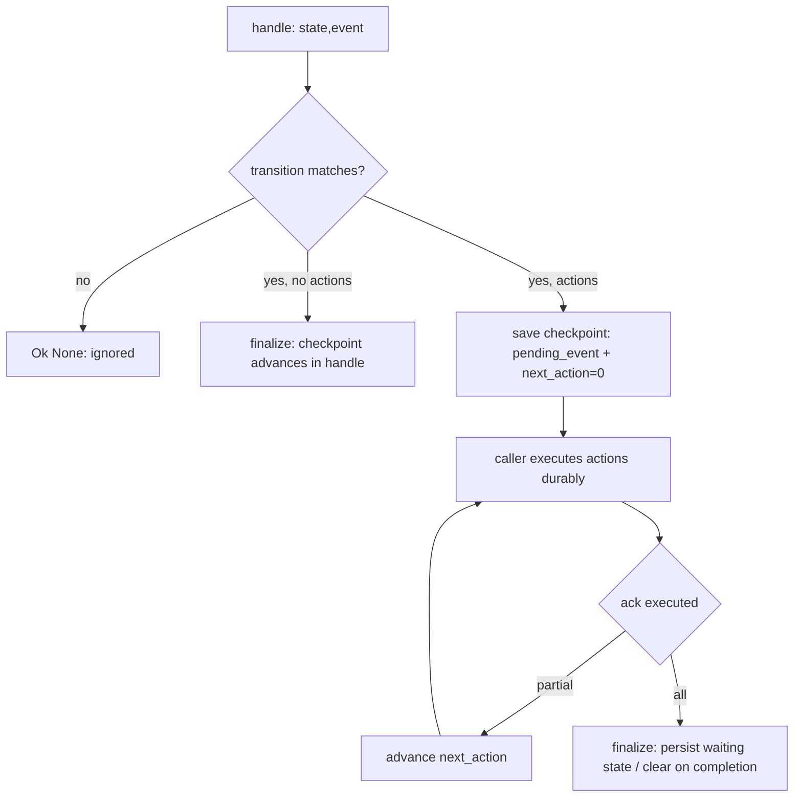
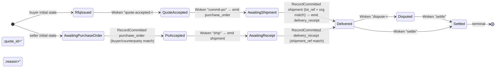
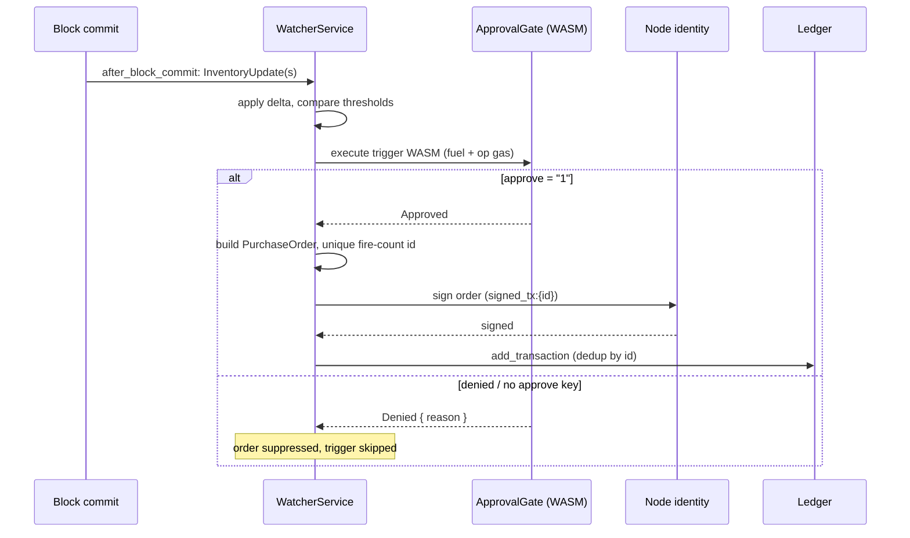

# GlassChain workflows and contracts

**Audience:** an engineer building business logic on GlassChain — writing a
contract, adding a flow, or wiring automation. This document is written against
the shipped code at `main`, not against the plan: every claim names the file and
symbol that implements it, and each code snippet below is copied from the
source. Where something is designed but not wired, the document says so in the
same sentence.

Sibling documents: [architecture](architecture.md) · [data-model](data-model.md)
· [consensus](consensus.md) · [privacy-and-identity](privacy-and-identity.md) ·
[operations](operations.md). Decisions: [ADR-001 execution layer](adr/adr-001-execution-layer.md) ·
[ADR-005 certification and audit](adr/adr-005-certification-and-audit.md) ·
[ADR-006 canonical schema v1](adr/adr-006-canonical-schema-v1.md) ·
[ADR-007 VM state semantics](adr/adr-007-vm-state-semantics.md) ·
[ADR-010 capability versioning](adr/adr-010-capability-versioning-policy.md).

---

## Part 1 — The packaging split

### 1. Contracts vs workflows

The workspace mirrors Corda's CorDapp split into a **deterministic, verification-only
contract layer** and an **I/O-driven workflow layer**:

- **`glasschain-contracts`** is the deterministic half. It owns the contract
  registry (`ContractEngine`), condition matching, and the WASM approval gate
  (`ApprovalGate`). The crate-level docs say it plainly
  (`crates/glasschain-contracts/src/lib.rs`):

  > Everything in this crate is a pure function of its inputs: no wall clock,
  > no randomness, no network, no persistence. Given the same contracts and the
  > same committed state, evaluation and emission are byte-identical — which is
  > what makes replay and cross-node agreement safe. I/O-driven automation
  > (event watchers, flow orchestration) lives in `glasschain-workflows`.

  The registry is a `BTreeMap<String, Contract>` (`engine.rs`), keyed by
  `contract_id`:

  ```rust
  /// Keyed by `contract_id`. A `BTreeMap` so iteration — and therefore
  /// transaction emission order — is deterministic across processes (the
  /// deterministic-contract invariant, ticket #49).
  contracts: BTreeMap<String, Contract>,
  ```

  A `HashMap` would make multi-contract emission order a function of hasher
  seeds and insertion history; the `BTreeMap` makes it a function of the
  contract ids alone — two nodes emit in the same order.

- **`glasschain-workflows`** is the I/O-driven half: flow state machines
  (`FlowRunner`), durable checkpoints over the `StorageProvider` seam, the triage
  view, and the `WatcherService`. The dependency is one-way: workflows use
  `ApprovalGate` and `ContractEngine`, while `glasschain-contracts` depends only
  on `glasschain-core`. Do not introduce a reverse edge — define a trait in
  `glasschain-core` and inject the implementation instead.

The split is enforced by dependency direction in `Cargo.toml`, and the two
automation halves share the same approval protocol: an `ApprovalGate` produces
a `GateDecision` from a guest's execution result
(`crates/glasschain-contracts/src/approval_gate.rs`):

```rust
// Approval gates consume **ephemeral** output only (ADR-007 decision 1):
// a guest contract cannot approve by requesting a persistent write, and
// an approval evaluation never persists anything.
if result
    .ephemeral
    .iter()
    .any(|(key, value)| key == "approve" && value.as_slice() == b"1")
{
    GateDecision::Approved
}
```

### 2. The determinism invariant

The contract layer's evaluation and emission are **pure functions of their
inputs**: no wall clock, no randomness, no network, no persistence. Replaying
the same inputs is byte-identical, which is what makes cross-node agreement
safe. Concretely:

- `ContractEngine::evaluate_supply_offer` derives every emitted transaction id
  from the contract id and the offer transaction id, and every quantity from
  conditions and the offer — never from `SystemTime::now()`.
- `Transition::apply` in the workflow framework has the same contract
  (`crates/glasschain-workflows/src/transition.rs`): "a pure, deterministic
  function `(state, event) -> TransitionResult`: no I/O, no wall-clock reads,
  no randomness. Re-applying the same `(state, event)` yields the same result,
  which is what makes checkpoint replay sound."
- Emission *order* is deterministic too: contracts iterate over the
  `BTreeMap`, and write sets are canonicalized (scope-sorted) at the execution
  seam (`ExecutionResult::canonicalize`).

**The documented exception.** The chain model in `glasschain-core` stamps
wall-clock timestamps at creation and lives *outside* this invariant:
`Transaction::with_id` sets `timestamp` from `SystemTime::now()`
(`crates/glasschain-core/src/transaction.rs`), `Block::with_write_set` does the
same (`block.rs`), and mining refreshes the block timestamp on the rare
nonce-wrap path. The genesis block is the deliberate exception to the
exception — fixed `timestamp = 0` so every node derives the identical genesis
hash (`ledger.rs`). Transaction and block timestamps are ordering hints, not
consensus-relevant data; contract and flow state must never depend on them.

---

## Part 2 — Contract execution

### 3. The WASM runtime

`glasschain-vm` implements the `ExecutionProvider` trait
(`crates/glasschain-core/src/providers.rs`) using **Wasmtime**
(`crates/glasschain-vm/src/wasm.rs`). Each execution gets a fresh `Store` with
two independent budgets: **instruction fuel** — Wasmtime's `consume_fuel(true)`
mode deducts 1 unit per WASM instruction, capped by `limits.fuel_limit` — and
**operation gas** — `GasCounter` charging host state operations against an
independent `operation_gas_limit`. Exhausting either returns
`CoreError::GasExhausted` with meter, used, and limit. Instantiation is not
metered as execution: the store gets `u64::MAX` fuel while the module
instantiates (Wasmtime meters data-segment copies there), then the real fuel
limit is set before `execute`.

**Reentrancy guard — available, not wired.** `GasCounter` has a call-depth
guard (`push_call` / `pop_call`, `GasCosts::max_call_depth = 8`), but the
Wasmtime provider never invokes it — contracts cannot recursively call other
contracts. ADR-001: *"The call-depth guard remains deferred until recursive
contract calls exist."* Do not describe it as an active protection.

**ADR-001 settled the execution layer.** WASM/Wasmtime **remains** the engine;
the "EVM-compatible smart contracts" requirement was clarified into a MUST
(contract support — met by WASM), a SHOULD (EVM compatibility — deferred behind
the `ExecutionProvider` seam as an optional adapter), and a non-requirement
(Solidity — out of scope). An EVM adapter must never become a dependency of
`glasschain-core`.

### 4. The host ABI — what a guest can call

The linker registers four host functions under the `env` module
(`crates/glasschain-vm/src/wasm.rs`, `build_linker`). The exact ABI, from the
`ExecutionProvider` docstring:

| Import | Signature | Semantics |
|---|---|---|
| `env::set_state` | `(key_ptr, key_len, val_ptr, val_len) -> ()` | Write an **ephemeral**, invocation-local key/value pair. |
| `env::get_state_len` | `(key_ptr, key_len) -> i32` | Byte length of a stored value; `-1` if the key is absent. |
| `env::get_state` | `(key_ptr, key_len, val_ptr, val_buf_len) -> i32` | Copy a stored value into guest memory; bytes written, `-1` missing/out-of-bounds key pointer, `-2` value larger than the supplied buffer. |
| `env::persist_state` | `(channel_ptr, channel_len, contract_ptr, contract_len, key_ptr, key_len, val_ptr, val_len, op, visibility, pdc_ptr, pdc_len) -> i32` | Request an **explicit persistent** set/delete under scope. Returns `0` success, `-1` unknown op, `-2` unknown visibility, `-3` empty PDC name, `-4` malformed pointers. |

**`set_state` is ephemeral; `persist_state` is the only persistence path.** This
is ADR-007's hybrid model and the single most important thing a contract author
must understand. `set_state` output lands in `ExecutionResult::ephemeral` —
visible only to the current invocation and its caller: approval gates read
`approve = "1"` from here, and an approval evaluation **never persists anything**
(`approval_gate.rs`; regression-tested in `wasm.rs` as
`test_set_state_remains_ephemeral`). `persist_state` pushes a `PersistentWrite`
(channel, contract, key, op, visibility) into the write set — a contract must
opt in to every persistent set or delete; persistence is never the default
interpretation of a host write.

`persist_state` parameter details (`add_persist_state` in `wasm.rs`): `op` `0` =
set (value bytes matter) / `1` = delete; `visibility` `0` = public / `1` =
named PDC (name must be non-empty); every write carries explicit **channel,
contract, and key scope** — there is no implicit global or cross-channel
keyspace.

**Duplicate-scope rejection.** `ExecutionResult::canonicalize`
(`crates/glasschain-core/src/write_set.rs`) is the single validation point: a
scoped `(channel, contract, key)` may have at most one operation per execution.
Ambiguous duplicates are **rejected** rather than resolved by provider-specific
ordering:

```rust
if !seen.insert(scoped) {
    return Err(CoreError::InvalidTransaction(format!(
        "persistent write: scoped key ({}, {}, {}) has more than one operation",
        write.channel, write.contract, write.key
    )));
}
```

The canonicalized copy is sorted by scope, so the committed write set has one
canonical serialization regardless of guest execution order; empty scope
components and empty PDC names are rejected the same way.

### 5. `ExecutionResult` and write sets

The typed execution result separates the two outputs
(`crates/glasschain-core/src/write_set.rs`):

```rust
pub struct ExecutionResult {
    /// Invocation-local output (the legacy `set_state` semantics).
    pub ephemeral: Vec<(String, Vec<u8>)>,
    /// Explicit persistent set/delete operations.
    pub writes: Vec<PersistentWrite>,
}
```

`PersistentWrite` carries the full scope (`channel`, `contract`, `key`), the
operation (`WriteOp::Set(Vec<u8>)` or `WriteOp::Delete`), and the visibility
(`WriteVisibility::Public` or `Pdc(name)`).

**How accepted write sets are committed with blocks.** At mining, the node
computes the block's write set from its committed world-state snapshot
(`Node::compute_write_set`, `crates/glasschain-network/src/node.rs`): for every
`TransactionKind::ContractExecution` in the candidate block it locates the
registered contract, decodes `wasm_code_b64`, and executes it against the
snapshot with `ExecutionLimits::new(100_000, 100_000)`. The emitted writes are
canonicalized and **redacted for PDC scope** (`PersistentWrite::block_form`): a
PDC-scoped `Set` becomes a SHA-256 *value commitment* in the block, never the
private value (the payload travels the ADR-003 dissemination path). The
resulting `Block.write_set` is inside the block hash (`calculate_hash` covers
`index, timestamp, transactions, write_set, previous_hash, nonce`).

Two consequences that matter for contract authors:

- A failing execution (invalid WASM, gas exhaustion) contributes **no** writes —
  the empty contribution is the complete contribution, and because the failure
  is a deterministic function of the same inputs, every node computes the
  identical write set and the block stays consistent.
- **Replay never re-executes WASM.** `Node::rebuild_world_state` (`node.rs`)
  rebuilds the materialized cache by walking committed blocks in order and
  applying each block's `write_set` to a fresh `HashMap` (and to storage,
  healing a partial apply after a backend failure):

  ```rust
  for write in &block.write_set {
      match &write.op {
          glasschain_core::WriteOp::Set(value) => {
              world_state.insert(write.state_key(), value.clone());
              storage.put_state(&write.state_key(), value)?;
          }
          glasschain_core::WriteOp::Delete => { ... }
      }
  }
  ```

  The state database is a **materialized cache of the committed chain**
  (ADR-007 decision 2). Keys in that cache are `ws:{channel}:{contract}:{key}`
  (`PersistentWrite::state_key`).

### 6. Gas — execution metering, not a fee

Gas is a **deterministic execution budget**, nothing more. There is no account,
no balance, no gas price, and no on-chain fee payment anywhere in the workspace.
`GasCosts::default_costs` (`crates/glasschain-vm/src/gas.rs`) is a fixed
table:

| Parameter | Value |
|:---|---:|
| `base_execution` | 1 000 |
| `state_read` (flat, per call) | 50 |
| `state_write` (flat, per call) | 200 |
| `per_byte_read` | 1 |
| `per_byte_write` | 2 |
| `max_call_depth` | 8 |

The gate policies choose the invocation budgets:
`ApprovalGatePolicy::ContractEvaluation` = 50 000 fuel / 50 000 operation gas;
`InventoryTrigger` = 100 000 / 100 000 (`approval_gate.rs`).

One nuance to keep you honest: the legacy SNCM asset schema computes
`gas_fee_multiplier` / `fee_multiplier` values (`crates/glasschain-core/src/
schema.rs`, `asset.rs`) — 0.7× for compliant assets, 0.5× for standard ones.
These are **paper multipliers on gas estimates for the asset-validation
report**: the REPL prints them and compliance tests assert them, but *nothing*
applies them to the WASM charging path (`GasCounter` uses the fixed table
above). There is still no fee model — do not write docs implying one.

### 7. A worked example

**The approval gate.** The canonical minimal guest, compiled from WAT at test
time and used across contract/workflow boundaries
(`crates/glasschain-contracts/src/test_wasm.rs`):

```wat
(module
  (import "env" "set_state" (func $set_state (param i32 i32 i32 i32)))
  (memory (export "memory") 1)
  (data (i32.const 0) "approve")
  (data (i32.const 7) "1")
  (func (export "execute")
    (call $set_state (i32.const 0) (i32.const 7) (i32.const 7) (i32.const 1))
  )
)
```

It writes the key `approve` (7 bytes at offset 0) with value `1` (1 byte at
offset 7) into the ephemeral result — `ApprovalGate` sees `approve = b"1"` and
returns `GateDecision::Approved`; a module with `"0"` at offset 7 denies. The
guest must export `execute` with signature `() -> ()` and export a `memory`.

**A persisting contract.** The committed-path fixture in
`crates/glasschain-network/tests/pdc_boundary.rs` shows `persist_state` —
channel `supply`, contract `inventory`, key `price`, op `0` = set,
visibility `1` (PDC), collection `pricing`:

```wat
(module
  (import "env" "persist_state" (func $persist (param i32 i32 i32 i32 i32 i32 i32 i32 i32 i32 i32 i32) (result i32)))
  (memory (export "memory") 1)
  (data (i32.const 0) "supply")
  (data (i32.const 10) "inventory")
  (data (i32.const 20) "price")
  (data (i32.const 40) "pricing")
  (func (export "execute")
    ;; The private value bytes (DE AD BE EF) are written at runtime.
    (i32.store (i32.const 30) (i32.const 0xEFBEADDE))
    (drop (call $persist
      (i32.const 0) (i32.const 6)
      (i32.const 10) (i32.const 9)
      (i32.const 20) (i32.const 5)
      (i32.const 30) (i32.const 4)
      (i32.const 0) (i32.const 1)
      (i32.const 40) (i32.const 7)))
  )
)
```

**The footgun this fixture exists to demonstrate.** A guest MUST compute
private values at runtime. Any value sitting in a WASM data segment rides along
in the committed `ContractCreation` transaction — `SmartContractDef`
`wasm_code_b64` is the module's full binary, replicated to every peer — and is
therefore **public** to anyone who reads the chain. The PDC fixture keeps
`DE AD BE EF` out of the data segments by writing it at runtime with an
`i32.store` of an obfuscated constant (`0xEFBEADDE`, a byte-reversed literal
that is meaningless without reading the store); only scope names live in data
segments. Rule: secret constants must be computed, never embedded in the
module's static data.

---

## Part 3 — The workflow framework

### 8. The core API: `handle` / `ack`

`glasschain-workflows` is a Corda-style state-machine framework
(`crates/glasschain-workflows/src/lib.rs`): an Action / Event / TransitionResult
algebra, **one type per transition**, checkpoint persistence over the existing
`StorageProvider` seam, and a triage view for stuck flows.

The runner's surface is deliberately small
(`crates/glasschain-workflows/src/runner.rs`):

```rust
pub fn handle(
    &self,
    storage: &Arc<dyn StorageProvider>,
    triage: &FlowTriage,
    flow_id: &str,
    initial_state: &S,
    event: &Event,
) -> Result<Option<FlowOutcome<S>>, WorkflowError>;

pub struct FlowOutcome<S> {
    pub state: S,           // the flow's state after the event's transition
    pub actions: Vec<Action>, // effects the caller must execute durably, in order
    pub completed: bool,    // true when the flow is terminal
}

pub fn ack(
    &self,
    storage: &Arc<dyn StorageProvider>,
    triage: &FlowTriage,
    flow_id: &str,
    executed: usize,        // how many of the pending actions were executed
) -> Result<(), WorkflowError>;
```

**Why the handle/ack split exists.** The runner never performs an action's I/O
itself: `handle` returns the actions to execute, the caller executes them
durably (submit to a node, mine, propagate), and only then calls `ack` — the
only place the checkpoint advances. This closes a real loss window: a
checkpoint-before-durability ordering was the hard finding in the #40 review
that this API was built to fix. The durability contract, documented in
`runner.rs`:

- **No loss** — a crash before submission leaves the checkpoint untouched; on
  resume the pending event is re-applied and its actions re-delivered.
- **At-least-once execution, exactly-once effects** — a crash *after* submission
  but *before* ack re-executes the emission, but emission ids are deterministic,
  so the ledger dedupes the effect.
- **Busy flows ignore incoming events** — a flow with un-acked pending work
  returns the remaining actions and does not acknowledge the new event;
  re-deliver the event after acknowledging.

The runner never performs an action's I/O itself (`runner.rs`): a flow whose
transition produced no actions is finalized immediately inside `handle`; one
with actions is parked with a pending checkpoint until `ack` walks it forward
— a partial count advances `next_action`, the final count finalizes
(clearing the checkpoint on completion, or persisting the waiting state
otherwise).



### 9. States, transitions, actions, events

The algebra (`crates/glasschain-workflows/src/`):

- **`FlowState`** (`state.rs`) — the data a flow carries between events, through
  checkpoints. Must be `Clone + Serialize + DeserializeOwned`, and every field
  must be replay-stable (no wall-clock time, no randomness, no handles). Each
  state implements `step() -> &'static str`, the stable human-readable step name
  the triage view surfaces.
- **`Transition`** (`transition.rs`) — one named type per transition. A pure,
  deterministic function `(state, event) -> TransitionResult`: no I/O, no
  wall-clock reads, no randomness. Dispatch is by `matches`, first match wins;
  the transition *table order* is therefore part of the flow definition.
- **`TransitionResult<S>`** — `{ state, actions, completed }`.
- **`Action`** (`action.rs`) — an effect a transition requests: `EmitTransaction(Transaction)`
  or `EmitRecord(CanonicalRecord)`. The runner executes actions *on the caller's
  behalf only by returning them*; the caller performs the real submission.
  `Action`'s docstring pins the idempotency contract: `Transaction::id` must be
  deterministic (use `Transaction::with_id`), and record ids and content must
  derive from the inputs — never from wall-clock time or randomness — for the
  same replay idempotency guarantee.
- **`Event`** (`event.rs`) — the inputs a flow reacts to:

  ```rust
  pub enum Event {
      RecordCommitted(CanonicalRecord),
      TransactionCommitted(TransactionKind),
      Woken(String),
      Resumed(String),
  }
  ```

**`Resumed` vs `Woken` — get this right.** `Event::Resumed` is a **liveness
signal only** and is swallowed by the runner for waiting flows: against a
waiting checkpoint it re-surfaces the flow in triage and returns `Ok(None)`;
against no checkpoint it is also a no-op; against pending work it triggers
re-delivery of the not-yet-acknowledged actions. It never advances a flow to a
new business step — no shipped transition matches it. Business decision points
need **`Event::Woken(reason)`**, a real input transitions may consume:
`"quote-accepted:q-1"`, `"commit-po"`, `"ship"`, `"settle"`, `"recall:…"`,
`"attest"`, and so on. Send `Woken` to make a flow move; `Resumed` only answers
"is there unfinished work?"

### 10. Checkpointing and resume

Checkpoints persist through the existing `StorageProvider` state seam under the
key prefix `workflow:checkpoint:` (`crates/glasschain-workflows/src/checkpoint.rs`) —
no new storage backend:

```rust
pub const CHECKPOINT_PREFIX: &str = "workflow:checkpoint:";

pub struct Checkpoint {
    pub flow_id: String,
    pub flow_kind: String,
    pub state: serde_json::Value,        // pre-transition state while pending
    pub pending_event: Option<Event>,    // the event whose actions are pending
    pub next_action: usize,              // actions already executed + acked
    pub updated_at: u64,                 // feeds the triage staleness view
}
```

While `pending_event` is `Some`, `state` holds the state **before** the pending
transition, so a resume re-applies the same event and re-derives the same
actions deterministically, skipping the first `next_action` of them; the
`updated_at` comes from the runner's clock at the durable point and survives
via the triage view.

`crates/glasschain-workflows/tests/resume.rs` proves the behaviors end to end:
a backend outage on the pending-checkpoint write surfaces as
`WorkflowError::Storage` and the retry delivers exactly once; an outage *after*
delivery but *before* ack leaves `next_action = 0` and resume re-delivers the
byte-identical action (ledger dedupe makes the effect exactly-once); a partial
ack (`next_action = 1` of 2) resumes with only the second action; unmatched
events and `Resumed` on a waiting flow are no-ops; and a fresh triage registry
re-surfaces a waiting flow with its **stored** `updated_at`, so staleness
survives a restart.

### 11. The shipped flows

Four flow modules ship in `crates/glasschain-workflows/src/`, exercised at the
node level by `crates/glasschain-network/tests/purchase_settlement_scenario.rs`
(two orgs) and `recall_flow_scenario.rs` (three orgs). In those scenarios the
test harness is the flow host: it drives each party's `FlowRunner` with
committed records fed back from the nodes' chains plus business wake-ups, and
executes emitted records durably through the real commit path
(`submit_transaction` → `mine` → peer broadcast). No node-hosted flow runtime
exists yet — see §18.

**Purchase-to-settlement** (`purchase_flow.rs`). Buyer and seller run *one*
state machine (`PurchaseFlowState`) with role-specific transition tables
(`buyer_flow` / `seller_flow`, both kind `"purchase_to_settlement"`), starting
from `RfqIssued` (buyer) or `AwaitingPurchaseOrder` (seller). Committed
canonical records are the coordination bus between the parties' runners. The
flow's own record mapping:

| Step | Record interaction |
|---|---|
| RFQ | flow-initial state; commercial terms stay off the global chain (ADR-010 §1 — no RFQ family exists by design) |
| Quote | flow state; the off-chain quote acceptance wakes the flow |
| PO | **emits** `purchase_order` — the negotiated outcome's first public commitment |
| Acceptance | **consumes** the committed `purchase_order` |
| Shipment | **emits** `shipment` |
| Receipt | **emits** `delivery_receipt` |
| Dispute | **consumes** the `delivery_receipt` reference |
| Settlement | terminal state referencing the committed PO |

Every `record_id` and `occurred_at` derives from the config or the consumed
record — never the wall clock — so a replayed emission is identical and the
ledger dedupes it. `PurchaseFlowConfig` fixes everything up front (`org`,
`counterparty`, `product_id`, `quantity`, `currency`, `lot_ref`, `rfq_id`,
`negotiated_at`, `delivery_on`). Wake reasons: `"quote-accepted:<quote_id>"`,
`"commit-po"`, `"ship"`, `"dispute:<reason>"`, `"settle"`.



**Recall, quarantine, dispute** (`recall_flow.rs`). Three first-class flows over
the `recall` and `inventory_transformation` families, all referencing the
immutable lot commitment:

- `recall_flow` — the issuer's lifecycle: `recall{status:"issued"}` → `active`
  → `completed`, **one append-only `recall` record per status change**;
  source records are never mutated. Record ids: `recall:{lot_ref}` (issued),
  `recall:{lot_ref}:active`, `recall:{lot_ref}:completed`. Wake reasons:
  `"recall:<reason>"`, `"activate"`, `"complete"`.
- `quarantine_flow` — a lot custodian observes the **public** recall record and
  quarantines the lot, emitting `inventory_transformation`
  (`transformation:{lot_ref}:quarantine`).
- `dispute_flow` — a custodian disputes the recall. The dispute reason travels
  only in the wake reason (`"dispute:<reason>"`) and the transient checkpoint —
  never into a committed payload, because the `inventory_transformation`
  whitelist admits only `lot_ref` and `transformation_type` (ADR-010 §1 by
  construction), and the node-level scenario asserts the reason never leaks into
  any payload on any chain.

The recall anchor matches on its **config**, not on "whichever lot committed
first" — the fix for a documented write-only-config review finding. From
`RecallAnchorLotTransition::matches`:

```rust
matches!(state, RecallFlowState::AwaitingLot)
    && matches!(
        event,
        Event::RecordCommitted(record)
            if record.schema_id == "lot"
                && record.commitment.is_some()
                // A recall must anchor exactly the configured lot —
                // anchoring whichever lot committed first would let a
                // recall trail point at the wrong batch.
                && record.record_id == self.config.lot_ref
    )
```

**Shipment → receipt** (`receipt_flow.rs`). The framework's reference example
(and the base case in `tests/resume.rs`): `AwaitingLot` anchors a committed
`lot` (holding its `lot_commitment`), then a `shipment` for that lot is consumed
and the `delivery_receipt` emitted (`receipt:{shipment_ref}`, `occurred_at` =
shipment's + 1, `received_at` from transition config). The emitted record
carries an empty signature set — attaching verified signatures is the
endorsement layer's job (ADR-008), performed by the runtime before submission.
`build_receipt` is shared with the purchase flow's receipt step.

**Certification and audit** (`attestation_flow.rs`). One parameterized
implementation serves both processes: `certification_flow` emits
`quality_certification`; `audit_flow` emits `audit_attestation`. Both anchor the
same required shape (`lot_ref`, `issuer`, `scope`, `valid_from`, `valid_to`,
`status`, `evidence_manifest`) and reference the anchored lot without mutating
it. `EmitAttestationTransition` requires the operator wake `"attest"` — a
decision, not an automatic consequence of anchoring. Both are `anchored: true`
families, so the emitted record computes and carries its own canonical
commitment. Record ids: `quality_certification:{lot_ref}` /
`audit_attestation:{lot_ref}`; `status: "valid"`; `occurred_at` from
`AttestationConfig::issued_at` (flow config, not the clock).

### 12. Record-less states — don't "fix" the registry

Important and counterintuitive: the v1 registry (`SCHEMA_V1` in
`crates/glasschain-core/src/canonical.rs`) has exactly **13 families**: `party_identity`,
`product`, `lot`, `inventory_threshold`, `purchase_order`, `shipment`,
`transit_event`, `delivery_receipt`, `inventory_transformation`, `recall`,
`quality_certification`, `audit_attestation`, `state_commitment`. There is **no**
rfq, quote, acceptance, dispute, or settlement family — by design. Those chain
steps are **flow states**, record-less because their content is either
commercial (off-chain, ADR-010 §1) or a wake reason. Every *family-bearing* step
emits or consumes its record:

- RFQ/Quote — flow state, nothing committed (pricing never enters the global
  chain); Acceptance — consumes the committed `purchase_order`; Dispute — flow
  state referencing the delivered receipt, reason off-chain; Settlement —
  terminal state referencing the committed PO. Every other step maps to a
  record (`purchase_order`, `shipment`, `delivery_receipt`, `recall`,
  `inventory_transformation`, cert/audit).

`SCHEMA_V1` is a frozen, capability-gated registry (ADR-006/ADR-010); extending
it to add an rfq/quote family would break the consensus boundary and the
commercial-data-off-chain invariant. Warn strongly: do not "fix" this by
extending `SCHEMA_V1` — the flow layer is the intended home for these steps.

### 13. Exactly-once emission — a contract with the host, not a framework guarantee

Flows are only exactly-once because **hosts** observe two conventions
(`purchase_flow.rs` module docs, echoed in `recall_flow.rs`):

1. Emissions are submitted with
   `Transaction::with_id(record.record_id, …)` — the transaction id **equals**
   the record id;
2. host-supplied `rfq_id` / `lot_ref` are globally unique — record ids derive
   from them (`po:{rfq_id}`, `shipment:{po_ref}:{lot_ref}`,
   `receipt:{shipment_ref}`, `recall:{lot_ref}`, …).

The ledger half of the deal is real: `Ledger::add_transaction`
(`crates/glasschain-core/src/ledger.rs`) states "duplicate IDs are silently
ignored to provide idempotency across federated nodes", and the scenarios assert
"no record may commit twice" across *all* nodes' chains. But the framework
cannot enforce the host conventions: a random emission id, or a reused `rfq_id`
across deals, either bypasses the dedupe or drops a legitimate record. Say it
plainly in any code that drives these flows. The same discipline applies to
watcher emissions, whose ids embed a per-trigger fire counter.

### 14. `evidence_manifest` shape

For the certification/audit families, `evidence_manifest` **must be an object**
`{"manifest_commitment": "<64-hex>"}` — ADR-005's embedded manifest, not a
string. Verified two ways:

- The flow emits exactly that (`attestation_flow.rs::build_attestation`):

  ```rust
  let manifest_commitment = sha256(
      format!(
          "manifest|{lot_commitment}|{}|{}|{}",
          config.scope, config.valid_from, config.valid_to
      )
      .as_bytes(),
  );
  let mut evidence_manifest = serde_json::Map::new();
  evidence_manifest.insert("manifest_commitment".to_owned(), Value::String(manifest_commitment));
  ```

  The commitment is derived deterministically from the immutable lot anchor and
  the attestation's own scope and validity — never from raw evidence, which
  stays private and off-chain (ADR-005 decision 4).

- Admission validates the shape (`canonical.rs::validate_record_with`): the
  value must be a JSON object whose `manifest_commitment` is a 64-hex string,
  or the record is rejected with `"evidence_manifest.manifest_commitment must
  be a 64-hex commitment"`. A plain string or an object with only `uri` fails.

---

## Part 4 — Watcher automation

### 15. The `WatcherService`

`WatcherService` (`crates/glasschain-workflows/src/watcher.rs`) is the
workflow-half of the automation split: commit-phase hooks that observe committed
state and autonomously emit transactions. It implements a plain
Event-Condition-Action loop over `InventoryUpdate` transactions — Event: an
`InventoryUpdate` commits in a block; Condition: the new level is at or below a
trigger's `reorder_threshold`; Action: generate a `PurchaseOrder` and return it
for submission.

Each trigger may carry `wasm_code_b64`; when an `ExecutionProvider` is
registered, the module executes *before* any order is emitted and must write
`set_state("approve", "1")` — the `ApprovalGate` protocol again, at the
`InventoryTrigger` policy (100k/100k). A denying gate suppresses the order; a
gate with no executor registered falls through and fires unconditionally (a
dev/test-only convenience). State snapshots (`inventory` levels +
`trigger_fire_counts`) round-trip via `serialize_state` / `restore_from_bytes`
under the storage key `watcher:state`; **triggers are excluded from the
snapshot** and re-registered from chain replay at startup.

The end-to-end path is complete and stress-tested (`Node::after_block_commit`,
`crates/glasschain-network/src/node.rs`):

```rust
let watcher_orders: Vec<Transaction> = {
    let mut s = state.lock().await;
    let mut orders = Vec::new();
    for tx in &block.transactions {
        if let TransactionKind::InventoryUpdate(ref update) = tx.kind {
            orders.extend(s.watcher.on_inventory_update(update));
        }
    }
    orders
};
```

The resulting orders are signed with the node's organizational identity
(persisted under `signed_tx:{id}` for external verification) and fed back into
the ledger's pending pool. The scenario tests drive watcher → WASM gate →
signed PO → committed block and assert gate approve/deny both ways.



### 16. The replay invariant — critical

**The watcher must be fed committed ledger events only.** It is driven
exclusively from committed block transactions (`after_block_commit` above), and
its state is rebuilt on restart from its persisted snapshot or by replaying
committed `InventoryUpdate` transactions — never from a live write path.
Driving it from storage write handles over `mpsc` was explicitly **evaluated
and rejected**; the rejected-proposals table in `.agents/handoff.md` records it
verbatim:

> | Drive the watcher from Sled write handles over `mpsc` | Breaks the replay
> invariant; nodes silently diverge after sync. The watcher **must** be fed
> committed ledger events only |

Rule: any watcher-side channel carrying uncommitted writes makes the watcher's
memory diverge from the chain the moment a peer syncs, and the divergence is
silent. Hang automation off the commit-phase hook (or off
`EventBusProvider::publish_block`, which the node calls with the committed
block) — never off a storage mutation.

### 17. Triage

`FlowTriage` (`crates/glasschain-workflows/src/triage.rs`) is the flow-discovery
view: the runner records every durable point there, an operator polls
`stuck_flows(now, stale_after_secs)` for flows that have not advanced past a
staleness threshold, and completed flows are cleared. Entries are
`{flow_id, flow_kind, step, updated_at}`, ordered deterministically. Note the
honest `ponytail:` marker in the source:

> `# ponytail: in-memory registry, lost on restart — flows are re-discovered
> lazily when driven again. Add a checkpoint scan (storage `list` capability)
> when triage must survive restarts (#43/#44 need it first).`

So triage is an in-memory registry: restart loses the view, but driving a
waiting flow re-surfaces it with its stored checkpoint timestamp, so staleness
survives (`resume.rs` proves this). A dashboard on `stuck_flows` only knows
about flows driven since the current process started.

The referenced purchase/recall tickets have shipped, but restart discovery has
not. D6 in the [source-comment debt plan](../.agents/plans/deferred-code-debt.md)
tracks a checkpoint scan that restores triage **without** a new event or duplicate
side effects, before unattended recall operation. The
[learning-loop mapping](../.agents/plans/requirements-alignment.md) uses existing
events/rules/flows and off-chain outcome evaluation; it does not imply a shipped
ML training engine or let a model bypass endorsement and recall authority.

### 18. Known limitation: no durable wake queue

A future node-hosted flow runtime needs a **durable wake queue**: because a
busy flow ignores incoming events, a `Woken` event that arrives while un-acked
pending work exists is **dropped** — no storage-backed queue re-delivers it
after the pending work is acked. Fine for today's operator-driven hosts (the
scenario harnesses ack each action before the next wake), but a real constraint
for autonomous hosts: either serialize delivery behind the ack loop or add the
queue yourself. Matches the note in `.agents/memories/debt-gap-handoff.md`.

---

## Checklist for adding a flow

1. Define your `FlowState` enum with a `step()` per variant — replay-stable
   fields only (`crates/glasschain-workflows/src/state.rs`).
2. One `Transition` type per step; `matches` selects, `apply` is pure over
   `(state, event)`.
3. Emit `Action::EmitRecord` / `EmitTransaction` with ids and `occurred_at`
   derived from inputs; submit with
   `Transaction::with_id(record.record_id, …)`.
4. To anchor a configured lot, match `record_id == config.lot_ref` — never
   "the first lot committed"; a write-only config field whose doc claims
   scoping is a hard review finding (see `recall_flow.rs`). Hold the
   `commitment`.
5. Use `Event::Woken(reason)` for business decisions; `Event::Resumed` is
   liveness-only.
6. Drive with committed records only (`§16`); ack after durable execution;
   re-deliver events while a flow is busy.
7. Every schema-bearing step must fit the frozen 13-family `SCHEMA_V1`;
   `evidence_manifest` is `{"manifest_commitment": "<64-hex>"}`.